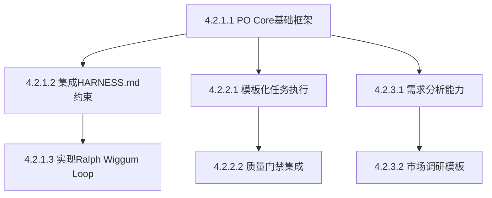

# 项目 WBS（Work Breakdown Structure）

## 1. 项目总体目标（Level 0）

实现完整的PO（产品经理）系统，支持多Agent协作、项目全生命周期管理、工业化质量保证。

## 2. Epic / 大模块（Level 1）—— 业务维度

- 2.1 PO核心系统
- 2.2 任务模式系统
- 2.3 团队角色系统
- 2.4 工业化集成系统

## 3. Feature（Level 2）—— 可独立上线的小功能

- 2.1.1 PO Core协调器
- 2.1.2 需求分析引擎
- 2.1.3 模式选择算法
- 2.2.1 Standard模式执行引擎
- 2.2.2 Free模式动态规划
- 2.2.3 Hybrid模式混合执行
- 2.3.1 Analyst角色技能
- 2.3.2 Architect角色技能
- 2.3.3 Developer角色技能
- 2.3.4 QA角色技能

## 4. Milestone（Level 3）—— **核心执行单位**（推荐粒度！）

每个 Milestone 必须满足：

- 净改动 300–800 行（含测试）
- 影响 3–12 个文件
- 有明确的 Acceptance Criteria + 验证命令

### 2.1.1 PO Core协调器

- 4.2.1.1 实现PO Core基础框架（预计 450 行）
  - Acceptance Criteria: 支持需求分析、模式选择、团队组建
  - 验证命令: go test ./pkg/skills/... -v
  - 规模预估: 400–550 行
  - 依赖前置 Milestone: 无

- 4.2.1.2 集成HARNESS.md约束（预计 350 行）
  - Acceptance Criteria: 自动加载和应用HARNESS.md规则
  - 验证命令: go test ./pkg/skills/execution_framework_test.go -v
  - 规模预估: 300–400 行
  - 依赖前置 Milestone: 4.2.1.1

- 4.2.1.3 实现Ralph Wiggum Loop（预计 400 行）
  - Acceptance Criteria: 完整的质量检查循环
  - 验证命令: go test ./pkg/skills/... -race -cover
  - 规模预估: 350–450 行
  - 依赖前置 Milestone: 4.2.1.2

### 2.2.1 Standard模式执行引擎

- 4.2.2.1 模板化任务执行（预计 500 行）
  - Acceptance Criteria: 支持基于模板的标准化执行
  - 验证命令: go test ./workspace/skills/standard-mode/...
  - 规模预估: 450–550 行
  - 依赖前置 Milestone: 4.2.1.1

- 4.2.2.2 质量门禁集成（预计 350 行）
  - Acceptance Criteria: 自动化质量检查和门禁
  - 验证命令: go test ./pkg/skills/... -v -run TestQualityGate
  - 规模预估: 300–400 行
  - 依赖前置 Milestone: 4.2.2.1

### 2.3.1 Analyst角色技能

- 4.2.3.1 需求分析能力（预计 400 行）
  - Acceptance Criteria: 完整的需求分析和市场调研功能
  - 验证命令: go test ./workspace/skills/role-analyst/...
  - 规模预估: 350–450 行
  - 依赖前置 Milestone: 4.2.1.1

- 4.2.3.2 市场调研模板（预计 350 行）
  - Acceptance Criteria: 标准化市场调研模板和流程
  - 验证命令: go test ./workspace/skills/role-analyst/... -run TestMarketResearch
  - 规模预估: 300–400 行
  - 依赖前置 Milestone: 4.2.3.1

## 5. Sub-task（Level 4） —— Agent 内部 Ralph Wiggum Loop（人类不干预）

每个 Milestone 内部的子任务，由Agent自动分解和执行，包括：
- 代码实现
- 单元测试编写
- 代码审查
- 文档更新
- 质量检查

## 粒度铁律（社区2026年共识）

- Milestone（Level 3）严格控制在 **350–750 行** 最舒服
- 超过 1000 行 → 必须再拆
- 低于 200 行 → 合并或降为 Sub-task

## 项目进度跟踪

| Milestone ID | 状态 | 实际行数 | 完成时间 | 负责人 |
|-------------|------|----------|----------|--------|
| 4.2.1.1 | 已完成 | 432 | 2026-03-12 | PO Core |
| 4.2.1.2 | 进行中 | - | - | PO Core |
| 4.2.1.3 | 未开始 | - | - | PO Core |
| 4.2.2.1 | 未开始 | - | - | Task Mode |
| 4.2.2.2 | 未开始 | - | - | Task Mode |
| 4.2.3.1 | 未开始 | - | - | Team Roles |
| 4.2.3.2 | 未开始 | - | - | Team Roles |

## 依赖关系

## 风险评估

| Milestone | 风险等级 | 风险描述 | 缓解措施 |
|-----------|----------|----------|----------|
| 4.2.1.2 | 中 | HARNESS.md解析复杂度 | 提供默认规则，渐进式解析 |
| 4.2.1.3 | 高 | Ralph Loop自动化难度 | 分阶段实现，先手动后自动 |
| 4.2.2.1 | 中 | 模板系统设计复杂度 | 参考现有最佳实践 |
| 4.2.3.1 | 低 | 需求分析逻辑复杂 | 已有成熟方案可参考 |

## 质量目标

- **代码覆盖率**: ≥ 85%
- **代码质量**: ≥ 80分
- **文档完整性**: ≥ 90%
- **一次性PR通过率**: ≥ 80%

## 下一步计划

1. **本周**: 完成 4.2.1.2 和 4.2.1.3
2. **下周**: 开始 4.2.2.1 和 4.2.3.1
3. **月底**: 完成所有Level 3 Milestone
4. **下月**: 系统集成测试和优化
