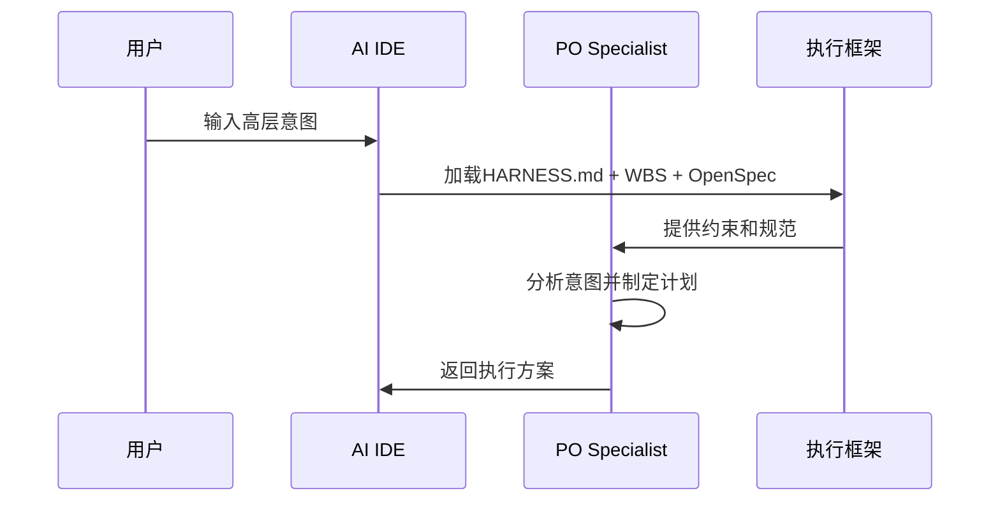
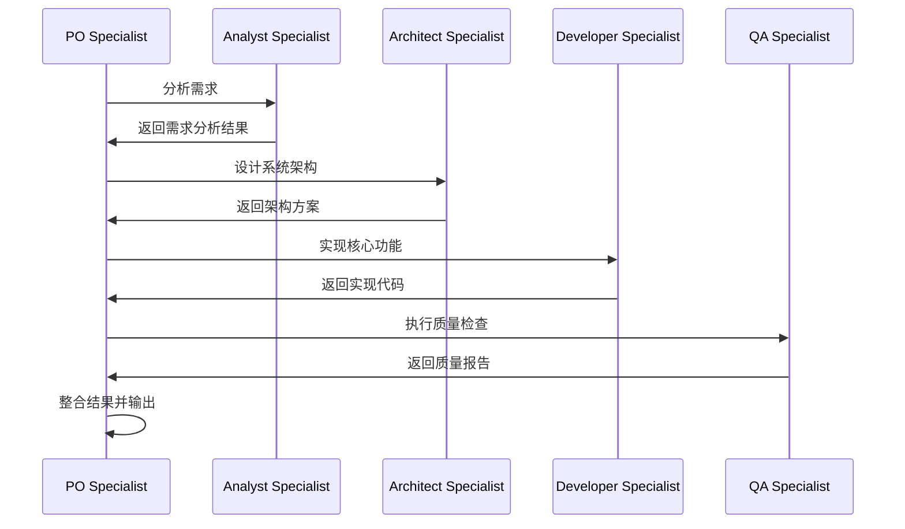
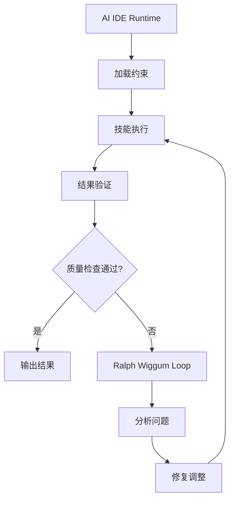

# AI Specialist Team - AI IDE时代的团队成员体系

## 🎯 核心理念

在传统编程中，我们有：
- **Runtime环境**: 提供代码执行的基础设施
- **编译器**: 将源代码转换为可执行程序
- **操作系统**: 管理进程、内存、资源
- **开发工具**: 支持编码、调试、测试

在AI编程中，这些角色对应为：
- **AI IDE**: 作为AI代码的"Runtime环境"
- **Model**: 作为AI代码的"CPU/处理器"
- **Skill定义**: 作为AI代码的"程序逻辑"
- **框架约束**: 作为AI代码的"操作系统规则"

## 👥 AI Specialist团队架构

### 1. 产品经理AI Specialist (PO Agent)
```yaml
role: "Product Manager AI Specialist"
runtime_role: "产品决策引擎"
model_requirements:
  - 强大的逻辑推理能力
  - 优秀的自然语言理解
  - 跨领域知识整合
skill_definition:
  - 需求分析和分解
  - 模式选择算法
  - 团队协调策略
  - 质量保证机制
responsibilities:
  - 将用户意图转化为可执行计划
  - 选择最优的执行模式
  - 协调其他AI Specialist
  - 确保输出符合质量标准
```

### 2. 架构师AI Specialist (Architect Agent)
```yaml
role: "Architect AI Specialist"
runtime_role: "系统设计引擎"
model_requirements:
  - 深度的技术知识
  - 抽象思维能力
  - 前瞻性设计思维
skill_definition:
  - 系统架构设计
  - 技术选型决策
  - 性能优化策略
  - 安全架构规划
responsibilities:
  - 设计可扩展的系统架构
  - 制定技术规范和标准
  - 评估技术风险
  - 指导开发实现
```

### 3. 开发者AI Specialist (Developer Agent)
```yaml
role: "Developer AI Specialist"
runtime_role: "代码生成引擎"
model_requirements:
  - 强大的代码生成能力
  - 多语言编程知识
  - 调试和问题解决
skill_definition:
  - 代码实现和优化
  - 测试用例生成
  - 文档编写能力
  - 代码审查和重构
responsibilities:
  - 根据设计生成高质量代码
  - 实现业务逻辑和功能
  - 编写和维护测试
  - 优化代码性能
```

### 4. 测试AI Specialist (QA Agent)
```yaml
role: "QA AI Specialist"
runtime_role: "质量保证引擎"
model_requirements:
  - 细致的思维模式
  - 全面的测试知识
  - 风险识别能力
skill_definition:
  - 测试策略设计
  - 缺陷分析和定位
  - 质量度量评估
  - 自动化测试实现
responsibilities:
  - 设计全面的测试策略
  - 执行各种类型的测试
  - 分析和报告质量问题
  - 确保产品符合标准
```

### 5. 需求分析师AI Specialist (Analyst Agent)
```yaml
role: "Analyst AI Specialist"
runtime_role: "需求洞察引擎"
model_requirements:
  - 深度业务理解能力
  - 市场和用户洞察
  - 数据分析能力
skill_definition:
  - 需求挖掘和分析
  - 市场调研能力
  - 竞品分析技能
  - 用户画像构建
responsibilities:
  - 深入理解用户需求
  - 分析市场和竞争环境
  - 生成需求文档
  - 提供业务洞察
```

## 🔄 AI IDE作为Runtime的工作流程

### 1. 意图输入阶段


### 2. 团队协作阶段


### 3. 质量保证循环


## 🛠️ AI Specialist的技能定义模式

### 1. Runtime角色映射
每个AI Specialist都有明确的Runtime角色：

```yaml
runtime_mapping:
  product_manager:
    primary: "决策引擎"
    secondary: "协调器"
    metrics: ["决策准确率", "协调效率", "用户满意度"]
    
  architect:
    primary: "设计引擎" 
    secondary: "标准制定者"
    metrics: ["设计质量", "技术前瞻性", "风险评估"]
    
  developer:
    primary: "生成引擎"
    secondary: "实现者"
    metrics: ["代码质量", "生成效率", "问题解决率"]
    
  qa:
    primary: "验证引擎"
    secondary: "质量守护者"
    metrics: ["缺陷发现率", "测试覆盖率", "质量一致性"]
    
  analyst:
    primary: "洞察引擎"
    secondary: "需求翻译者"
    metrics: ["需求准确率", "洞察深度", "分析完整性"]
```

### 2. Model+Skill组合模式
```yaml
model_skill_combination:
  definition: "Model提供基础能力，Skill定义应用模式"
  
  example_po:
    model_capabilities:
      - "逻辑推理"
      - "自然语言处理"
      - "决策制定"
    skill_patterns:
      - "需求分析模板"
      - "模式选择算法"
      - "团队协调流程"
    combined_output: "产品管理决策和计划"
    
  example_developer:
    model_capabilities:
      - "代码生成"
      - "多语言知识"
      - "调试能力"
    skill_patterns:
      - "代码模板库"
      - "实现最佳实践"
      - "测试生成模式"
    combined_output: "高质量代码实现"
```

## 🎯 实践指南

### 1. AI Specialist开发原则

#### 明确Runtime角色
- 每个技能必须明确定义其在AI IDE中的Runtime角色
- 避免角色重叠，确保职责清晰
- 建立角色间的协作协议

#### Model能力最大化
- 技能定义要充分发挥Model的基础能力
- 避免让Model做不擅长的事情
- 利用Model的特长领域

#### 约束驱动开发
- 所有技能必须在HARNESS.md约束下工作
- 遵循WBS的粒度要求
- 符合OpenSpec的规范定义

### 2. 团队协作模式

#### 层级协作
```yaml
hierarchical_collaboration:
  level_1: "PO Specialist - 总协调"
  level_2: "Architect + Analyst - 设计和分析"
  level_3: "Developer + QA - 实现和验证"
  
  communication_flow:
    - "PO向下游传达需求和计划"
    - "下游向PO反馈进度和问题"
    - "平级间协作配合"
```

#### 并行协作
```yaml
parallel_collaboration:
  independent_tasks: "不同 Specialist 可并行工作"
  coordination_points: "关键节点需要同步"
  conflict_resolution: "PO负责冲突解决"
  
  examples:
    - "Architect设计系统时，Analyst可并行调研"
    - "Developer实现功能时，QA可并行准备测试"
```

### 3. 质量保证机制

#### 多层验证
```yaml
validation_layers:
  skill_level: "技能内部自检"
  team_level: "团队交叉验证"
  framework_level: "框架统一检查"
  user_level: "用户最终确认"
```

#### 持续改进
```yaml
continuous_improvement:
  feedback_loop: "每次执行都收集反馈"
  learning_mechanism: "从失败中学习改进"
  knowledge_evolution: "技能定义持续演进"
```

## 🚀 未来发展方向

### 1. 更精细的Specialization
- **领域专家**: 针对特定行业的AI Specialist
- **技术专家**: 针对特定技术栈的AI Specialist
- **流程专家**: 针对特定开发流程的AI Specialist

### 2. 智能团队组合
- **动态组队**: 根据任务特点自动组合最优团队
- **角色学习**: AI Specialist从合作中学习更好的协作模式
- **性能优化**: 基于历史表现优化团队配置

### 3. 自我进化能力
- **技能自修复**: 检测并修复自身技能定义的问题
- **模式自适应**: 根据项目特点自动调整执行模式
- **知识积累**: 将项目经验转化为可复用的知识库

## 📋 实施检查清单

### AI Specialist定义检查
- [ ] 明确的Runtime角色定义
- [ ] 清晰的Model能力要求
- [ ] 完整的技能行为模式
- [ ] 详细的协作接口定义

### 团队协作检查
- [ ] 角色职责无重叠
- [ ] 协作流程清晰
- [ ] 冲突解决机制
- [ ] 质量保证流程

### 框架集成检查
- [ ] HARNESS.md约束遵循
- [ ] WBS粒度控制支持
- [ ] OpenSpec规范集成
- [ ] Ralph Wiggum Loop支持

---

通过这个AI Specialist团队体系，我们将AI IDE从单纯的"工具"升级为真正的"智能团队平台"，每个AI Specialist都是专业的团队成员，在AI IDE这个Runtime环境中协同工作，实现真正的AI驱动软件开发！
