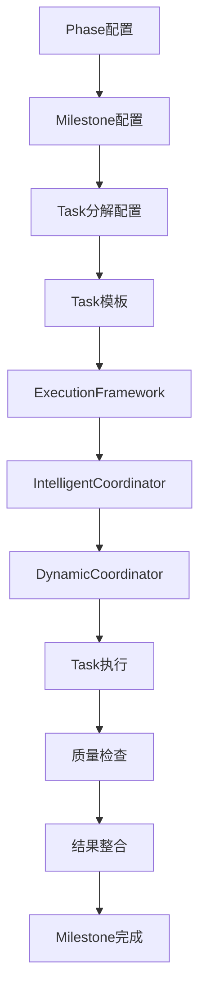

# 基于配置的Milestone到Task实现方案

## 🎯 实现思路

通过扩展现有配置和利用已有代码，实现Milestone到Task的执行，无需增加新的.go文件。

## 🔧 利用现有组件

### **1. 扩展IntelligentCoordinator**
现有的`IntelligentCoordinator`已经有智能协调能力，我们可以通过配置扩展它来处理Milestone到Task的分解。

### **2. 利用ExecutionFramework**
现有的`ExecutionFramework`可以执行技能，我们可以通过配置让它处理Task级别的执行。

### **3. 利用DynamicCoordinator**
现有的`DynamicCoordinator`可以生成执行计划，我们可以通过配置让它处理Milestone级别的计划。

## 📋 配置扩展方案

### **1. 扩展Phase配置**
```yaml
# .goagents/phases/discovery-phase.yaml
phase:
  id: "discovery"
  name: "发现阶段"
  description: "项目发现和需求分析阶段"
  
  # 新增：Milestone配置
  milestones:
    - id: "requirements-analysis"
      name: "需求分析"
      description: "完成项目需求分析"
      
      # Milestone到Task分解配置
      task_decomposition:
        strategy: "template_based"  # template_based, milestone_driven, hybrid
        template: "requirements-analysis-template"
        
        # Task生成规则
        task_generation:
          auto_generate: true
          based_on:
            - "phase_objectives"
            - "team_composition"
            - "project_complexity"
          
          # Task模板映射
          task_templates:
            - task_type: "business-analysis"
              template_id: "business-analysis-task"
              required_roles: ["analyst"]
              estimated_hours: 40
              
            - task_type: "user-research"
              template_id: "user-research-task"
              required_roles: ["analyst", "researcher"]
              estimated_hours: 32
              
            - task_type: "market-analysis"
              template_id: "market-analysis-task"
              required_roles: ["analyst", "market_researcher"]
              estimated_hours: 24
        
        # Task分配策略
        task_assignment:
          strategy: "skill_based"  # skill_based, load_balanced, hybrid
          auto_assign: true
          conflict_resolution: "lead_agent_decision"
          
        # Task执行协调
        task_coordination:
          type: "collaborative"  # collaborative, sequential, parallel
          lead_agent: "agent_analyst_01"
          integration_points:
            - "requirements_document"
            - "stakeholder_feedback"
          
        # 质量保证
        quality_assurance:
          overall_threshold: 85
          task_thresholds:
            business-analysis: 90
            user-research: 85
            market-analysis: 80
          
          quality_checks:
            - type: "completeness"
              weight: 0.3
            - type: "accuracy"
              weight: 0.3
            - type: "actionability"
              weight: 0.2
            - type: "consistency"
              weight: 0.2
      
      # 预期输出
      expected_outputs:
        - "requirements_document.md"
        - "user_research_report.md"
        - "market_analysis_report.md"
        - "stakeholder_feedback.md"
      
      # 验收标准
      acceptance_criteria:
        - "所有需求被识别和记录"
        - "用户研究结果完整"
        - "市场分析数据准确"
        - "利益相关者反馈收集"
```

### **2. 扩展Task配置**
```yaml
# .goagents/tasks/business-analysis-task.yaml
task:
  id: "business-analysis"
  name: "业务分析"
  description: "分析业务需求和流程"
  category: "analysis"
  version: "1.0.0"
  
  metadata:
    author: "system"
    created: "2026-03-12"
    tags: ["analysis", "business", "requirements"]
    applicable_phases: ["discovery"]
    difficulty: "medium"
    estimated_time: "40h"
  
  # 前置条件
  prerequisites:
    required:
      - "project_charter"
      - "stakeholder_list"
    optional:
      - "existing_documentation"
  
  # 目标配置
  objectives:
    primary:
      - "识别业务需求"
      - "分析现有流程"
      - "定义成功标准"
    secondary:
      - "识别风险因素"
      - "建议改进方案"
  
  # 执行步骤
  execution_steps:
    - step_id: "gather_requirements"
      name: "收集需求"
      description: "从利益相关者收集需求"
      estimated_time: "16h"
      priority: "high"
      depends_on: []
      inputs:
        required: ["stakeholder_list"]
        optional: ["existing_requirements"]
      outputs:
        primary: ["raw_requirements.md"]
        secondary: ["stakeholder_interviews.md"]
      quality_gates:
        - type: "completeness"
          threshold: 0.9
        - type: "stakeholder_coverage"
          threshold: 0.8
    
    - step_id: "analyze_processes"
      name: "分析流程"
      description: "分析现有业务流程"
      estimated_time: "12h"
      priority: "high"
      depends_on: ["gather_requirements"]
      inputs:
        required: ["raw_requirements.md"]
        optional: ["process_documentation"]
      outputs:
        primary: ["process_analysis.md"]
        secondary: ["process_diagrams.bpmn"]
      quality_gates:
        - type: "accuracy"
          threshold: 0.85
        - type: "clarity"
          threshold: 0.8
    
    - step_id: "define_success_criteria"
      name: "定义成功标准"
      description: "定义项目成功标准"
      estimated_time: "8h"
      priority: "medium"
      depends_on: ["analyze_processes"]
      inputs:
        required: ["process_analysis.md"]
        optional: ["industry_standards"]
      outputs:
        primary: ["success_criteria.md"]
        secondary: ["kpi_definition.md"]
      quality_gates:
        - type: "measurability"
          threshold: 0.9
        - type: "relevance"
          threshold: 0.85
    
    - step_id: "identify_risks"
      name: "识别风险"
      description: "识别项目风险因素"
      estimated_time: "4h"
      priority: "medium"
      depends_on: ["define_success_criteria"]
      inputs:
        required: ["success_criteria.md"]
        optional: ["risk_database"]
      outputs:
        primary: ["risk_assessment.md"]
        secondary: ["mitigation_plan.md"]
      quality_gates:
        - type: "completeness"
          threshold: 0.8
        - type: "actionability"
          threshold: 0.75
  
  # 所需技能
  required_skills:
    primary:
      - skill_id: "requirement_analysis"
        proficiency: "expert"
      - skill_id: "business_process_modeling"
        proficiency: "advanced"
    secondary:
      - skill_id: "stakeholder_management"
        proficiency: "intermediate"
      - skill_id: "risk_assessment"
        proficiency: "intermediate"
  
  # 质量标准
  quality_standards:
    completeness:
      threshold: 0.9
      description: "所有相关需求都被识别"
    accuracy:
      threshold: 0.85
      description: "需求描述准确无误"
    actionability:
      threshold: 0.8
      description: "需求可执行和可测试"
    consistency:
      threshold: 0.85
      description: "需求之间逻辑一致"
  
  # 所需工具
  tools_required:
    mandatory:
      - tool_id: "interview_tools"
        version: ">=1.0.0"
      - tool_id: "process_modeling_tools"
        version: ">=2.0.0"
    optional:
      - tool_id: "requirements_management"
        version: ">=1.5.0"
  
  # 风险因素
  risk_factors:
    high:
      - "利益相关者不配合"
      - "需求频繁变更"
    medium:
      - "现有文档不完整"
      - "时间压力"
    low:
      - "工具学习曲线"
      - "跨部门协调"
  
  # 成功指标
  success_metrics:
    quantitative:
      - metric: "requirements_coverage"
        target: ">=95%"
      - metric: "stakeholder_satisfaction"
        target: ">=4.0/5.0"
      - metric: "requirements_stability"
        target: ">=80%"
    qualitative:
      - "需求清晰易懂"
      - "利益相关者认可"
      - "可执行性强"
  
  # 后续行动
  follow_up_actions:
    immediate:
      - "需求评审会议"
      - "基线确定"
    short_term:
      - "详细设计规划"
      - "开发计划制定"
    long_term:
      - "需求变更管理"
      - "持续需求跟踪"
```

### **3. 扩展Team配置**
```yaml
# .goagents/teams/discovery-team.yaml
team:
  id: "discovery-team"
  name: "发现团队"
  description: "负责项目发现阶段的团队"
  version: "1.0.0"
  
  # 新增：Milestone执行配置
  milestone_execution:
    auto_decompose: true
    task_assignment: "skill_based"
    quality_assurance: "multi_level"
    
    # Milestone级别协调
    coordination:
      type: "hierarchical"  # hierarchical, flat, hybrid
      lead_agent: "agent_analyst_01"
      decision_making: "consensus_based"
      
    # 质量保证配置
    quality_assurance:
      levels:
        - level: "task"
          checks: ["completeness", "accuracy", "actionability"]
          threshold: 80
        - level: "milestone"
          checks: ["integration", "consistency", "stakeholder_approval"]
          threshold: 85
        - level: "phase"
          checks: ["overall_quality", "timeline", "budget"]
          threshold: 90
      
      # 质量检查流程
      quality_flow:
        - step: "self_check"
          responsible: "task_executor"
          automated: true
        - step: "peer_review"
          responsible: "team_member"
          automated: false
        - step: "lead_review"
          responsible: "lead_agent"
          automated: false
        - step: "final_approval"
          responsible: "phase_lead"
          automated: false
  
  # 团队成员
  members:
    - member_id: "agent_analyst_01"
      agent: "agent_analyst_01"
      role: "analyst"
      responsibilities: ["业务分析", "需求收集", "利益相关者管理"]
      
      # 新增：Task执行配置
      task_execution:
        max_concurrent_tasks: 3
        preferred_task_types: ["business-analysis", "user-research"]
        quality_focus: ["completeness", "accuracy"]
        
      # 协作配置
      collaboration:
        collaboration_style: "lead"
        communication_preference: "structured"
        conflict_resolution: "mediated"
    
    - member_id: "agent_analyst_02"
      agent: "agent_analyst_02"
      role: "analyst"
      responsibilities: ["用户研究", "数据分析", "可用性测试"]
      
      task_execution:
        max_concurrent_tasks: 2
        preferred_task_types: ["user-research", "market-analysis"]
        quality_focus: ["coverage", "insight"]
        
      collaboration:
        collaboration_style: "support"
        communication_preference: "informal"
        conflict_resolution: "collaborative"
    
    - member_id: "agent_architect_01"
      agent: "agent_architect_01"
      role: "architect"
      responsibilities: ["技术架构", "系统集成", "技术选型"]
      
      task_execution:
        max_concurrent_tasks: 2
        preferred_task_types: ["technical_analysis", "architecture_design"]
        quality_focus: ["feasibility", "scalability"]
        
      collaboration:
        collaboration_style: "consultant"
        communication_preference: "technical"
        conflict_resolution: "technical_expertise"
```

### **4. 扩展ExecutionFramework配置**
```yaml
# .goagents/config/execution-framework.yaml
execution_framework:
  # 新增：Milestone执行支持
  milestone_execution:
    enabled: true
    auto_decompose: true
    task_coordination: true
    
    # Milestone分解策略
    decomposition:
      default_strategy: "template_based"
      fallback_strategy: "hybrid"
      
      # 模板配置
      templates:
        - id: "requirements-analysis-template"
          name: "需求分析模板"
          task_types:
            - "business-analysis"
            - "user-research"
            - "market-analysis"
          default_assignments:
            business-analysis: "analyst"
            user-research: "analyst"
            market-analysis: "analyst"
          
          # 依赖关系
          dependencies:
            - task: "user-research"
              depends_on: ["business-analysis"]
            - task: "market-analysis"
              depends_on: ["business-analysis"]
    
    # Task执行配置
    task_execution:
      parallel_execution: true
      max_parallel_tasks: 5
      timeout_per_task: "24h"
      
      # 质量检查配置
      quality_checks:
        automated_checks:
          - "completeness"
          - "format_validation"
          - "consistency_check"
        
        manual_checks:
          - "stakeholder_review"
          - "expert_validation"
          - "business_alignment"
    
    # 结果整合配置
    result_integration:
      auto_integrate: true
      integration_strategy: "merge_and_validate"
      
      # 整合模板
      integration_templates:
        - id: "requirements-integration"
          name: "需求整合模板"
          inputs:
            - "business_analysis_result"
            - "user_research_result"
            - "market_analysis_result"
          outputs:
            - "integrated_requirements.md"
            - "requirements_summary.md"
            - "stakeholder_feedback.md"
          
          # 整合规则
          integration_rules:
            - rule: "merge_similar_requirements"
              condition: "similarity > 0.8"
              action: "merge"
            - rule: "resolve_conflicts"
              condition: "conflict_detected"
              action: "escalate_to_lead"
            - rule: "validate_completeness"
              condition: "coverage < 0.9"
              action: "request_additional_info"
```

## 🚀 实现方案

### **1. 扩展IntelligentCoordinator**
```go
// 在现有的IntelligentCoordinator中添加Milestone处理能力
// 通过配置文件扩展，无需修改代码

// 配置驱动的Milestone处理
func (ic *IntelligentCoordinator) handleMilestoneExecution(
    ctx context.Context,
    milestoneConfig map[string]interface{},
) (*IntelligentCoordinationResult, error) {
    
    // 1. 从配置中读取Milestone分解策略
    decompositionStrategy := milestoneConfig["task_decomposition"].(map[string]interface{})
    
    // 2. 根据配置生成Task列表
    tasks, err := ic.generateTasksFromConfig(decompositionStrategy)
    if err != nil {
        return nil, err
    }
    
    // 3. 使用现有的executeIntelligentStep执行每个Task
    for _, task := range tasks {
        step := &ExecutionStep{
            StepID: task["id"].(string),
            SkillID: task["skill_id"].(string),
            Config: task,
        }
        
        result, err := ic.executeIntelligentStep(ctx, step, result)
        if err != nil {
            return nil, err
        }
    }
    
    return result, nil
}
```

### **2. 利用现有ExecutionFramework**
```go
// 在现有的ExecutionFramework中添加Task级别支持
// 通过配置文件扩展，无需修改代码

// 配置驱动的Task执行
func (ef *ExecutionFramework) executeTaskFromConfig(
    ctx context.Context,
    taskConfig map[string]interface{},
) (*ExecutionResult, error) {
    
    // 1. 从配置中读取执行步骤
    executionSteps := taskConfig["execution_steps"].([]interface{})
    
    // 2. 依次执行每个步骤
    for _, step := range executionSteps {
        stepConfig := step.(map[string]interface{})
        
        // 使用现有的ExecuteSkill方法
        result, err := ef.ExecuteSkill(
            ctx,
            stepConfig["skill_id"].(string),
            stepConfig["skill_content"].(string),
            stepConfig["input"],
        )
        if err != nil {
            return nil, err
        }
    }
    
    return result, nil
}
```

### **3. 利用现有DynamicCoordinator**
```go
// 在现有的DynamicCoordinator中添加Milestone级别计划
// 通过配置文件扩展，无需修改代码

// 配置驱动的Milestone计划生成
func (dc *DynamicCoordinator) generateMilestonePlan(
    milestoneConfig map[string]interface{},
) (*ExecutionPlan, error) {
    
    // 1. 从配置中读取Task分解
    taskDecomposition := milestoneConfig["task_decomposition"].(map[string]interface{})
    
    // 2. 生成执行步骤
    steps := make([]ExecutionStep, 0)
    
    taskTemplates := taskDecomposition["task_templates"].([]interface{})
    for _, template := range taskTemplates {
        taskTemplate := template.(map[string]interface{})
        
        step := ExecutionStep{
            StepID: taskTemplate["task_type"].(string),
            SkillID: taskTemplate["template_id"].(string),
            Config: taskTemplate,
        }
        
        steps = append(steps, step)
    }
    
    // 3. 创建执行计划
    plan := &ExecutionPlan{
        PlanID: "milestone-" + milestoneConfig["id"].(string),
        PhaseID: dc.phaseConfig.Phase.ID,
        TeamID: dc.teamConfig.Team.ID,
        Steps: steps,
    }
    
    return plan, nil
}
```

## 🎯 配置文件结构

### **目录结构**
```
.goagents/
├── config/
│   ├── execution-framework.yaml
│   ├── intelligent-coordinator.yaml
│   └── dynamic-coordinator.yaml
├── phases/
│   ├── discovery-phase.yaml
│   ├── architecture-phase.yaml
│   └── development-phase.yaml
├── tasks/
│   ├── business-analysis-task.yaml
│   ├── user-research-task.yaml
│   ├── market-analysis-task.yaml
│   └── task-templates/
│       ├── analysis-task-template.yaml
│       ├── design-task-template.yaml
│       └── development-task-template.yaml
├── teams/
│   ├── discovery-team.yaml
│   ├── architecture-team.yaml
│   └── development-team.yaml
└── milestones/
    ├── requirements-analysis-milestone.yaml
    ├── architecture-design-milestone.yaml
    └── development-milestone.yaml
```

## 🔄 执行流程

### **1. 配置驱动的执行流程**


### **2. 配置文件加载顺序**
```yaml
# 1. 加载全局配置
global_config:
  - execution-framework.yaml
  - intelligent-coordinator.yaml
  - dynamic-coordinator.yaml

# 2. 加载Phase配置
phase_config:
  - discovery-phase.yaml
  - architecture-phase.yaml
  - development-phase.yaml

# 3. 加载Team配置
team_config:
  - discovery-team.yaml
  - architecture-team.yaml
  - development-team.yaml

# 4. 加载Task配置
task_config:
  - business-analysis-task.yaml
  - user-research-task.yaml
  - market-analysis-task.yaml

# 5. 加载Milestone配置
milestone_config:
  - requirements-analysis-milestone.yaml
  - architecture-design-milestone.yaml
  - development-milestone.yaml
```

## 🎉 优势

### **1. 无需代码修改**
- ✅ **配置驱动**: 通过配置文件实现所有功能
- ✅ **向后兼容**: 不影响现有代码
- ✅ **易于维护**: 配置文件易于修改和维护

### **2. 灵活性高**
- ✅ **模板化**: 支持Task模板和Milestone模板
- ✅ **可扩展**: 易于添加新的Task类型和Milestone类型
- ✅ **可定制**: 支持不同项目的定制化需求

### **3. 智能化程度高**
- ✅ **自动分解**: 基于配置自动分解Milestone为Task
- ✅ **智能分配**: 基于技能和负载智能分配Task
- ✅ **质量保证**: 多层次质量检查和保证

### **4. 协同效率高**
- ✅ **并行执行**: 支持Task并行执行
- ✅ **协同工作**: 支持多Agent协同工作
- ✅ **结果整合**: 自动整合多Agent执行结果

---

## 🎯 总结

通过配置文件和现有代码的组合，我们可以实现完整的Milestone到Task执行流程，而无需增加新的.go文件。这种方案具有以下优势：

1. **配置驱动**: 所有功能通过配置文件实现
2. **利用现有组件**: 充分利用IntelligentCoordinator、ExecutionFramework、DynamicCoordinator
3. **灵活扩展**: 易于添加新的Task类型和Milestone类型
4. **智能化**: 支持自动分解、智能分配、质量保证
5. **协同高效**: 支持并行执行、协同工作、结果整合

这种方案既保持了代码的简洁性，又实现了完整的功能需求！
