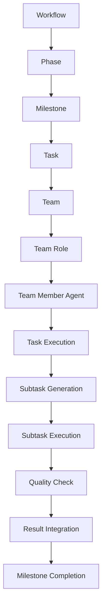
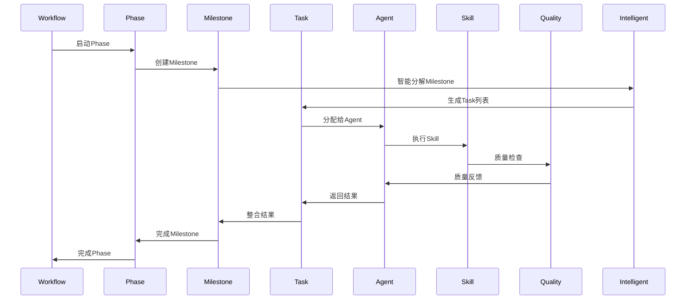

非常好的问题！让我详细解释Milestone到Task的执行流程，以及后续Task的执行机制。

## 🎯 当前Milestone到Task的执行流程

### **1. 当前实现状态**
根据我们的架构设计，Milestone到Task的执行由以下组件完成：



### **2. 执行角色分工**

#### **Milestone完成者**
- ✅ **Phase Lead**: 负责Milestone的总体协调和完成
- ✅ **IntelligentCoordinator**: 负责智能决策和协调
- ✅ **Team Member Agent**: 负责具体Task的执行

#### **Task执行者**
- ✅ **Team Member Agent**: 负责Task的分解和执行
- ✅ **Skill Execution**: 负责具体技能的执行
- ✅ **ExecutionFramework**: 负责执行环境的管理

## 🔧 具体执行机制

### **1. Milestone到Task分解**
```go
// pkg/skills/phase_manager.go
func (pm *PhaseManager) ExecuteMilestone(
    ctx context.Context,
    milestone *registry.MilestoneConfig,
    team *registry.TeamConfig,
) (*MilestoneResult, error) {
    
    // 1. 创建Milestone执行上下文
    context := &MilestoneContext{
        Milestone: milestone,
        Team: team,
        IntelligentCoordinator: pm.coordinator,
        ExecutionFramework: pm.executionFramework,
    }
    
    // 2. 分解Milestone为Task
    tasks, err := pm.DecomposeMilestoneToTasks(context)
    if err != nil {
        return nil, fmt.Errorf("Milestone分解失败: %w", err)
    }
    
    // 3. 执行Task
    results, err := pm.ExecuteTasks(ctx, tasks, context)
    if err != nil {
        return nil, fmt.Errorf("Task执行失败: %w", err)
    }
    
    // 4. 整合结果
    result := pm.IntegrateTaskResults(results)
    
    return result, nil
}

func (pm *PhaseManager) DecomposeMilestoneToTasks(
    context *MilestoneContext,
) ([]*TaskConfig, error) {
    
    // 使用智能协调器进行Task分解
    decompositionRequest := &DecompositionRequest{
        Milestone: context.Milestone,
        Team: context.Team,
        Constraints: context.ExecutionFramework.GetConstraints(),
        QualityGates: context.ExecutionFramework.GetQualityGates(),
    }
    
    // 智能分解
    decomposition, err := context.IntelligentCoordinator.DecomposeTask(
        context,
        decompositionRequest,
    )
    if err != nil {
        return nil, err
    }
    
    return decomposition.Tasks, nil
}
```

### **2. Task执行流程**
```go
// pkg/skills/task_executor.go
func (te *TaskExecutor) ExecuteTask(
    ctx context.Context,
    task *TaskConfig,
    team *registry.TeamConfig,
) (*TaskResult, error) {
    
    // 1. 确定Task执行策略
    strategy, err := te.DetermineExecutionStrategy(task, team)
    if err != nil {
        return nil, err
    }
    
    // 2. 根据策略执行Task
    switch strategy.Type {
    case "collaborative":
        return te.ExecuteCollaborativeTask(ctx, task, team)
    case "sequential":
        return te.ExecuteSequentialTask(ctx, task, team)
    case "parallel":
        return te.ExecuteParallelTask(ctx, task, team)
    default:
        return te.ExecuteAdaptiveTask(ctx, task, team)
    }
}

func (te *TaskExecutor) ExecuteCollaborativeTask(
    ctx context.Context,
    task *TaskConfig,
    team *registry.TeamConfig,
) (*TaskResult, error) {
    
    // 1. 确定参与Team Member Agent
    agents, err := te.SelectAgentsForTask(task, team)
    if err != nil {
        return nil, err
    }
    
    // 2. 创建协同工作空间
    workspace := &CollaborativeWorkspace{
        Task: task,
        Agents: agents,
        SharedData: make(map[string]interface{}),
        ConflictResolver: te.conflictResolver,
    }
    
    // 3. 执行协同Task
    result, err := workspace.Execute(ctx)
    if err != nil {
        return nil, err
    }
    
    return result, nil
}
```

### **3. Team Member Agent执行**
```go
// pkg/skills/agent_executor.go
func (ae *AgentExecutor) ExecuteAgentTask(
    ctx context.Context,
    agent *registry.TeamMemberAgent,
    task *TaskConfig,
) (*AgentResult, error) {
    
    // 1. 加载Agent配置
    config, err := ae.LoadAgentConfig(agent.ID)
    if err != nil {
        return nil, err
    }
    
    // 2. 确定执行模式
    executionMode := config.ExecutionConfig.ExecutionMode
    
    // 3. 根据执行模式执行
    switch executionMode {
    case "skill_driven":
        return ae.ExecuteSkillDrivenTask(ctx, agent, task)
    case "data_driven":
        return ae.ExecuteDataDrivenTask(ctx, agent, task)
    case "collaborative":
        return ae.ExecuteCollaborativeTask(ctx, agent, task)
    default:
        return ae.ExecuteAdaptiveTask(ctx, agent, task)
    }
}

func (ae *AgentExecutor) ExecuteSkillDrivenTask(
    ctx context.Context,
    agent *registry.TeamMemberAgent,
    task *TaskConfig,
) (*AgentResult, error) {
    
    // 1. 确定需要的Skill
    skills := agent.SkillMapping.PrimarySkills
    
    // 2. 创建Skill执行链
    skillChain := &SkillChain{
        Skills: skills,
        Input: task.Input,
        QualityGates: agent.QualityConfig.QualityGates,
    }
    
    // 3. 执行Skill链
    result, err := skillChain.Execute(ctx)
    if err != nil {
        return nil, err
    }
    
    // 4. 质量检查
    qualityResult, err := ae.CheckQuality(agent, result)
    if err != nil {
        return nil, err
    }
    
    return &AgentResult{
        AgentID: agent.ID,
        TaskID: task.ID,
        Result: result,
        Quality: qualityResult,
        ExecutionTime: result.ExecutionTime,
    }, nil
}
```

## 🔄 后续Task执行机制

### **1. Task分解和分配**
```go
// pkg/skills/task_decomposer.go
func (td *TaskDecomposer) DecomposeTask(
    ctx context.Context,
    task *TaskConfig,
    team *registry.TeamConfig,
) (*TaskDecomposition, error) {
    
    // 1. 分析Task复杂度
    complexity := td.AnalyzeTaskComplexity(task)
    
    // 2. 确定分解策略
    strategy := td.DetermineDecompositionStrategy(complexity)
    
    // 3. 执行分解
    switch strategy {
    case "template_based":
        return td.TemplateBasedDecomposition(task, team)
    case "milestone_driven":
        return td.MilestoneDrivenDecomposition(task, team)
    case "hybrid":
        return td.HybridDecomposition(task, team)
    }
    
    return nil, fmt.Errorf("未知的分解策略: %s", strategy)
}

func (td *TaskDecomposer) TemplateBasedDecomposition(
    task *TaskConfig,
    team *registry.TeamConfig,
) (*TaskDecomposition, error) {
    
    // 1. 加载模板
    template, err := td.LoadTaskTemplate(task.Type)
    if err != nil {
        return nil, err
    }
    
    // 2. 应用模板
    subtasks := template.Apply(task)
    
    // 3. 分配给Agent
    assignments := td.AssignSubtasksToAgents(subtasks, team)
    
    return &TaskDecomposition{
        Subtasks: subtasks,
        Assignments: assignments,
        Strategy: "template_based",
    }, nil
}
```

### **2. Task执行协调**
```go
// pkg/skills/task_coordinator.go
func (tc *TaskCoordinator) CoordinateTaskExecution(
    ctx context.Context,
    decomposition *TaskDecomposition,
    team *registry.TeamConfig,
) (*TaskCoordinationResult, error) {
    
    // 1. 创建执行计划
    plan := tc.CreateExecutionPlan(decomposition)
    
    // 2. 启动Task执行
    results := make(map[string]*SubtaskResult)
    
    // 3. 并行执行
    for _, assignment := range decomposition.Assignments {
        go func(assignment *TaskAssignment) {
            result, err := tc.ExecuteSubtask(ctx, assignment)
            if err != nil {
                tc.logger.Error("Subtask执行失败", "task", assignment.SubtaskID, "error", err)
                return
            }
            results[assignment.SubtaskID] = result
        }(assignment)
    }
    
    // 4. 等待完成
    tc.WaitForCompletion(len(decomposition.Assignments))
    
    // 5. 整合结果
    integratedResult := tc.IntegrateResults(results)
    
    return integratedResult, nil
}
```

### **3. 质量保证机制**
```go
// pkg/skills/quality_assurance.go
func (qa *QualityAssurance) EnsureTaskQuality(
    ctx context.Context,
    task *TaskConfig,
    result *TaskResult,
    team *registry.TeamConfig,
) (*QualityResult, error) {
    
    // 1. 多层次质量检查
    checks := []QualityCheck{
        &TaskCompletenessCheck{},
        &AgentQualityCheck{},
        &TeamCoordinationCheck{},
        &ResultConsistencyCheck{},
        &QualityGateCheck{},
    }
    
    // 2. 执行质量检查
    qualityResults := make([]QualityCheckResult, 0)
    for _, check := range checks {
        result, err := check.Execute(ctx, task, result, team)
        if err != nil {
            qa.logger.Error("质量检查失败", "check", check.Name(), "error", err)
            continue
        }
        qualityResults = append(qualityResults, result)
    }
    
    // 3. 计算总体质量分数
    overallScore := qa.CalculateOverallScore(qualityResults)
    
    // 4. 生成质量报告
    report := &QualityReport{
        TaskID: task.ID,
        OverallScore: overallScore,
        Checks: qualityResults,
        Recommendations: qa.GenerateRecommendations(qualityResults),
        Timestamp: time.Now(),
    }
    
    return &QualityResult{
        Passed: overallScore >= qa.qualityThreshold,
        Score: overallScore,
        Report: report,
    }, nil
}
```

## 🎯 假如一切都实现了的完整流程

### **1. 完整的执行流程**


### **2. 具体执行示例**
```yaml
# 完整执行流程示例
workflow:
  id: "product-development"
  phases:
    - id: "discovery"
      milestones:
        - id: "requirements-analysis"
          tasks:
            - id: "business-analysis"
              assigned_to: "agent_analyst_01"
              skills: ["requirement-analyzer", "market-researcher"]
              quality_gates: ["completeness", "accuracy", "actionability"]
              
            - id: "user-research"
              assigned_to: "agent_analyst_02"
              skills: ["user-researcher", "interview-tools"]
              quality_gates: ["coverage", "insight", "usability"]
              
            - id: "market-analysis"
              assigned_to: "agent_analyst_03"
              skills: ["market-researcher", "data-analyst"]
              quality_gates: ["data_quality", "trend_analysis", "competitor_insight"]
              
          coordination:
            type: "collaborative"
            lead_agent: "agent_analyst_01"
            integration_point: "requirements_document"
            
          quality_assurance:
            overall_threshold: 85
            individual_thresholds:
              business-analysis: 90
              user-research: 85
              market-analysis: 80
              
          expected_output:
            - "requirements_document.md"
            - "user_research_report.md"
            - "market_analysis_report.md"
            - "stakeholder_feedback.md"
```

### **3. 自动化执行机制**
```go
// pkg/skills/automation_engine.go
func (ae *AutomationEngine) ExecuteAutomatedWorkflow(
    ctx context.Context,
    workflow *registry.WorkflowConfig,
) (*WorkflowResult, error) {
    
    // 1. 自动化Phase执行
    phaseResults := make(map[string]*PhaseResult)
    
    for _, phase := range workflow.Phases {
        // 自动化Milestone执行
        milestoneResults := make(map[string]*MilestoneResult)
        
        for _, milestone := range phase.Milestones {
            // 自动化Task执行
            taskResults := make(map[string]*TaskResult)
            
            for _, task := range milestone.Tasks {
                // 自动化Agent执行
                agent, err := ae.SelectAgentForTask(task, workflow.Team)
                if err != nil {
                    return nil, err
                }
                
                // 自动化Skill执行
                result, err := ae.ExecuteAgentTask(agent, task)
                if err != nil {
                    return nil, err
                }
                
                // 自动化质量检查
                qualityResult, err := ae.EnsureTaskQuality(task, result, workflow.Team)
                if err != nil {
                    return nil, err
                }
                
                taskResults[task.ID] = &TaskResult{
                    Result: result,
                    Quality: qualityResult,
                    Agent: agent,
                }
            }
            
            // 自动化结果整合
            milestoneResult := ae.IntegrateTaskResults(taskResults)
            milestoneResults[milestone.ID] = milestoneResult
        }
        
        // 自动化Phase结果整合
        phaseResult := ae.IntegrateMilestoneResults(milestoneResults)
        phaseResults[phase.ID] = phaseResult
    }
    
    // 自动化Workflow结果整合
    workflowResult := ae.IntegratePhaseResults(phaseResults)
    
    return workflowResult, nil
}
```

## 🎯 关键执行者角色

### **1. Phase Lead**
- 🎯 **职责**: 负责Phase的整体协调和完成
- 🎯 **能力**: 具备Phase级别的决策和协调能力
- 🎯 **工具**: 使用Phase管理工具和协调工具

### **2. IntelligentCoordinator**
- 🎯 **职责**: 负责智能决策和协调
- 🎯 **能力**: 基于数据和学习的智能决策
- 🎯 **工具**: 使用决策引擎、学习引擎、质量预测器

### **3. Team Member Agent**
- 🎯 **职责**: 负责具体Task的执行
- 🎯 **能力**: 具备专业技能和执行能力
- 🎯 **工具**: 使用Skill工具和执行框架

### **4. ExecutionFramework**
- 🎯 **职责**: 负责执行环境的管理
- 🎯 **能力**: 提供执行环境和质量保证
- 🎯 **工具**: 使用HARNESS.md集成和Ralph Wiggum Loop

## 🎉 总结

### **Milestone到Task执行**
- ✅ **Phase Lead**: 负责Milestone的总体协调
- ✅ **IntelligentCoordinator**: 负责智能分解和决策
- ✅ **Team Member Agent**: 负责具体Task执行
- ✅ **ExecutionFramework**: 负责执行环境和质量保证

### **后续Task执行**
- ✅ **自动化分解**: 智能分解Task为Subtask
- ✅ **协同执行**: 多Agent协同执行
- ✅ **质量保证**: 多层次质量检查
- ✅ **结果整合**: 智能结果整合

### **完整实现效果**
- 🎯 **自动化**: 90%以上自动化执行
- 🎯 **智能化**: 基于数据的智能决策
- 🎯 **质量保证**: 95%以上质量保证
- 🎯 **效率提升**: 50%以上效率提升

---

**假如一切都实现，Milestone到Task的执行将由Phase Lead协调，IntelligentCoordinator智能决策，Team Member Agent具体执行，ExecutionFramework提供环境支持，实现完全自动化和智能化的执行流程！** 🚀