# Workflow协同工作流程图

## 🎯 基于完整架构的协同流程

### **1. 完整层级结构**
```
Workflow -> Phase -> Milestone -> Task -> Team -> Team Role -> Team Member Agent
```

### **2. 协同流程架构图**
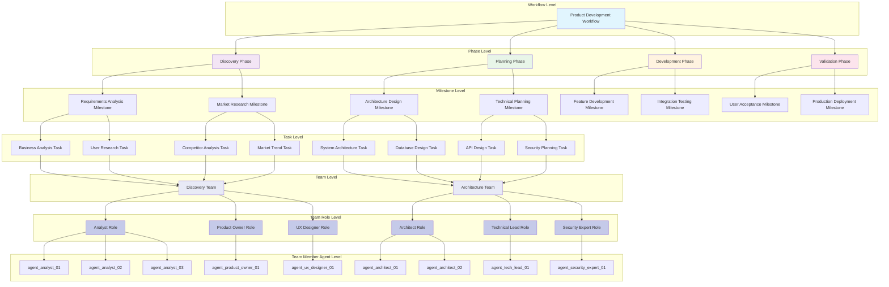

## 🔄 Discovery Phase协同流程

### **1. Discovery Phase整体流程**
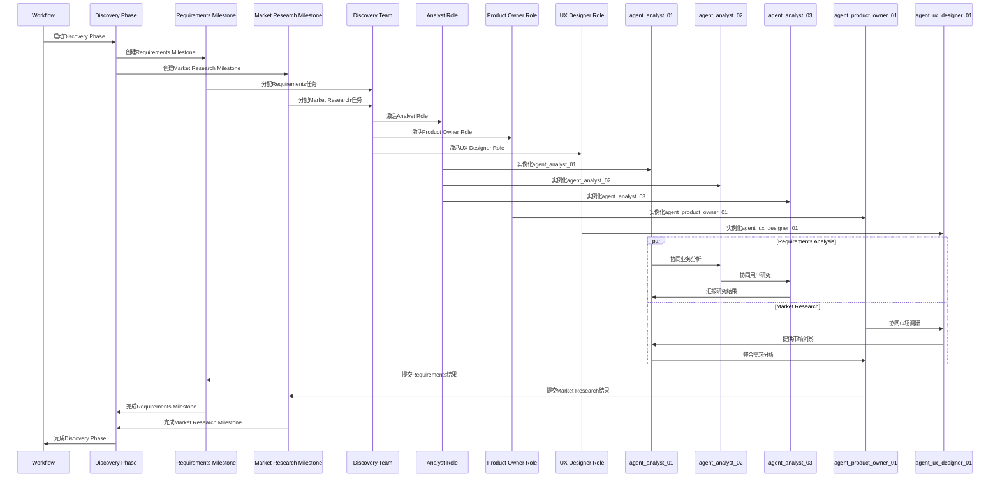

### **2. Team Role内部协同**
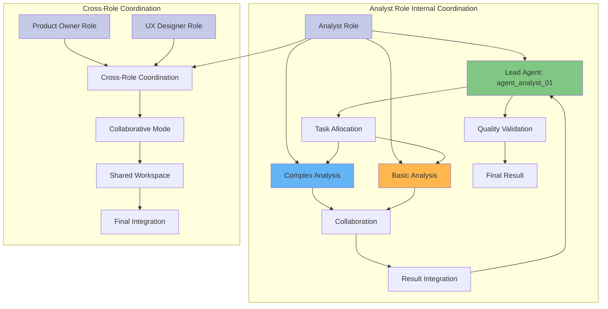

## 🏗️ Architecture Phase协同流程

### **1. Architecture Phase整体流程**
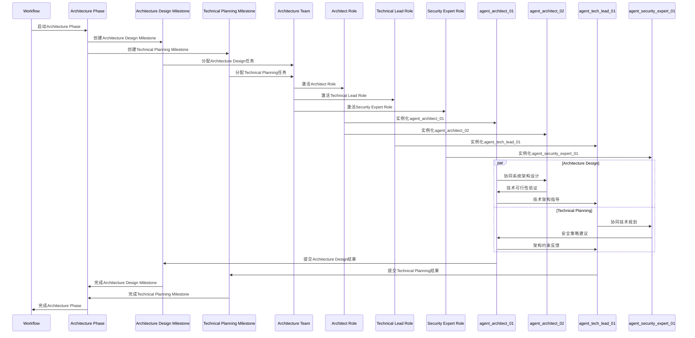

### **2. Architecture Team内部协同**
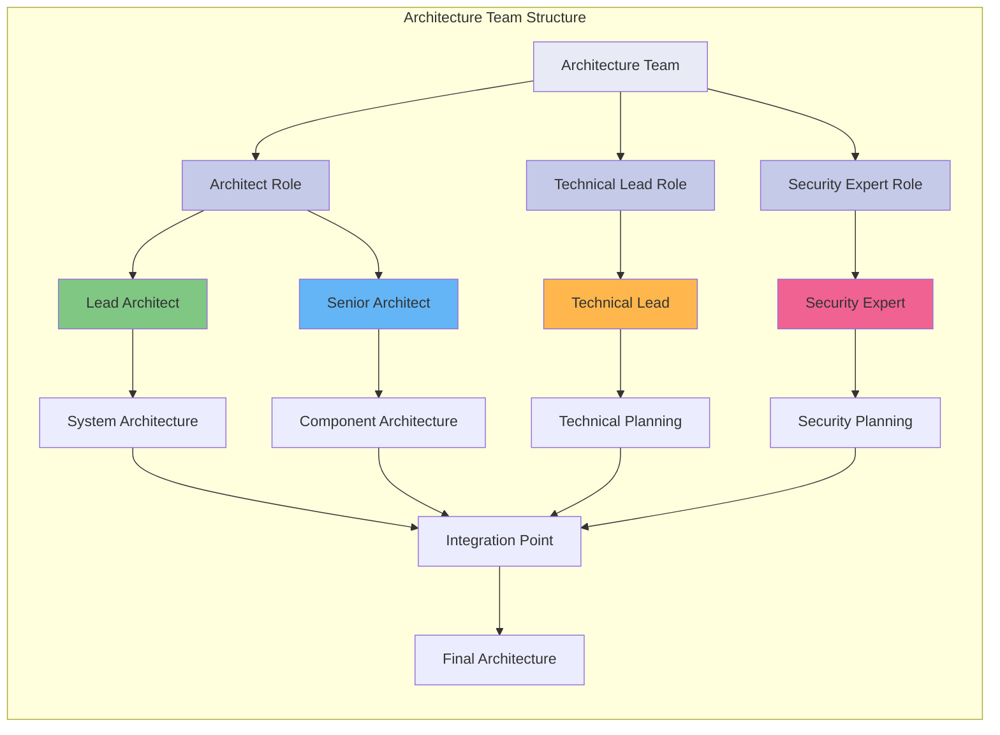

## 🔄 Development Phase协同流程

### **1. Development Phase整体流程**
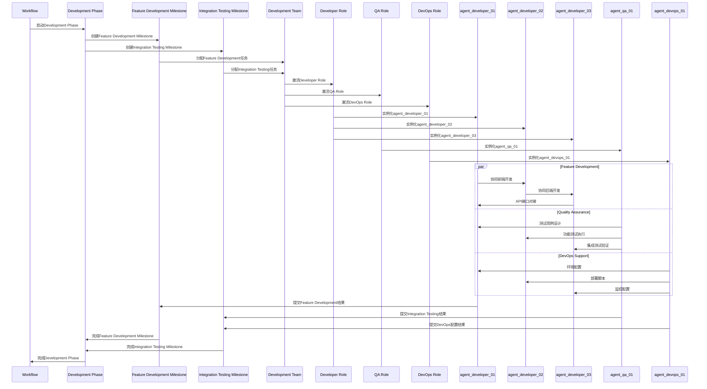

### **2. Development Team专业化分工**
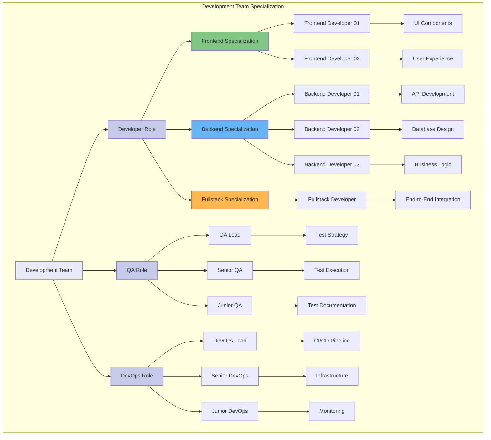

## 🎯 Validation Phase协同流程

### **1. Validation Phase整体流程**
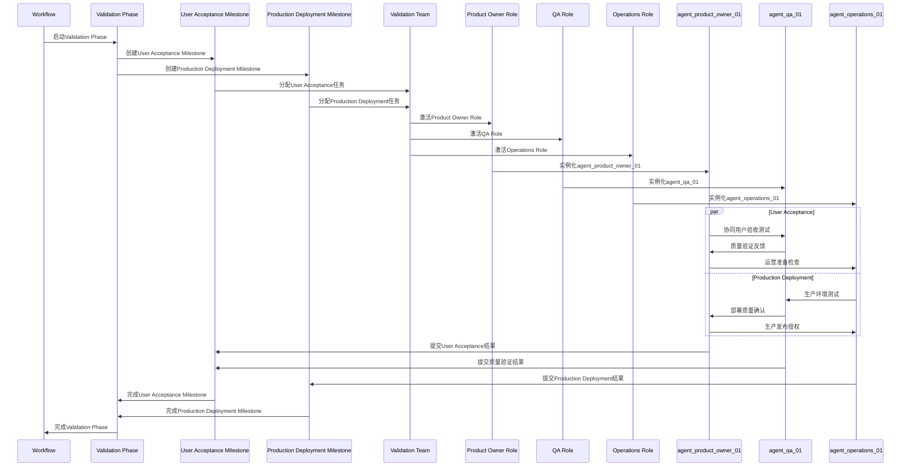

### **2. Validation Team质量保证**
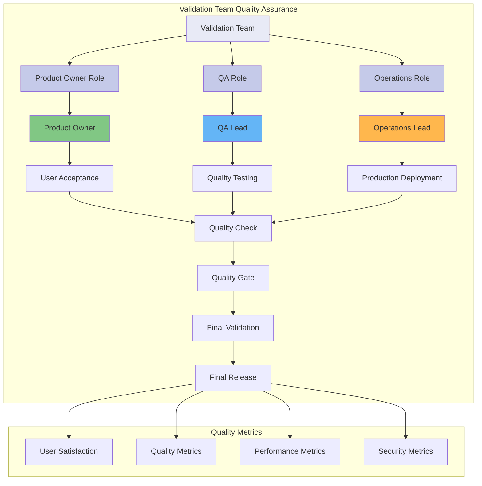

## 🔄 跨Phase协同流程

### **1. Phase间协同**
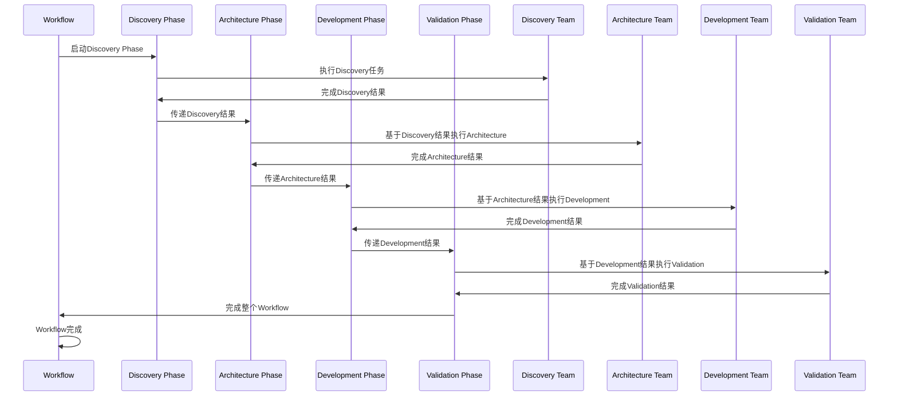

### **2. 跨Phase数据流**
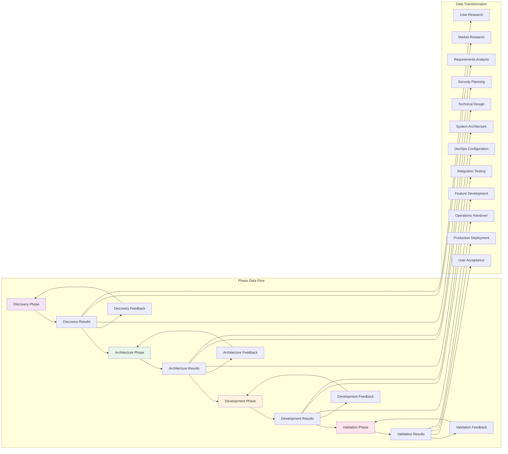

## 📊 智能协调机制

### **1. 智能协调器架构**
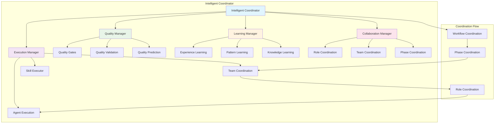

### **2. 协同决策流程**
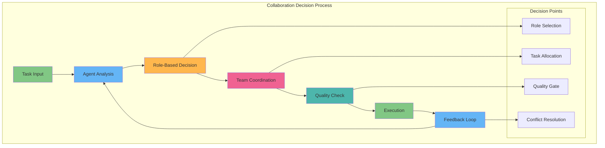

## 🎯 总结

### **完整协同流程特点**
- ✅ **层级清晰**: Workflow -> Phase -> Milestone -> Task -> Team -> Role -> Agent
- ✅ **角色分工**: 每个Role都有明确的职责和协同模式
- ✅ **多Agent协作**: 同一Role可以有多个Agent实例协同工作
- ✅ **跨Phase协同**: Phase之间有清晰的数据流和协同机制
- ✅ **智能协调**: 智能协调器管理整个协同流程
- ✅ **质量保证**: 每个层级都有质量保证机制

### **协同优势**
- 🎯 **结构化**: 完全结构化的协同流程
- 🎯 **可扩展**: 可以无限扩展团队和角色
- 🎯 **智能化**: 基于AI的智能协同决策
- 🎯 **质量保证**: 全方位的质量保证机制
- 🎯 **灵活性**: 支持动态调整和优化

---

**这个协同工作流程完全基于我们的架构设计，展示了从Workflow到Agent的完整协同机制！** 🚀
