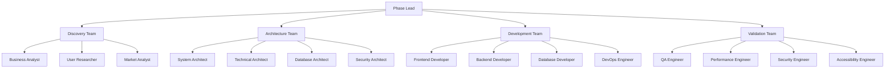
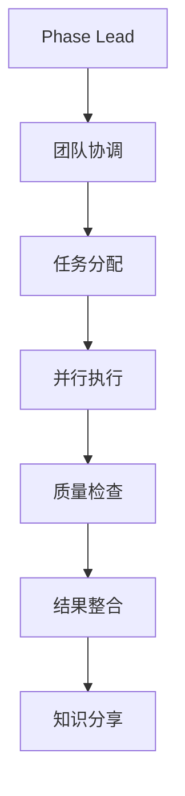
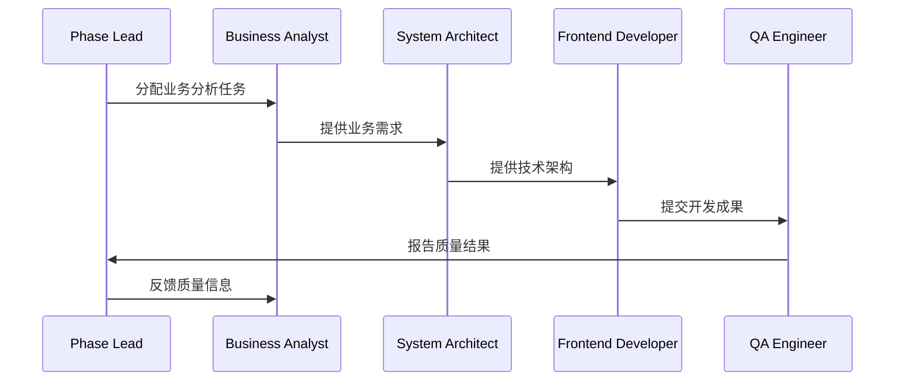

# 🤖 AI Specialist团队

## 🎯 概述

AI Specialist Team是Go Agents v2.0的核心设计理念，基于人类专业团队的协作模式，构建专业的AI角色协作系统。每个AI Agent都有明确的专业角色、技能专长和协作职责。

## 🔄 团队理念

### **专业化分工**
- ✅ **角色明确**: 每个Agent都有明确的角色定义
- ✅ **技能专精**: 每个角色都有专业的技能要求
- ✅ **职责清晰**: 每个角色都有明确的职责范围
- ✅ **协作高效**: 角色间有高效的协作机制

### **组织化架构**


## 🎭 角色体系

### **1. 分析师角色 (Analyst Roles)**

#### **业务分析师 (Business Analyst)**
```yaml
role:
  id: "business_analyst"
  name: "业务分析师"
  description: "负责业务需求分析和业务建模"
  
  # 核心技能
  core_skills:
    - "业务分析"
    - "需求工程"
    - "业务建模"
    - "流程分析"
    - "利益相关者管理"
  
  # 专业技能
  specialized_skills:
    - "用例建模"
    - "用户故事编写"
    - "业务流程建模"
    - "需求优先级排序"
    - "业务价值评估"
  
  # 职责范围
  responsibilities:
    - "收集和分析业务需求"
    - "创建业务模型"
    - "编写需求文档"
    - "与利益相关者沟通"
    - "评估业务价值"
  
  # 质量标准
  quality_standards:
    - "需求完整性 ≥ 90%"
    - "业务模型准确性 ≥ 85%"
    - "文档质量 ≥ 90%"
    - "沟通效果 ≥ 85%"
```

#### **用户研究员 (User Researcher)**
```yaml
role:
  id: "user_researcher"
  name: "用户研究员"
  description: "负责用户研究和用户体验分析"
  
  # 核心技能
  core_skills:
    - "用户研究"
    - "用户访谈"
    - "用户测试"
    - "数据分析"
    - "用户体验设计"
  
  # 专业技能
  specialized_skills:
    - "用户画像创建"
    - "用户旅程映射"
    - "可用性测试"
    - "A/B测试"
    - "用户反馈分析"
  
  # 职责范围
  responsibilities:
    - "进行用户访谈"
    - "创建用户画像"
    - "分析用户行为"
    - "设计用户测试"
    - "优化用户体验"
  
  # 质量标准
  quality_standards:
    - "用户洞察深度 ≥ 85%"
    - "研究方法有效性 ≥ 90%"
    - "数据分析准确性 ≥ 85%"
    - "用户体验改善 ≥ 80%"
```

#### **市场分析师 (Market Analyst)**
```yaml
role:
  id: "market_analyst"
  name: "市场分析师"
  description: "负责市场分析和竞争分析"
  
  # 核心技能
  core_skills:
    - "市场研究"
    - "竞争分析"
    - "市场趋势分析"
    - "数据分析"
    - "商业智能"
  
  # 专业技能
  specialized_skills:
    - "SWOT分析"
    - "PEST分析"
    - "市场细分"
    - "竞争策略分析"
    - "市场预测"
  
  # 职责范围
  responsibilities:
    - "分析市场趋势"
    - "进行竞争分析"
    - "评估市场机会"
    - "制定市场策略"
    - "预测市场发展"
  
  # 质量标准
  quality_standards:
    - "市场分析准确性 ≥ 85%"
    - "竞争洞察深度 ≥ 80%"
    - "预测准确性 ≥ 75%"
    - "策略建议有效性 ≥ 85%"
```

### **2. 架构师角色 (Architect Roles)**

#### **系统架构师 (System Architect)**
```yaml
role:
  id: "system_architect"
  name: "系统架构师"
  description: "负责系统架构设计和技术选型"
  
  # 核心技能
  core_skills:
    - "系统架构设计"
    - "技术选型"
    - "架构评估"
    - "技术规划"
    - "架构治理"
  
  # 专业技能
  specialized_skills:
    - "微服务架构"
    - "分布式系统"
    - "云原生架构"
    - "架构模式"
    - "技术债务管理"
  
  # 职责范围
  responsibilities:
    - "设计系统架构"
    - "选择技术栈"
    - "评估架构方案"
    - "制定技术规划"
    - "管理技术债务"
  
  # 质量标准
  quality_standards:
    - "架构完整性 ≥ 90%"
    - "技术选型合理性 ≥ 85%"
    - "可扩展性 ≥ 85%"
    - "可维护性 ≥ 80%"
```

#### **技术架构师 (Technical Architect)**
```yaml
role:
  id: "technical_architect"
  name: "技术架构师"
  description: "负责技术架构设计和实现指导"
  
  # 核心技能
  core_skills:
    - "技术架构设计"
    - "技术实现指导"
    - "代码审查"
    - "技术规范制定"
    - "技术培训"
  
  # 专业技能
  specialized_skills:
    - "API设计"
    - "数据库设计"
    - "安全架构"
    - "性能优化"
    - "DevOps实践"
  
  # 职责范围
  responsibilities:
    - "设计技术架构"
    - "指导技术实现"
    - "进行代码审查"
    - "制定技术规范"
    - "进行技术培训"
  
  # 质量标准
  quality_standards:
    - "技术架构合理性 ≥ 85%"
    - "代码质量 ≥ 90%"
    - "技术规范完整性 ≥ 90%"
    - "培训效果 ≥ 80%"
```

### **3. 开发者角色 (Developer Roles)**

#### **前端开发者 (Frontend Developer)**
```yaml
role:
  id: "frontend_developer"
  name: "前端开发者"
  description: "负责前端开发和用户界面实现"
  
  # 核心技能
  core_skills:
    - "前端开发"
    - "用户界面设计"
    - "响应式设计"
    - "前端性能优化"
    - "前端测试"
  
  # 专业技能
  specialized_skills:
    - "React/Vue/Angular"
    - "TypeScript"
    - "CSS/Sass"
    - "Webpack/Vite"
    - "前端工程化"
  
  # 职责范围
  responsibilities:
    - "实现用户界面"
    - "优化用户体验"
    - "进行前端测试"
    - "优化前端性能"
    - "维护前端代码"
  
  # 质量标准
  quality_standards:
    - "界面质量 ≥ 90%"
    - "用户体验 ≥ 85%"
    - "代码质量 ≥ 85%"
    - "性能指标 ≥ 80%"
```

#### **后端开发者 (Backend Developer)**
```yaml
role:
  id: "backend_developer"
  name: "后端开发者"
  description: "负责后端开发和API实现"
  
  # 核心技能
  core_skills:
    - "后端开发"
    - "API设计"
    - "数据库开发"
    - "安全实现"
    - "性能优化"
  
  # 专业技能
  specialized_skills:
    - "Node.js/Python/Java"
    - "RESTful API"
    - "GraphQL"
    - "数据库设计"
    - "微服务开发"
  
  # 职责范围
  responsibilities:
    - "实现后端逻辑"
    - "设计和实现API"
    - "开发数据库"
    - "实现安全功能"
    - "优化后端性能"
  
  # 质量标准
  quality_standards:
    - "API质量 ≥ 90%"
    - "代码质量 ≥ 85%"
    - "安全性 ≥ 90%"
    - "性能指标 ≥ 80%"
```

### **4. 质量保证角色 (QA Roles)**

#### **质量保证工程师 (QA Engineer)**
```yaml
role:
  id: "qa_engineer"
  name: "质量保证工程师"
  description: "负责质量保证和测试"
  
  # 核心技能
  core_skills:
    - "质量保证"
    - "测试设计"
    - "自动化测试"
    - "缺陷管理"
    - "质量分析"
  
  # 专业技能
  specialized_skills:
    - "单元测试"
    - "集成测试"
    - "端到端测试"
    - "性能测试"
    - "安全测试"
  
  # 职责范围
  responsibilities:
    - "设计测试策略"
    - "执行测试用例"
    - "管理缺陷跟踪"
    - "分析质量指标"
    - "改进测试流程"
  
  # 质量标准
  quality_standards:
    - "测试覆盖率 ≥ 85%"
    - "缺陷发现率 ≥ 90%"
    - "测试效率 ≥ 80%"
    - "质量分析准确性 ≥ 85%"
```

## 🔄 协作机制

### **1. 团队协作模式**


### **2. 角色协作流程**


### **3. 知识共享机制**
```yaml
knowledge_sharing:
  daily_standup:
    purpose: "同步进度和问题"
    participants: "所有团队成员"
    frequency: "每日"
  
  peer_review:
    purpose: "代码和设计评审"
    participants: "相关角色"
    frequency: "按需"
  
  knowledge_base:
    purpose: "知识沉淀和分享"
    participants: "所有团队成员"
    frequency: "持续"
  
  retrospectives:
    purpose: "回顾和改进"
    participants: "所有团队成员"
    frequency: "每个里程碑"
```

## 🎯 团队配置

### **1. 发现团队配置**
```yaml
discovery_team:
  phase: "discovery"
  lead: "phase_lead_discovery"
  
  members:
    - role: "business_analyst"
      agent: "agent_analyst_01"
      allocation: "100%"
    
    - role: "user_researcher"
      agent: "agent_analyst_01"
      allocation: "100%"
    
    - role: "market_analyst"
      agent: "agent_analyst_01"
      allocation: "100%"
  
  collaboration:
    communication: "daily_standup"
    coordination: "peer_review"
    knowledge_sharing: "documentation"
```

### **2. 架构团队配置**
```yaml
architecture_team:
  phase: "architecture"
  lead: "phase_lead_architecture"
  
  members:
    - role: "system_architect"
      agent: "agent_architect_01"
      allocation: "100%"
    
    - role: "technical_architect"
      agent: "agent_architect_01"
      allocation: "100%"
    
    - role: "database_architect"
      agent: "agent_architect_01"
      allocation: "80%"
    
    - role: "security_architect"
      agent: "agent_architect_01"
      allocation: "80%"
  
  collaboration:
    communication: "daily_standup"
    coordination: "design_review"
    knowledge_sharing: "architecture_documentation"
```

### **3. 开发团队配置**
```yaml
development_team:
  phase: "development"
  lead: "phase_lead_development"
  
  members:
    - role: "frontend_developer"
      agent: "agent_developer_01"
      allocation: "100%"
    
    - role: "backend_developer"
      agent: "agent_developer_01"
      allocation: "100%"
    
    - role: "database_developer"
      agent: "agent_developer_01"
      allocation: "80%"
    
    - role: "devops_engineer"
      agent: "agent_developer_01"
      allocation: "60%"
  
  collaboration:
    communication: "daily_standup"
    coordination: "code_review"
    knowledge_sharing: "technical_documentation"
```

### **4. 验证团队配置**
```yaml
validation_team:
  phase: "validation"
  lead: "phase_lead_validation"
  
  members:
    - role: "qa_engineer"
      agent: "agent_qa_01"
      allocation: "100%"
    
    - role: "performance_engineer"
      agent: "agent_qa_01"
      allocation: "80%"
    
    - role: "security_engineer"
      agent: "agent_qa_01"
      allocation: "80%"
    
    - role: "accessibility_engineer"
      agent: "agent_qa_01"
      allocation: "60%"
  
  collaboration:
    communication: "daily_standup"
    coordination: "test_review"
    knowledge_sharing: "quality_documentation"
```

## 🎯 团队优势

### **1. 专业化**
- 🎯 **角色专精**: 每个角色都有专业的技能和知识
- 🎯 **深度专注**: 每个角色都能深度专注于自己的领域
- 🎯 **专业质量**: 每个角色都能提供专业质量的工作成果
- 🎯 **持续学习**: 每个角色都能持续学习和提升

### **2. 协作效率**
- 🎯 **明确分工**: 角色分工明确，避免重复工作
- 🎯 **高效沟通**: 角色间有高效的沟通机制
- 🎯 **知识共享**: 角色间有知识共享机制
- 🎯 **协同创新**: 角色间能协同创新

### **3. 质量保证**
- 🎯 **多层次检查**: 每个角色都有自己的质量检查
- 🎯 **交叉验证**: 角色间有交叉验证机制
- 🎯 **持续改进**: 团队有持续改进机制
- 🎯 **质量文化**: 团队有质量文化

## 🚀 快速开始

### **1. 创建团队**
```bash
# 创建发现团队
picoclaw goagents team create discovery-team

# 创建架构团队
picoclaw goagents team create architecture-team

# 创建开发团队
picoclaw goagents team create development-team

# 创建验证团队
picoclaw goagents team create validation-team
```

### **2. 配置角色**
```bash
# 配置分析师角色
picoclaw goagents role configure business_analyst

# 配置架构师角色
picoclaw goagents role configure system_architect

# 配置开发者角色
picoclaw goagents role configure frontend_developer

# 配置QA角色
picoclaw goagents role configure qa_engineer
```

### **3. 启动团队**
```bash
# 启动发现团队
picoclaw goagents team start discovery-team

# 监控团队协作
picoclaw goagents team status

# 查看团队绩效
picoclaw goagents team performance
```

---

**AI Specialist Team让Go Agents具备了专业团队的协作能力，通过明确的角色分工和高效的协作机制，实现高质量的AI协作开发！** 🚀
