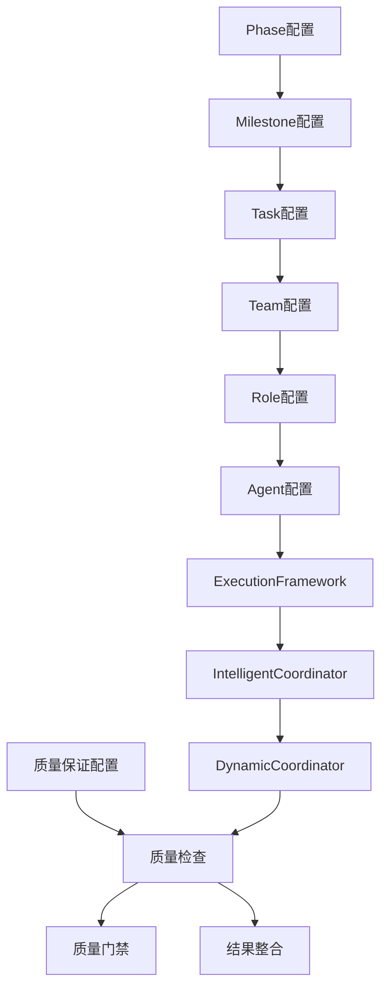
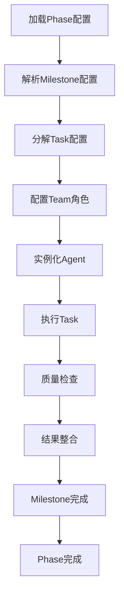
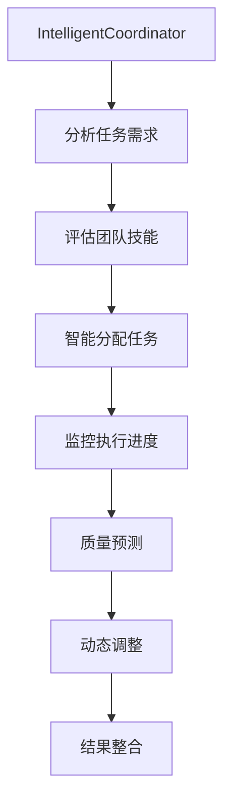

# 🏗️ 配置驱动架构

## 🎯 概述

Go Agents v2.0 采用完全配置驱动的架构设计，通过配置文件驱动整个系统的执行，无需手动编程。这种设计确保了系统的灵活性、可维护性和可扩展性。

## 🔄 架构原理

### **配置驱动理念**
- ✅ **声明式配置**: 通过YAML配置文件声明系统行为
- ✅ **零代码**: 无需编写Go代码即可实现复杂功能
- ✅ **动态执行**: 配置文件动态驱动执行流程
- ✅ **模块化设计**: 每个组件都有独立的配置文件

### **核心组件架构**


## 📁 配置文件结构

### **目录结构**
```
.goagents/
├── config/                    # 核心配置
│   ├── execution-framework.yaml      # 执行框架配置
│   ├── intelligent-coordinator.yaml    # 智能协调器配置
│   └── dynamic-coordinator.yaml       # 动态协调器配置
├── phases/                   # Phase配置
│   ├── discovery-phase.yaml           # 发现阶段配置
│   ├── architecture-phase.yaml         # 架构阶段配置
│   ├── development-phase.yaml         # 开发阶段配置
│   └── validation-phase.yaml          # 验证阶段配置
├── tasks/                    # Task配置
│   ├── business-analysis-task.yaml     # 业务分析任务配置
│   ├── user-research-task.yaml         # 用户研究任务配置
│   ├── market-analysis-task.yaml       # 市场分析任务配置
│   └── task-templates/                # Task模板
│       └── common-task-template.yaml   # 通用任务模板
├── teams/                    # Team配置
│   ├── discovery-team.yaml             # 发现团队配置
│   ├── architecture-team.yaml         # 架构团队配置
│   ├── development-team.yaml          # 开发团队配置
│   └── validation-team.yaml           # 验证团队配置
├── roles/                    # Role配置
│   ├── analyst-role.yaml               # 分析师角色配置
│   ├── architect-role.yaml            # 架构师角色配置
│   ├── developer-role.yaml             # 开发者角色配置
│   └── qa-role.yaml                   # 质量保证角色配置
├── agents/                   # Agent配置
│   ├── agent_analyst_01.yaml           # 分析师Agent实例
│   ├── agent_architect_01.yaml         # 架构师Agent实例
│   ├── agent_developer_01.yaml         # 开发者Agent实例
│   └── agent_qa_01.yaml               # 质量保证Agent实例
├── specialists/              # Specialist配置
│   ├── analyst-specialist.yaml         # 分析师专家配置
│   ├── architect-specialist.yaml       # 架构师专家配置
│   ├── developer-specialist.yaml       # 开发者专家配置
│   └── qa-specialist.yaml             # 质量保证专家配置
└── milestones/               # Milestone配置
    ├── requirements-analysis-milestone.yaml # 需求分析里程碑
    ├── architecture-design-milestone.yaml   # 架构设计里程碑
    └── development-milestone.yaml            # 开发里程碑
```

## 🎯 核心配置文件

### **1. ExecutionFramework配置**
```yaml
# execution-framework.yaml
execution_framework:
  name: "ExecutionFramework"
  description: "执行框架配置"
  
  # HARNESS.md集成
  harness_integration:
    enabled: true
    auto_load: true
    rule_application: "automatic"
  
  # Ralph Wiggum Loop
  ralph_wiggum_loop:
    enabled: true
    quality_checks: true
    feedback_loop: true
  
  # 执行配置
  execution_config:
    parallel_execution: true
    timeout: "30m"
    retry_count: 3
    quality_gates: true
```

### **2. Phase配置**
```yaml
# discovery-phase.yaml
phase:
  id: "discovery"
  name: "发现阶段"
  description: "需求分析、用户研究、市场分析"
  
  # 阶段目标
  objectives:
    - "明确项目需求"
    - "了解用户需求"
    - "分析市场机会"
  
  # Milestone配置
  milestones:
    - id: "requirements-analysis"
      name: "需求分析"
      tasks:
        - "business-analysis"
        - "user-research"
        - "market-analysis"
  
  # Team配置
  team: "discovery-team"
  
  # 执行配置
  execution_config:
    mode: "standard"
    quality_gates: true
    timeline: "2 weeks"
```

### **3. Team配置**
```yaml
# discovery-team.yaml
team:
  id: "discovery-team"
  name: "发现团队"
  description: "负责需求分析、用户研究、市场分析"
  
  # 团队成员
  members:
    - role: "business_analyst"
      agent: "agent_analyst_01"
      responsibilities: ["需求分析", "业务建模"]
    
    - role: "user_researcher"
      agent: "agent_analyst_01"
      responsibilities: ["用户研究", "用户访谈"]
    
    - role: "market_analyst"
      agent: "agent_analyst_01"
      responsibilities: ["市场分析", "竞争分析"]
  
  # 协作配置
  collaboration:
    communication: "daily_standup"
    coordination: "peer_review"
    knowledge_sharing: "documentation"
```

### **4. Task配置**
```yaml
# business-analysis-task.yaml
task:
  id: "business-analysis"
  name: "业务分析"
  description: "分析业务需求，创建业务模型"
  
  # 执行步骤
  execution_steps:
    - step: "requirement_gathering"
      description: "收集业务需求"
      estimated_time: "2h"
      quality_gates: ["completeness_check"]
    
    - step: "business_modeling"
      description: "创建业务模型"
      estimated_time: "3h"
      quality_gates: ["accuracy_check"]
    
    - step: "requirement_documentation"
      description: "编写需求文档"
      estimated_time: "2h"
      quality_gates: ["documentation_quality"]
  
  # 所需技能
  required_skills:
    - "business_analysis"
    - "requirement_engineering"
    - "documentation"
  
  # 输入输出
  inputs:
    - "project_context"
    - "stakeholder_requirements"
  
  outputs:
    - "business_requirements"
    - "use_cases"
    - "business_model"
```

## 🔄 执行流程

### **配置驱动的执行流程**


### **智能协调机制**


## 🎯 配置特性

### **1. 声明式配置**
- ✅ **YAML格式**: 易于阅读和编写
- ✅ **结构化**: 清晰的层次结构
- ✅ **可验证**: 内置验证规则
- ✅ **版本控制**: 支持配置版本管理

### **2. 动态执行**
- ✅ **实时加载**: 配置变更实时生效
- ✅ **热更新**: 无需重启即可更新配置
- ✅ **参数化**: 支持参数化配置
- ✅ **模板化**: 支持配置模板

### **3. 智能协调**
- ✅ **自动分配**: 基于技能自动分配任务
- ✅ **负载均衡**: 智能负载均衡
- ✅ **质量预测**: 基于历史数据预测质量
- ✅ **持续优化**: 基于反馈持续优化

## 🔧 配置管理

### **配置验证**
```yaml
# 配置验证规则
validation_rules:
  - rule: "required_fields"
    fields: ["id", "name", "description"]
    error_message: "缺少必需字段"
  
  - rule: "reference_integrity"
    check: "team_references"
    error_message: "团队引用无效"
  
  - rule: "dependency_check"
    check: "task_dependencies"
    error_message: "任务依赖无效"
```

### **配置更新**
```bash
# 更新配置
picoclaw goagents config update discovery-phase.yaml

# 验证配置
picoclaw goagents config validate

# 重新加载配置
picoclaw goagents config reload
```

## 🎯 优势

### **1. 灵活性**
- 🎯 **无需编程**: 通过配置文件实现所有功能
- 🎯 **动态调整**: 实时调整执行策略
- 🎯 **模块化**: 独立的配置模块
- 🎯 **可扩展**: 易于添加新功能

### **2. 可维护性**
- 🎯 **结构清晰**: 清晰的配置结构
- 🎯 **版本控制**: 配置文件版本管理
- 🎯 **文档化**: 配置即文档
- 🎯 **测试友好**: 易于测试配置

### **3. 可扩展性**
- 🎯 **插件化**: 支持配置插件
- 🎯 **模板化**: 支持配置模板
- 🎯 **自定义**: 支持自定义配置
- 🎯 **集成性**: 易于集成第三方系统

## 🚀 快速开始

### **1. 初始化配置**
```bash
# 初始化配置
picoclaw goagents config init

# 创建Phase配置
picoclaw goagents phase create discovery

# 创建Team配置
picoclaw goagents team create discovery-team
```

### **2. 配置执行**
```bash
# 启动Phase
picoclaw goagents phase start discovery

# 监控执行
picoclaw goagents status

# 检查质量
picoclaw goagents quality check
```

### **3. 配置优化**
```bash
# 分析配置
picoclaw goagents config analyze

# 优化建议
picoclaw goagents config optimize

# 性能调优
picoclaw goagents config tune
```

---

**配置驱动架构让Go Agents变得更加灵活、可维护和可扩展，通过简单的配置文件即可实现复杂的AI协作功能！** 🚀
