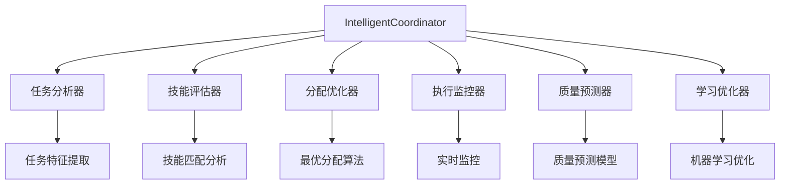
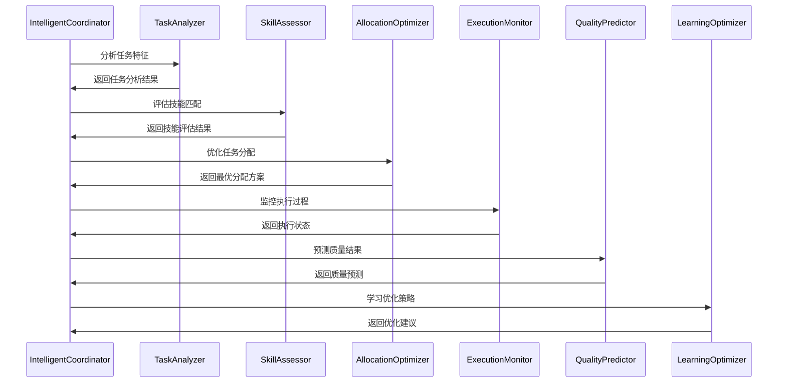
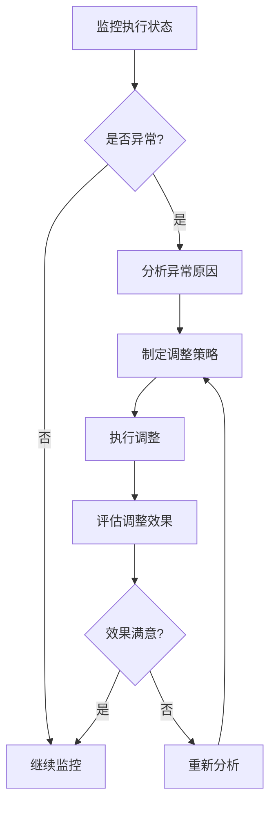

# 🧠 智能协调系统

## 🎯 概述

IntelligentCoordinator是Go Agents v2.0的核心智能协调系统，负责智能任务分配、执行监控、质量预测和持续优化。它基于AI算法和历史数据，实现智能化的团队协作和任务执行。

## 🔄 协调原理

### **智能协调理念**
- ✅ **数据驱动**: 基于历史数据和实时数据进行决策
- ✅ **智能分配**: 根据技能匹配度智能分配任务
- ✅ **动态调整**: 根据执行情况动态调整策略
- ✅ **持续优化**: 基于反馈持续优化协调策略

### **协调架构**


## 🎯 核心功能

### **1. 智能任务分配**

#### **任务分析**
```yaml
task_analysis:
  # 任务特征提取
  feature_extraction:
    - "任务复杂度"
    - "技能要求"
    - "时间预估"
    - "质量标准"
    - "依赖关系"
  
  # 任务分类
  classification:
    categories:
      - "分析类任务"
      - "设计类任务"
      - "开发类任务"
      - "测试类任务"
    
    algorithms:
      - "决策树分类"
      - "随机森林"
      - "支持向量机"
  
  # 难度评估
  difficulty_assessment:
    factors:
      - "技术复杂度"
      - "工作量估算"
      - "质量要求"
      - "时间压力"
    
    scoring:
      simple: "1-3分"
      moderate: "4-6分"
      complex: "7-8分"
      very_complex: "9-10分"
```

#### **技能匹配**
```yaml
skill_matching:
  # 技能矩阵
  skill_matrix:
    business_analyst:
      - "业务分析": 0.9
      - "需求工程": 0.85
      - "流程分析": 0.8
      - "文档编写": 0.9
    
    system_architect:
      - "系统架构": 0.95
      - "技术选型": 0.9
      - "架构评估": 0.85
      - "技术规划": 0.8
    
    frontend_developer:
      - "前端开发": 0.9
      - "UI设计": 0.8
      - "响应式设计": 0.85
      - "前端测试": 0.8
    
    qa_engineer:
      - "质量保证": 0.9
      - "测试设计": 0.85
      - "自动化测试": 0.8
      - "质量分析": 0.85
  
  # 匹配算法
  matching_algorithm:
    method: "加权匹配"
    weights:
      skill_score: 0.4
      availability: 0.3
      workload: 0.2
      performance: 0.1
    
    threshold: 0.7
```

#### **分配优化**
```yaml
allocation_optimization:
  # 优化目标
  objectives:
    - "最大化技能匹配度"
    - "最小化完成时间"
    - "平衡工作负载"
    - "提高质量水平"
  
  # 约束条件
  constraints:
    - "每个Agent同时任务数 ≤ 3"
    - "技能匹配度 ≥ 0.7"
    - "工作负载均衡度 ≥ 0.8"
    - "质量预测值 ≥ 0.8"
  
  # 优化算法
  algorithms:
    - "遗传算法"
    - "模拟退火"
    - "粒子群优化"
    - "贪心算法"
```

### **2. 执行监控**

#### **实时监控**
```yaml
real_time_monitoring:
  # 监控指标
  metrics:
    task_progress:
      - "完成百分比"
      - "剩余时间"
      - "进度偏差"
      - "风险等级"
    
    agent_performance:
      - "工作效率"
      - "质量得分"
      - "协作效果"
      - "学习进步"
    
    team_coordination:
      - "沟通频率"
      - "协作质量"
      - "知识分享"
      - "冲突解决"
  
  # 监控频率
  monitoring_frequency:
    task_level: "每5分钟"
    agent_level: "每15分钟"
    team_level: "每30分钟"
    project_level: "每小时"
  
  # 预警机制
  alert_mechanism:
    triggers:
      - "进度延迟 > 20%"
      - "质量下降 > 15%"
      - "工作负载 > 90%"
      - "协作冲突 > 2次"
    
    actions:
      - "自动通知"
      - "任务重分配"
      - "资源调配"
      - "策略调整"
```

#### **异常处理**
```yaml
exception_handling:
  # 异常类型
  exception_types:
    task_exceptions:
      - "任务阻塞"
      - "质量不达标"
      - "时间超限"
      - "资源不足"
    
    agent_exceptions:
      - "技能不足"
      - "工作过载"
      - "协作冲突"
      - "性能下降"
    
    system_exceptions:
      - "配置错误"
      - "网络故障"
      - "资源耗尽"
      - "服务异常"
  
  # 处理策略
  handling_strategies:
    auto_recovery:
      - "任务重试"
      - "资源重分配"
      - "降级处理"
      - "备用方案"
    
    manual_intervention:
      - "人工审核"
      - "专家支持"
      - "紧急会议"
      - "决策调整"
```

### **3. 质量预测**

#### **预测模型**
```yaml
prediction_models:
  # 质量预测
  quality_prediction:
    features:
      - "任务复杂度"
      - "技能匹配度"
      - "历史表现"
      - "工作负载"
      - "协作效果"
    
    models:
      - "线性回归"
      - "决策树"
      - "神经网络"
      - "随机森林"
    
    accuracy_target: "≥ 85%"
  
  # 时间预测
  time_prediction:
    features:
      - "任务规模"
      - "技能水平"
      - "历史数据"
      - "依赖关系"
      - "干扰因素"
    
    models:
      - "时间序列分析"
      - "回归分析"
      - "机器学习"
      - "专家系统"
    
    accuracy_target: "≥ 80%"
  
  # 风险预测
  risk_prediction:
    features:
      - "任务难度"
      - "团队经验"
      - "技术风险"
      - "时间压力"
      - "资源约束"
    
    models:
      - "风险评估模型"
      - "概率分析"
      - "决策树"
      - "贝叶斯网络"
    
    accuracy_target: "≥ 75%"
```

#### **预测应用**
```yaml
prediction_application:
  # 预测驱动决策
  decision_making:
    task_assignment:
      - "基于质量预测选择Agent"
      - "基于时间预测规划进度"
      - "基于风险预测制定预案"
    
    resource_allocation:
      - "基于负载预测分配资源"
      - "基于质量预测配置QA"
      - "基于风险预测准备应急"
    
    quality_control:
      - "基于质量预测设置检查点"
      - "基于风险预测增加审查"
      - "基于预测结果调整标准"
  
  # 预测反馈
  feedback_loop:
    data_collection:
      - "实际质量数据"
      - "实际时间数据"
      - "实际风险数据"
      - "实际结果数据"
    
    model_update:
      - "定期重训练模型"
      - "调整模型参数"
      - "优化特征选择"
      - "提高预测精度"
```

### **4. 学习优化**

#### **机器学习**
```yaml
machine_learning:
  # 学习算法
  learning_algorithms:
    supervised_learning:
      - "分类算法"
      - "回归算法"
      - "决策树"
      - "神经网络"
    
    unsupervised_learning:
      - "聚类分析"
      - "关联规则"
      - "降维算法"
      - "异常检测"
    
    reinforcement_learning:
      - "Q学习"
      - "策略梯度"
      - "Actor-Critic"
      - "深度强化学习"
  
  # 学习目标
  learning_objectives:
    - "提高任务分配准确性"
    - "优化执行效率"
    - "提升质量预测精度"
    - "增强风险识别能力"
    - "改进协作效果"
  
  # 学习策略
  learning_strategies:
    online_learning:
      - "实时数据学习"
      - "在线模型更新"
      - "即时反馈调整"
    
    batch_learning:
      - "定期批量训练"
      - "历史数据分析"
      - "模型性能评估"
    
    transfer_learning:
      - "跨项目知识迁移"
      - "预训练模型应用"
      - "领域适应"
```

#### **持续优化**
```yaml
continuous_optimization:
  # 优化维度
  optimization_dimensions:
    process_optimization:
      - "任务分配流程"
      - "协作机制"
      - "质量检查流程"
      - "风险管控流程"
    
    algorithm_optimization:
      - "匹配算法"
      - "预测模型"
      - "优化算法"
      - "学习算法"
    
    resource_optimization:
      - "人力资源分配"
      - "时间资源规划"
      - "质量资源配置"
      - "应急资源准备"
  
  # 优化方法
  optimization_methods:
    automated_optimization:
      - "参数调优"
      - "算法选择"
      - "流程改进"
      - "资源配置"
    
    human_in_the_loop:
      - "专家审核"
      - "经验反馈"
      - "策略调整"
      - "决策支持"
  
  # 优化评估
  optimization_evaluation:
    metrics:
      - "分配准确率"
      - "执行效率"
      - "质量水平"
      - "风险控制"
      - "团队满意度"
    
    benchmarks:
      - "历史最佳表现"
      - "行业标准"
      - "竞争对手"
      - "理论最优"
```

## 🔄 协调流程

### **智能协调流程**


### **动态调整流程**


## 🎯 技术实现

### **算法实现**
```go
// 智能分配算法
func (ic *IntelligentCoordinator) IntelligentAllocation(tasks []Task, agents []Agent) AllocationResult {
    // 1. 任务分析
    taskFeatures := ic.analyzeTasks(tasks)
    
    // 2. 技能评估
    skillMatrix := ic.assessSkills(agents)
    
    // 3. 匹配计算
    matchScores := ic.calculateMatches(taskFeatures, skillMatrix)
    
    // 4. 优化分配
    optimalAllocation := ic.optimizeAllocation(matchScores, agents)
    
    // 5. 质量预测
    qualityPredictions := ic.predictQuality(optimalAllocation)
    
    return AllocationResult{
        Allocation: optimalAllocation,
        QualityPredictions: qualityPredictions,
        Confidence: ic.calculateConfidence(),
    }
}

// 质量预测模型
func (ic *IntelligentCoordinator) PredictQuality(task Task, agent Agent) QualityPrediction {
    features := ic.extractFeatures(task, agent)
    prediction := ic.qualityModel.Predict(features)
    return QualityPrediction{
        Score: prediction.Score,
        Confidence: prediction.Confidence,
        RiskFactors: prediction.RiskFactors,
    }
}
```

### **配置文件**
```yaml
# intelligent-coordinator.yaml
intelligent_coordinator:
  name: "IntelligentCoordinator"
  description: "智能协调系统配置"
  
  # 算法配置
  algorithms:
    task_analysis:
      model: "ensemble"
      features: ["complexity", "skills", "time", "quality"]
    
    skill_matching:
      method: "weighted_matching"
      weights: {"skill": 0.4, "availability": 0.3, "workload": 0.2, "performance": 0.1}
    
    allocation_optimization:
      algorithm: "genetic_algorithm"
      population_size: 100
      generations: 50
      mutation_rate: 0.1
  
  # 监控配置
  monitoring:
    real_time: true
    interval: "5m"
    alerts: true
    auto_recovery: true
  
  # 学习配置
  learning:
    enabled: true
    algorithm: "reinforcement_learning"
    update_frequency: "daily"
    model_retention: "30d"
```

## 🎯 协调优势

### **1. 智能化**
- 🎯 **数据驱动**: 基于数据进行智能决策
- 🎯 **自适应**: 根据情况自动调整策略
- 🎯 **预测能力**: 能够预测执行结果
- 🎯 **学习能力**: 持续学习和改进

### **2. 效率提升**
- 🎯 **最优分配**: 找到最优的任务分配方案
- 🎯 **动态调整**: 实时调整执行策略
- 🎯 **资源优化**: 优化资源配置
- 🎯 **时间节省**: 减少人工协调时间

### **3. 质量保证**
- 🎯 **质量预测**: 预测任务质量
- 🎯 **风险控制**: 识别和控制风险
- 🎯 **持续改进**: 持续改进协调策略
- 🎯 **标准化**: 标准化协调流程

## 🚀 快速开始

### **1. 启用智能协调**
```bash
# 启用智能协调器
picoclaw goagents coordinator enable

# 配置协调参数
picoclaw goagents coordinator config

# 启动协调服务
picoclaw goagents coordinator start
```

### **2. 监控协调效果**
```bash
# 查看协调状态
picoclaw goagents coordinator status

# 查看分配结果
picoclaw goagents coordinator allocation

# 查看质量预测
picoclaw goagents coordinator prediction
```

### **3. 优化协调策略**
```bash
# 分析协调效果
picoclaw goagents coordinator analyze

# 优化协调参数
picoclaw goagents coordinator optimize

# 训练协调模型
picoclaw goagents coordinator train
```

---

**IntelligentCoordinator让Go Agents具备了智能协调能力，通过AI算法实现最优的任务分配和执行监控，大大提升了团队协作的效率和质量！** 🚀
