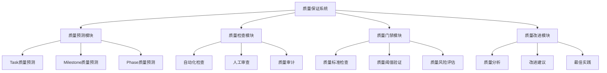
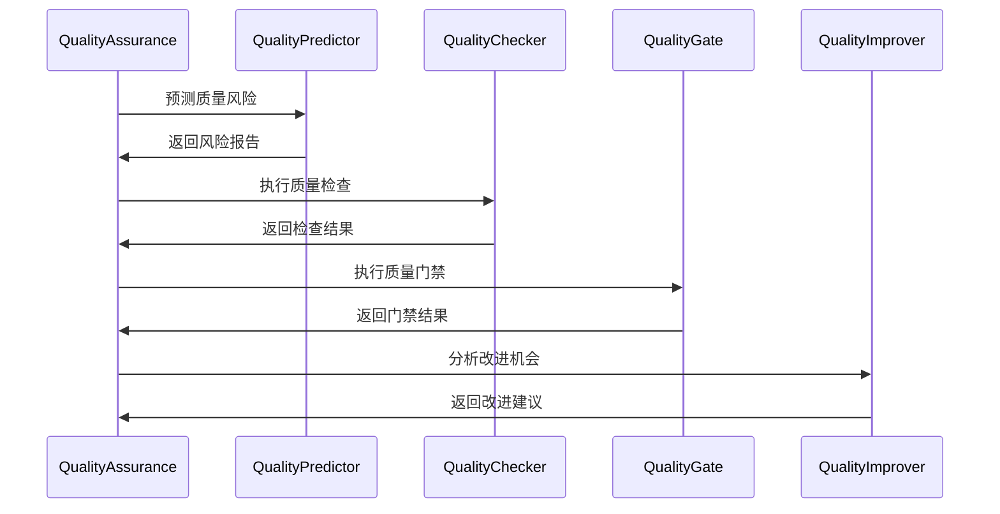
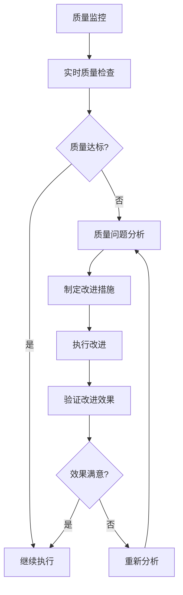

# 🔍 质量保证系统

## 🎯 概述

质量保证系统是Go Agents v2.0的多层次质量检查和保证机制，通过智能质量预测、自动化质量检查、质量门禁和持续改进，确保整个项目执行过程的高质量输出。

## 🔄 质量保证理念

### **多层次质量保证**
- ✅ **Task级别**: 单个任务的质量检查和保证
- ✅ **Milestone级别**: 里程碑级别的质量整合和验证
- ✅ **Phase级别**: 阶段级别的整体质量评估
- ✅ **Project级别**: 项目级别的最终质量验收

### **质量保证架构**


## 🎯 质量标准体系

### **1. Task质量标准**

#### **通用质量标准**
```yaml
task_quality_standards:
  # 完整性标准
  completeness:
    requirement_coverage: "≥ 95%"
    deliverable_completeness: "≥ 90%"
    documentation_completeness: "≥ 85%"
    
  # 准确性标准
  accuracy:
    technical_accuracy: "≥ 90%"
    business_logic_accuracy: "≥ 95%"
    data_accuracy: "≥ 98%"
    
  # 可执行性标准
  executability:
    code_compilation: "100%"
    test_execution: "≥ 95%"
    deployment_success: "≥ 90%"
    
  # 可维护性标准
  maintainability:
    code_readability: "≥ 85%"
    modularity: "≥ 80%"
    documentation_quality: "≥ 85%"
```

#### **专业质量标准**
```yaml
specialized_quality_standards:
  # 分析类任务
  analysis_tasks:
    requirement_clarity: "≥ 90%"
    stakeholder_satisfaction: "≥ 85%"
    business_value: "≥ 80%"
    
  # 设计类任务
  design_tasks:
    design_completeness: "≥ 90%"
    technical_feasibility: "≥ 85%"
    scalability: "≥ 80%"
    security_consideration: "≥ 85%"
    
  # 开发类任务
  development_tasks:
    code_quality: "≥ 85%"
    test_coverage: "≥ 80%"
    performance_benchmark: "≥ 80%"
    security_compliance: "≥ 90%"
    
  # 测试类任务
  testing_tasks:
    test_effectiveness: "≥ 85%"
    defect_detection_rate: "≥ 90%"
    test_automation: "≥ 80%"
    quality_reporting: "≥ 85%"
```

### **2. Milestone质量标准**

#### **整合质量标准**
```yaml
milestone_quality_standards:
  # 任务整合质量
  task_integration:
    task_completion_rate: "≥ 95%"
    deliverable_consistency: "≥ 90%"
    integration_success: "≥ 95%"
    
  # 时间质量
  timeline_quality:
    schedule_adherence: "≥ 85%"
    milestone_completion: "≥ 90%"
    delay_tolerance: "≤ 10%"
    
  # 资源质量
  resource_quality:
    resource_utilization: "≥ 80%"
    budget_adherence: "≥ 90%"
    team_satisfaction: "≥ 80%"
    
  # 利益相关者质量
  stakeholder_quality:
    stakeholder_satisfaction: "≥ 85%"
    expectation_alignment: "≥ 90%"
    communication_effectiveness: "≥ 85%"
```

### **3. Phase质量标准**

#### **整体质量标准**
```yaml
phase_quality_standards:
  # 目标达成质量
  objective_achievement:
    objective_completion_rate: "≥ 90%"
    quality_target_met: "≥ 85%"
    business_value_delivered: "≥ 80%"
    
  # 流程质量
  process_quality:
    process_efficiency: "≥ 80%"
    collaboration_effectiveness: "≥ 85%"
    knowledge_sharing: "≥ 80%"
    
  # 输出质量
  output_quality:
    deliverable_quality: "≥ 85%"
    documentation_quality: "≥ 85%"
    knowledge_transfer: "≥ 80%"
    
  # 学习质量
  learning_quality:
    lessons_learned: "≥ 85%"
    process_improvement: "≥ 80%"
    capability_enhancement: "≥ 80%"
```

## 🔍 质量检查机制

### **1. 自动化质量检查**

#### **代码质量检查**
```yaml
code_quality_checks:
  # 静态代码分析
  static_analysis:
    tools:
      - "SonarQube"
      - "ESLint"
      - "PMD"
      - "Checkstyle"
    
    metrics:
      - "代码复杂度"
      - "代码重复率"
      - "代码覆盖率"
      - "安全漏洞"
    
    thresholds:
      complexity: "≤ 10"
      duplication: "≤ 5%"
      coverage: "≥ 80%"
      vulnerabilities: "0"
  
  # 依赖检查
  dependency_checks:
    tools:
      - "OWASP Dependency Check"
      - "Snyk"
      - "WhiteSource"
    
    checks:
      - "安全漏洞"
      - "许可证合规"
      - "版本兼容性"
      - "依赖更新"
```

#### **文档质量检查**
```yaml
documentation_quality_checks:
  # 文档完整性检查
  completeness_check:
    required_sections:
      - "概述"
      - "架构设计"
      - "API文档"
      - "部署指南"
      - "故障排除"
    
    validation_rules:
      - "每个章节都有内容"
      - "图表和代码示例正确"
      - "链接和引用有效"
      - "格式规范一致"
  
  # 文档质量检查
  quality_check:
    readability:
      - "语言简洁明了"
      - "逻辑结构清晰"
      - "术语使用一致"
      - "示例代码可运行"
    
    accuracy:
      - "技术信息准确"
      - "配置参数正确"
      - "命令示例有效"
      - "版本信息最新"
```

#### **测试质量检查**
```yaml
test_quality_checks:
  # 测试覆盖率检查
  coverage_check:
    metrics:
      - "语句覆盖率 ≥ 80%"
      - "分支覆盖率 ≥ 75%"
      - "函数覆盖率 ≥ 85%"
      - "行覆盖率 ≥ 80%"
    
    tools:
      - "Istanbul"
      - "JaCoCo"
      - "Coverage.py"
      - "dotCover"
  
  # 测试有效性检查
  effectiveness_check:
    metrics:
      - "缺陷发现率 ≥ 85%"
      - "测试通过率 ≥ 95%"
      - "测试执行时间 ≤ 5min"
      - "测试稳定性 ≥ 90%"
    
    validation:
      - "测试用例覆盖主要场景"
      - "边界条件测试充分"
      - "异常处理测试完整"
      - "性能测试达标"
```

### **2. 人工质量审查**

#### **同行评审**
```yaml
peer_review:
  # 评审流程
  review_process:
    preparation:
      - "提交评审请求"
      - "准备评审材料"
      - "选择评审人员"
      - "设置评审目标"
    
    execution:
      - "独立评审"
      - "评审会议"
      - "问题讨论"
      - "改进建议"
    
    follow_up:
      - "问题修复"
      - "重新评审"
      - "评审总结"
      - "知识分享"
  
  # 评审标准
  review_criteria:
    technical_quality:
      - "代码质量"
      - "架构设计"
      - "性能考虑"
      - "安全考虑"
    
    functional_quality:
      - "需求满足"
      - "功能完整性"
      - "用户体验"
      - "边界条件"
    
    maintainability:
      - "代码可读性"
      - "模块化程度"
      - "文档完整性"
      - "测试覆盖"
```

#### **专家审查**
```yaml
expert_review:
  # 专家类型
  expert_types:
    domain_expert:
      focus: "业务逻辑和需求满足"
      criteria: "业务价值、用户需求、流程优化"
    
    technical_expert:
      focus: "技术实现和架构设计"
      criteria: "技术可行性、架构合理性、性能优化"
    
    security_expert:
      focus: "安全性和合规性"
      criteria: "安全漏洞、合规要求、风险评估"
    
    usability_expert:
      focus: "用户体验和可用性"
      criteria: "用户友好性、易用性、无障碍性"
  
  # 审查方法
  review_methods:
    structured_review:
      - "检查清单评审"
      - "场景化测试"
      - "原型验证"
      - "用户测试"
    
    exploratory_review:
      - "自由探索测试"
      - "边界条件测试"
      - "异常场景测试"
      - "压力测试"
```

## 🚪 质量门禁

### **1. Task质量门禁**

#### **门禁配置**
```yaml
task_quality_gates:
  # 必须通过的检查
  mandatory_checks:
    code_quality:
      enabled: true
      threshold: "≥ 80%"
      block_on_failure: true
    
    test_coverage:
      enabled: true
      threshold: "≥ 80%"
      block_on_failure: true
    
    documentation:
      enabled: true
      threshold: "≥ 85%"
      block_on_failure: true
  
  # 警告检查
  warning_checks:
    performance:
      enabled: true
      threshold: "≥ 75%"
      block_on_failure: false
    
    security:
      enabled: true
      threshold: "≥ 85%"
      block_on_failure: false
  
  # 门禁策略
  gate_strategy:
    strict_mode: true
    exception_handling: "manual_approval"
    escalation_policy: "team_lead_approval"
```

#### **门禁执行**
```yaml
gate_execution:
  # 执行时机
  execution_triggers:
    - "任务提交时"
    - "代码合并时"
    - "发布前"
    - "里程碑完成时"
  
  # 执行流程
  execution_flow:
    1. "触发质量检查"
    2. "执行自动化检查"
    3. "生成检查报告"
    4. "评估检查结果"
    5. "执行门禁决策"
    6. "记录门禁结果"
  
  # 异常处理
  exception_handling:
    auto_retry: true
    retry_count: 3
    manual_review: true
    escalation: true
```

### **2. Milestone质量门禁**

#### **里程碑门禁**
```yaml
milestone_quality_gates:
  # 任务完成门禁
  task_completion_gate:
    completion_rate: "≥ 95%"
    quality_score: "≥ 85%"
    documentation: "≥ 90%"
    
  # 时间门禁
  timeline_gate:
    schedule_adherence: "≥ 85%"
    delay_tolerance: "≤ 10%"
    buffer_utilization: "≤ 50%"
    
  # 质量门禁
  quality_gate:
    overall_quality: "≥ 85%"
    defect_rate: "≤ 5%"
    stakeholder_satisfaction: "≥ 80%"
    
  # 集成门禁
  integration_gate:
    integration_success: "≥ 95%"
    system_stability: "≥ 90%"
    performance_benchmark: "≥ 80%"
```

### **3. Phase质量门禁**

#### **阶段门禁**
```yaml
phase_quality_gates:
  # 目标达成门禁
  objective_gate:
    objective_completion: "≥ 90%"
    quality_target_met: "≥ 85%"
    business_value: "≥ 80%"
    
  # 流程门禁
  process_gate:
    process_efficiency: "≥ 80%"
    collaboration_effectiveness: "≥ 85%"
    knowledge_sharing: "≥ 80%"
    
  # 输出门禁
  output_gate:
    deliverable_quality: "≥ 85%"
    documentation_quality: "≥ 85%"
    knowledge_transfer: "≥ 80%"
    
  # 学习门禁
  learning_gate:
    lessons_learned: "≥ 85%"
    process_improvement: "≥ 80%"
    capability_enhancement: "≥ 80%"
```

## 📈 质量改进

### **1. 质量分析**

#### **质量指标分析**
```yaml
quality_metrics_analysis:
  # 质量趋势分析
  trend_analysis:
    metrics:
      - "质量得分趋势"
      - "缺陷率趋势"
      - "返工率趋势"
      - "客户满意度趋势"
    
    analysis_methods:
      - "时间序列分析"
      - "趋势预测"
      - "异常检测"
      - "相关性分析"
  
  # 质量根因分析
  root_cause_analysis:
    techniques:
      - "鱼骨图分析"
      - "5Why分析"
      - "帕累托分析"
      - "故障树分析"
    
    focus_areas:
      - "人员因素"
      - "流程因素"
      - "技术因素"
      - "环境因素"
  
  # 质量对比分析
  comparative_analysis:
    benchmarks:
      - "历史最佳"
      - "行业标准"
      - "竞争对手"
      - "理论最优"
    
    comparison_metrics:
      - "质量水平"
      - "效率指标"
      - "成本效益"
      - "客户满意度"
```

#### **质量预测分析**
```yaml
quality_prediction_analysis:
  # 预测模型
  prediction_models:
    quality_prediction:
      features:
        - "任务复杂度"
        - "技能匹配度"
        - "历史表现"
        - "工作负载"
        - "协作效果"
      
      models:
        - "线性回归"
        - "决策树"
        - "神经网络"
        - "随机森林"
      
      accuracy_target: "≥ 85%"
    
    risk_prediction:
      features:
        - "质量历史"
        - "团队经验"
        - "技术风险"
        - "时间压力"
        - "资源约束"
      
      models:
        - "风险评估模型"
        - "概率分析"
        - "决策树"
        - "贝叶斯网络"
      
      accuracy_target: "≥ 75%"
```

### **2. 改进措施**

#### **流程改进**
```yaml
process_improvement:
  # 改进识别
  improvement_identification:
    sources:
      - "质量检查结果"
      - "团队反馈"
      - "客户反馈"
      - "最佳实践研究"
    
    methods:
      - "流程分析"
      - "瓶颈识别"
      - "效率分析"
      - "价值流分析"
  
  # 改进实施
  improvement_implementation:
    prioritization:
      - "影响程度"
      - "实施难度"
      - "成本效益"
      - "时间紧迫性"
    
    execution:
      - "试点实施"
      - "效果评估"
      - "全面推广"
      - "持续监控"
  
  # 改进验证
  improvement_validation:
    metrics:
      - "质量指标改善"
      - "效率提升"
      - "成本降低"
      - "满意度提升"
    
    validation_methods:
      - "前后对比"
      - "统计分析"
      - "用户反馈"
      - "专家评估"
```

#### **能力提升**
```yaml
capability_improvement:
  # 技能提升
  skill_enhancement:
    training_programs:
      - "技术培训"
      - "质量培训"
      - "流程培训"
      - "工具培训"
    
    learning_methods:
      - "在线课程"
      - "工作坊"
      - "导师制"
      - "实践项目"
  
  # 工具改进
  tool_improvement:
    tool_evaluation:
      - "功能评估"
      - "性能评估"
      - "易用性评估"
      - "成本效益评估"
    
    tool_optimization:
      - "配置优化"
      - "集成优化"
      - "自动化优化"
      - "使用培训"
  
  # 文化建设
  culture_development:
    quality_culture:
      - "质量意识培养"
      - "质量责任明确"
      - "质量激励机制"
      - "质量分享机制"
    
    continuous_improvement:
      - "改进意识培养"
      - "创新鼓励"
      - "知识分享"
      - "最佳实践推广"
```

## 🔄 质量保证流程

### **质量保证流程**


### **质量监控流程**


## 🎯 质量保证优势

### **1. 全面性**
- 🎯 **多层次**: Task、Milestone、Phase、Project多层次覆盖
- 🎯 **全流程**: 从需求到交付的全流程质量保证
- 🎯 **全方位**: 技术、流程、人员全方位质量关注
- 🎯 **全周期**: 项目全生命周期的质量跟踪

### **2. 智能化**
- 🎯 **智能预测**: 基于AI的质量风险预测
- 🎯 **自动检查**: 自动化的质量检查和验证
- 🎯 **智能分析**: 智能的质量分析和改进建议
- 🎯 **持续学习**: 持续学习和优化的质量模型

### **3. 实效性**
- 🎯 **实时监控**: 实时的质量监控和预警
- 🎯 **快速反馈**: 快速的质量反馈和改进
- 🎯 **有效改进**: 针对性的质量改进措施
- 🎯 **持续提升**: 持续的质量提升和优化

## 🚀 快速开始

### **1. 配置质量保证**
```bash
# 启用质量保证
picoclaw goagents quality enable

# 配置质量标准
picoclaw goagents quality standards

# 设置质量门禁
picoclaw goagents quality gates
```

### **2. 执行质量检查**
```bash
# 执行质量检查
picoclaw goagents quality check

# 查看质量报告
picoclaw goagents quality report

# 监控质量状态
picoclaw goagents quality monitor
```

### **3. 改进质量**
```bash
# 分析质量问题
picoclaw goagents quality analyze

# 制定改进计划
picoclaw goagents quality improve

# 验证改进效果
picoclaw goagents quality validate
```

---

**质量保证系统让Go Agents具备了企业级的质量管控能力，通过多层次的质量检查和智能化的质量预测，确保项目的高质量交付！** 🚀
