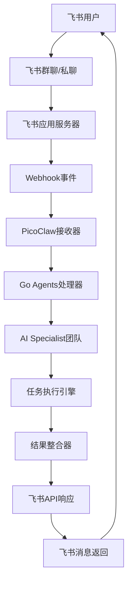
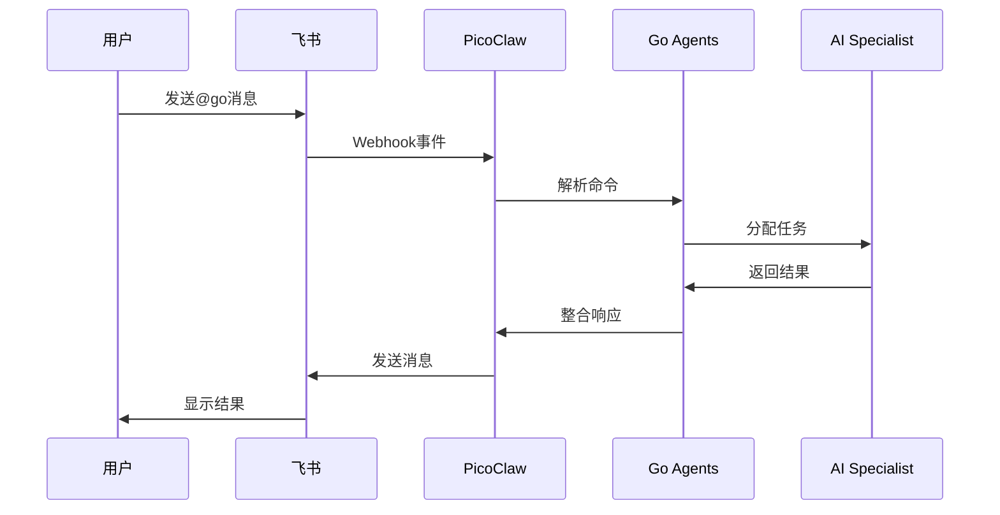

# 📱 飞书集成指南

## 🎯 概述

飞书（Lark）是字节跳动旗下的企业协作平台，通过事件驱动的Webhook机制，Go Agents v2.0可以深度集成到飞书中，让用户在熟悉的协作环境中直接使用AI协作开发能力。

## 🏗️ 集成架构

### 整体架构图


### 消息流程


## 🚀 快速开始

### 1. 创建飞书应用

#### 步骤1：注册应用
```bash
# 1. 访问飞书开放平台
# https://open.feishu.cn/

# 2. 登录并创建应用
# 应用类型：企业自建应用
# 应用名称：Go Agents Assistant
# 应用描述：AI协作开发助手
# 应用图标：上传Go Agents图标
```

#### 步骤2：获取应用凭证
```bash
# 获取应用信息
App ID: cli_xxxxxxxxxxxxxxxx
App Secret: xxxxxxxxxxxxxxxxxxxxxxxxxxxxxxxx

# 记录这些信息，后续配置需要使用
```

### 2. 配置应用权限

#### 基础权限配置
```yaml
# 在飞书开放平台 > 权限管理中配置以下权限
required_permissions:
  # 消息权限
  message_permissions:
    - permission: "im:message"
      description: "发送消息权限"
      required: true
    
    - permission: "im:message.group_at"
      description: "群聊@消息权限"
      required: true
    
    - permission: "im:message.group_at:readonly"
      description: "读取群聊@消息权限"
      required: true
  
  # 用户权限
  user_permissions:
    - permission: "contact:user.base:readonly"
      description: "读取用户基本信息"
      required: true
    
    - permission: "contact:user.email:readonly"
      description: "读取用户邮箱"
      required: false
```

#### 高级权限配置（可选）
```yaml
advanced_permissions:
  # 云盘权限
  drive_permissions:
    - permission: "drive:drive"
      description: "云盘权限"
      required: false
    
    - permission: "drive:file"
      description: "文件权限"
      required: false
  
  # 知识库权限
  wiki_permissions:
    - permission: "wiki:wiki"
      description: "知识库权限"
      required: false
```

### 3. 配置事件订阅

#### 事件订阅配置
```yaml
# 在飞书开放平台 > 事件订阅中配置
event_subscriptions:
  # 请求网址
  request_url: "https://your-domain.com/webhook/feishu"
  
  # 订阅事件
  events:
    # 消息事件
    message_events:
      - event: "im.message.receive_v1"
        description: "接收消息事件"
        required: true
    
    # 群聊事件
    group_events:
      - event: "im.chat.member.user.added_v1"
        description: "用户加入群聊事件"
        required: false
      
      - event: "im.chat.member.user.deleted_v1"
        description: "用户离开群聊事件"
        required: false
    
    # 应用事件
    app_events:
      - event: "application.bot.menu_v6"
        description: "应用菜单点击事件"
        required: false
```

#### 加密配置（推荐）
```yaml
encryption_config:
  # 启用加密
  enabled: true
  
  # 加密密钥（飞书自动生成）
  encrypt_key: "xxxxxxxxxxxxxxxxxxxxxxxxxxxxxxxx"
  
  # 验证令牌（自定义）
  verification_token: "your_custom_verification_token"
```

### 4. 配置PicoClaw

#### 创建配置文件
```bash
# 创建PicoClaw配置文件
mkdir -p ~/.picoclaw
cat > ~/.picoclaw/config.json << EOF
{
  "channels": {
    "feishu": {
      "enabled": true,
      "app_id": "cli_xxxxxxxxxxxxxxxx",
      "app_secret": "xxxxxxxxxxxxxxxxxxxxxxxxxxxxx",
      "encrypt_key": "xxxxxxxxxxxxxxxxxxxxxxxxxxxxxxxx",
      "verification_token": "your_custom_verification_token",
      "allow_from": [],
      "random_reaction_emoji": ["🚀", "🎯", "✨", "🔥"],
      "response_format": "markdown"
    }
  },
  "tools": {
    "skills": {
      "enabled": true,
      "registries": {
        "clawhub": {
          "enabled": true,
          "base_url": "https://clawhub.ai",
          "auth_token": ""
        }
      }
    }
  },
  "goagents": {
    "enabled": true,
    "workspace": "/path/to/.goagents",
    "default_mode": "standard",
    "auto_start": true,
    "auto_assemble": true
  }
}
EOF
```

#### Go Agents集成配置
```yaml
# 创建Go Agents配置
mkdir -p ~/.goagents/config

# 飞书集成配置
cat > ~/.goagents/config/feishu-integration.yaml << EOF
feishu_integration:
  # 基础配置
  basic:
    enabled: true
    workspace: "/path/to/.goagents"
    auto_load: true
    
  # 技能配置
  skills:
    enabled:
      - "po-core"
      - "ai-specialist-team"
      - "intelligent-coordinator"
      - "quality-assurance"
    
    auto_install: true
    auto_update: true
    
  # 团队配置
  teams:
    auto_assemble: true
    default_team: "general-team"
    
    role_mapping:
      feishu_admin: "phase_lead"
      feishu_owner: "phase_lead"
      feishu_member: "team_member"
      
  # 消息处理
  message_processing:
    command_prefix: "@go"
    response_format: "markdown"
    include_progress: true
    include_emoji: true
    
  # 安全配置
  security:
    user_whitelist: []
    command_timeout: 300
    max_concurrent_tasks: 5
EOF
```

### 5. 部署和启动

#### 部署方式1：本地部署
```bash
# 1. 安装PicoClaw
curl -sSL https://get.picoclaw.ai | sh

# 2. 安装Go Agents技能
picoclaw skills install po-core
picoclaw skills enable po-core

# 3. 初始化Go Agents
picoclaw goagents config init

# 4. 启动服务
picoclaw start --port 8080

# 5. 配置Webhook
# 在飞书开放平台中设置Webhook URL:
# https://your-domain.com:8080/webhook/feishu
```

#### 部署方式2：Docker部署
```bash
# 1. 创建Dockerfile
cat > Dockerfile << EOF
FROM node:18-alpine

WORKDIR /app

# 安装PicoClaw
RUN curl -sSL https://get.picoclaw.ai | sh

# 复制配置文件
COPY config.json /root/.picoclaw/
COPY goagents/ /root/.goagents/

# 暴露端口
EXPOSE 8080

# 启动命令
CMD ["picoclaw", "start", "--port", "8080"]
EOF

# 2. 构建镜像
docker build -t picoclaw-feishu .

# 3. 运行容器
docker run -d \
  --name picoclaw-feishu \
  -p 8080:8080 \
  -v /path/to/config:/root/.picoclaw \
  -v /path/to/goagents:/root/.goagents \
  picoclaw-feishu
```

#### 部署方式3：云服务部署
```yaml
# 使用云服务商（如阿里云、腾讯云等）
cloud_deployment:
  # 云服务器配置
  server:
    type: "ecs"
    cpu: "2核"
    memory: "4GB"
    disk: "40GB"
    os: "Ubuntu 20.04"
  
  # 网络配置
  network:
    bandwidth: "5Mbps"
    security_group: "web"
    ssl_certificate: true
  
  # 域名配置
  domain:
    name: "goagents.yourdomain.com"
    ssl: true
    cdn: true
```

## 🎯 使用指南

### 基础命令使用

#### 简单任务
```bash
# 在飞书群聊或私聊中直接使用
@go "开发用户登录功能"

# 系统响应：
# 🚀 **Go Agents 启动**
# 
# 正在分析您的需求...
# 
# 📋 **PO任务分析结果**
# 
# **需求**: 开发用户登录功能
# **类型**: 新功能开发
# **复杂度**: 中等 (0.7)
# **推荐模式**: Standard（标准化功能）
# **预估工期**: 3-5天
# 
# **团队配置**:
# - Discovery: business_analyst + user_researcher
# - Architecture: system_architect + technical_architect
# - Development: frontend_developer + backend_developer
# - Validation: qa_engineer + performance_engineer
# 
# 是否开始执行？(回复"是"或"开始")
```

#### 项目状态查询
```bash
# 查看当前项目状态
@go "查看项目状态"

# 查看特定任务状态
@go "查看用户登录功能开发状态"

# 查看团队状态
@go "查看团队状态"
```

### 高级功能使用

#### 模式指定
```bash
# 使用Standard模式
@go --mode=standard "开发电商购物车功能"

# 使用Free模式
@go --mode=free "探索AI推荐系统实现"

# 使用Hybrid模式
@go --mode=hybrid "升级现有系统并添加新功能"
```

#### 团队指定
```bash
# 指定发现团队
@go --team=discovery-team "进行市场分析和用户研究"

# 指定架构团队
@go --team=architecture-team "设计微服务架构"

# 指定开发团队
@go --team=development-team "开发用户管理模块"
```

#### 配置指定
```bash
# 使用电商配置
@go --config=ecommerce "开发商品管理功能"

# 使用金融配置
@go --config=fintech "开发支付系统"

# 使用游戏配置
@go --config=game "开发游戏角色系统"
```

### 交互式对话

#### 需求澄清
```bash
# 用户: @go 我想开发一个网站
# Go Agents: 我来帮您开发网站！为了更好地为您服务，我需要了解一些详细信息：
# 
# 🤔 **需求澄清**
# 
# 1. 网站类型是什么？
#    - 电商网站
#    - 企业官网
#    - 社交平台
#    - 其他（请说明）
# 
# 2. 主要功能有哪些？
#    - 用户注册登录
#    - 商品展示
#    - 在线支付
#    - 其他（请说明）
# 
# 3. 预期完成时间？
#    - 1周内
#    - 2-4周
#    - 1-3个月
#    - 其他（请说明）
# 
# 请回复您的选择，我将为您制定详细的开发计划！
```

#### 进度汇报
```bash
# Go Agents主动汇报进度
# 📊 **项目进度汇报**
# 
# **项目**: 用户登录功能开发
# **当前阶段**: Development (开发阶段)
# **整体进度**: 65%
# 
# **阶段详情**:
# ✅ Discovery (100%) - 需求分析和用户研究完成
# ✅ Architecture (100%) - 系统架构设计完成
# 🔄 Development (65%) - 功能开发进行中
#   ✅ 前端界面开发 (90%)
#   🔄 后端API开发 (60%)
#   ⏳ 数据库开发 (40%)
# ⏳ Validation (0%) - 质量验证待开始
# 
# **预计完成时间**: 2天后
# **质量分数**: 88/100
# 
# 如有疑问，请随时@我！
```

## 🔧 高级配置

### 1. 自定义命令

#### 创建自定义命令
```yaml
# 在Go Agents配置中创建自定义命令
custom_commands:
  # 项目管理命令
  project_management:
    - name: "项目列表"
      command: "@go 项目列表"
      action: "list_projects"
      description: "查看所有项目列表"
    
    - name: "项目详情"
      command: "@go 项目详情 {project_name}"
      action: "project_details"
      description: "查看项目详细信息"
    
    - name: "项目删除"
      command: "@go 删除项目 {project_name}"
      action: "delete_project"
      description: "删除指定项目"
  
  # 团队管理命令
  team_management:
    - name: "团队状态"
      command: "@go 团队状态"
      action: "team_status"
      description: "查看团队状态"
    
    - name: "团队配置"
      command: "@go 团队配置 {team_name}"
      action: "team_config"
      description: "配置团队信息"
```

### 2. 消息格式定制

#### 自定义消息模板
```yaml
# 自定义响应消息格式
message_templates:
  # 成功消息模板
  success_template: |
    ✅ **任务完成**
    
    **任务**: {task_name}
    **状态**: {status}
    **完成时间**: {completion_time}
    **质量分数**: {quality_score}/100
    
    {additional_info}
  
  # 进度消息模板
  progress_template: |
    🔄 **任务进行中**
    
    **任务**: {task_name}
    **当前阶段**: {current_phase}
    **整体进度**: {progress_percentage}%
    
    **阶段详情**:
    {phase_details}
    
    **预计完成时间**: {estimated_completion}
  
  # 错误消息模板
  error_template: |
    ❌ **任务执行失败**
    
    **错误信息**: {error_message}
    **错误代码**: {error_code}
    **建议解决方案**: {suggested_solution}
    
    如需帮助，请联系管理员或查看文档。
```

### 3. 权限控制

#### 用户权限配置
```yaml
# 用户权限控制
user_permissions:
  # 管理员权限
  admin_permissions:
    users: ["admin@company.com", "tech_lead@company.com"]
    permissions:
      - "project_create"
      - "project_delete"
      - "team_manage"
      - "config_modify"
      - "user_manage"
  
  # 普通用户权限
  user_permissions:
    users: ["*"]  # 所有用户
    permissions:
      - "project_view"
      - "task_execute"
      - "status_query"
      - "help_access"
  
  # 访客权限
  guest_permissions:
    users: ["guest@company.com"]
    permissions:
      - "status_query"
      - "help_access"
```

## 📊 监控和维护

### 1. 性能监控

#### 监控指标
```yaml
monitoring_metrics:
  # 响应时间指标
  response_time:
    average: "< 2s"
    p95: "< 5s"
    p99: "< 10s"
    alert_threshold: "5s"
  
  # 吞吐量指标
  throughput:
    requests_per_second: "> 50"
    concurrent_users: "> 100"
    alert_threshold: "< 30 rps"
  
  # 错误率指标
  error_rate:
    target: "< 1%"
    warning_threshold: "2%"
    critical_threshold: "5%"
  
  # 可用性指标
  availability:
    target: "> 99.9%"
    warning_threshold: "99.5%"
    critical_threshold: "99%"
```

#### 监控工具
```bash
# 使用内置监控
picoclaw monitor start

# 查看监控数据
picoclaw monitor stats

# 设置监控告警
picoclaw monitor alert --threshold=5s --email=admin@company.com
```

### 2. 日志管理

#### 日志配置
```yaml
logging_config:
  # 日志级别
  level: "INFO"
  
  # 日志格式
  format: "json"
  
  # 日志输出
  outputs:
    - type: "file"
      path: "/var/log/picoclaw/app.log"
      rotation: "daily"
      retention: "30d"
    
    - type: "elasticsearch"
      url: "http://elasticsearch:9200"
      index: "picoclaw-logs"
  
  # 日志内容
  include_fields:
    - "timestamp"
    - "level"
    - "message"
    - "user_id"
    - "command"
    - "response_time"
    - "error_code"
```

### 3. 备份和恢复

#### 备份策略
```yaml
backup_strategy:
  # 配置文件备份
  config_backup:
    frequency: "daily"
    retention: "30d"
    storage: "s3://picoclaw-backup/config"
  
  # 数据备份
  data_backup:
    frequency: "weekly"
    retention: "90d"
    storage: "s3://picoclaw-backup/data"
  
  # 日志备份
  log_backup:
    frequency: "monthly"
    retention: "1y"
    storage: "s3://picoclaw-backup/logs"
```

## 🎯 最佳实践

### 1. 安全最佳实践
- ✅ 启用消息加密
- ✅ 配置用户白名单
- ✅ 定期更新密钥
- ✅ 监控异常访问
- ✅ 备份重要数据

### 2. 性能最佳实践
- ✅ 使用缓存机制
- ✅ 优化数据库查询
- ✅ 配置负载均衡
- ✅ 监控资源使用
- ✅ 定期性能测试

### 3. 用户体验最佳实践
- ✅ 提供清晰的帮助信息
- ✅ 使用友好的错误提示
- ✅ 支持多种交互方式
- ✅ 及时反馈执行状态
- ✅ 提供详细的使用文档

---

**飞书集成指南让Go Agents能够深度集成到飞书平台中，为用户提供无缝的AI协作开发体验！** 🚀
