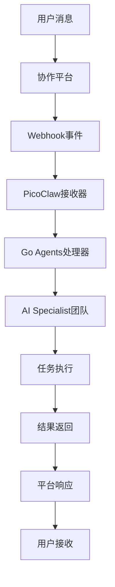

# 🌐 平台集成指南

## 🎯 概述

Go Agents v2.0 支持通过多种企业协作平台进行调用，包括飞书、钉钉、企业微信、Slack等。通过这些平台，用户可以在熟悉的协作环境中直接使用Go Agents的AI协作能力。

## 📱 支持的平台

### 国内平台
- **飞书 (Lark)**: 字节跳动企业协作平台
- **钉钉**: 阿里巴巴企业协作平台
- **企业微信**: 腾讯企业协作平台

### 国际平台
- **Slack**: 国际主流企业协作平台
- **Discord**: 社区和企业协作平台
- **Microsoft Teams**: 微软企业协作平台
- **Telegram**: 即时通讯平台

## 🏗️ 集成架构

### 事件驱动架构


### 配置驱动集成
```yaml
platform_integration:
  # 平台配置
  platforms:
    feishu:
      enabled: true
      config:
        app_id: "cli_xxx"
        app_secret: "xxx"
        encrypt_key: ""
        verification_token: ""
    
    dingtalk:
      enabled: true
      config:
        app_key: "xxx"
        app_secret: "xxx"
        token: "xxx"
        aes_key: ""
    
    slack:
      enabled: true
      config:
        bot_token: "xoxb-xxx"
        signing_secret: "xxx"
  
  # Go Agents配置
  goagents:
    enabled: true
    workspace: "/path/to/goagents"
    default_mode: "standard"
    auto_start: true
  
  # 消息路由
  routing:
    default_channel: "goagents"
    command_prefix: "@go"
    response_format: "markdown"
```

## 🚀 飞书集成详解

### 1. 飞书应用配置

#### 创建飞书应用
```bash
# 1. 访问飞书开放平台
# https://open.feishu.cn/

# 2. 创建企业自建应用
# 应用类型：企业自建应用
# 应用名称：Go Agents Assistant
# 应用描述：AI协作开发助手
```

#### 配置应用权限
```yaml
feishu_permissions:
  # 基础权限
  basic:
    - "contact:user.base:readonly"      # 读取用户基本信息
    - "contact:user.email:readonly"     # 读取用户邮箱
    - "im:message"                     # 发送消息
    - "im:message.group_at"             # 群聊@消息
    - "im:message.group_at:readonly"     # 读取群聊@消息
  
  # 高级权限
  advanced:
    - "drive:drive"                    # 云盘权限
    - "drive:file"                     # 文件权限
    - "wiki:wiki"                      # 知识库权限
```

#### 配置事件订阅
```yaml
feishu_events:
  # 消息事件
  message_events:
    - "im.message.receive_v1"           # 接收消息事件
  
  # 群聊事件
  group_events:
    - "im.chat.member.user.added_v1"    # 用户加入群聊
    - "im.chat.member.user.deleted_v1"   # 用户离开群聊
  
  # 应用事件
  app_events:
    - "application.bot.menu_v6"         # 应用菜单点击
```

### 2. PicoClaw配置

#### 配置文件设置
```json
{
  "channels": {
    "feishu": {
      "enabled": true,
      "app_id": "cli_xxx",
      "app_secret": "xxx",
      "encrypt_key": "xxx",
      "verification_token": "xxx",
      "allow_from": [],
      "random_reaction_emoji": ["🚀", "🎯", "✨"]
    }
  },
  "tools": {
    "skills": {
      "enabled": true,
      "registries": {
        "clawhub": {
          "enabled": true,
          "base_url": "https://clawhub.ai"
        }
      }
    }
  }
}
```

#### Go Agents集成配置
```yaml
goagents_integration:
  # 工作空间配置
  workspace:
    path: "/path/to/.goagents"
    auto_load: true
    config_validation: true
  
  # 技能配置
  skills:
    enabled: ["po-core", "ai-specialist-team", "intelligent-coordinator"]
    auto_install: true
    auto_update: true
  
  # 团队配置
  teams:
    auto_assemble: true
    default_team: "general-team"
    role_mapping:
      feishu_admin: "phase_lead"
      feishu_member: "team_member"
```

### 3. 使用方式

#### 基础命令
```bash
# 在飞书中直接使用
@go "开发用户登录功能"

# 查看项目状态
@go "查看项目状态"

# 获取帮助
@go "帮助"
```

#### 高级命令
```bash
# 指定模式
@go --mode=standard "开发电商购物车"
@go --mode=free "探索AI推荐系统"
@go --mode=hybrid "升级现有系统"

# 指定团队
@go --team=discovery-team "进行市场分析"
@go --team=architecture-team "设计系统架构"

# 指定配置
@go --config=ecommerce "开发电商功能"
@go --config=fintech "开发金融功能"
```

#### 交互式对话
```bash
# 用户: @go 我想开发一个电商网站
# Go Agents: 我来帮您开发电商网站！让我先分析一下需求...
# 
# 📋 **PO任务分析结果**
# 
# **需求**: 开发电商网站
# **推荐模式**: Standard（标准化电商项目）
# **预估工期**: 2-3周
# 
# **阶段规划**:
# 1. Discovery (3天) - 需求分析和用户研究
# 2. Architecture (4天) - 系统架构设计
# 3. Development (10-12天) - 功能开发和测试
# 4. Validation (2天) - 质量验证和部署
# 
# 是否开始执行？
```

## 🔧 其他平台集成

### 钉钉集成
```json
{
  "channels": {
    "dingtalk": {
      "enabled": true,
      "app_key": "xxx",
      "app_secret": "xxx",
      "token": "xxx",
      "aes_key": "xxx"
    }
  }
}
```

### 企业微信集成
```json
{
  "channels": {
    "wecom": {
      "enabled": true,
      "corp_id": "xxx",
      "corp_secret": "xxx",
      "token": "xxx",
      "aes_key": "xxx"
    }
  }
}
```

### Slack集成
```json
{
  "channels": {
    "slack": {
      "enabled": true,
      "bot_token": "xoxb-xxx",
      "signing_secret": "xxx",
      "app_token": "xapp-xxx"
    }
  }
}
```

## 🎯 最佳实践

### 1. 安全配置
```yaml
security_best_practices:
  # 访问控制
  access_control:
    user_whitelist: true
    ip_whitelist: true
    rate_limiting: true
  
  # 数据加密
  encryption:
    message_encryption: true
    data_transmission_encryption: true
    storage_encryption: true
  
  # 审计日志
  audit_logging:
    enabled: true
    log_level: "INFO"
    retention_days: 90
```

### 2. 性能优化
```yaml
performance_optimization:
  # 缓存策略
  caching:
    response_cache: true
    user_session_cache: true
    config_cache: true
  
  # 并发处理
  concurrency:
    max_concurrent_requests: 100
    request_timeout: 30
    retry_attempts: 3
  
  # 资源管理
  resource_management:
    memory_limit: "1GB"
    cpu_limit: "50%"
    disk_cleanup: true
```

### 3. 监控告警
```yaml
monitoring_alerting:
  # 健康检查
  health_checks:
    platform_connectivity: true
    goagents_status: true
    skill_availability: true
  
  # 告警配置
  alerts:
    error_threshold: 5
    response_time_threshold: 5000
    availability_threshold: 99.5
  
  # 通知渠道
  notification_channels:
    email: ["admin@company.com"]
    slack: "#alerts"
    feishu: "goagents-alerts"
```

## 🚀 部署指南

### 1. 环境准备
```bash
# 安装PicoClaw
curl -sSL https://get.picoclaw.ai | sh

# 安装Go Agents技能
picoclaw skills install po-core
picoclaw skills enable po-core

# 配置工作空间
picoclaw goagents config init
```

### 2. 配置部署
```bash
# 创建配置文件
cp config.example.json config.json

# 编辑配置
vim config.json

# 验证配置
picoclaw config validate
```

### 3. 启动服务
```bash
# 启动PicoClaw
picoclaw start

# 启动Go Agents
picoclaw goagents start

# 检查状态
picoclaw status
```

### 4. 测试验证
```bash
# 测试飞书集成
curl -X POST "http://localhost:8080/webhook/feishu" \
  -H "Content-Type: application/json" \
  -d '{"event":{"message":{"content":"@go 测试"}}}'

# 测试Go Agents
curl -X POST "http://localhost:8080/api/goagents" \
  -H "Content-Type: application/json" \
  -d '{"command":"开发用户登录功能"}'
```

## 📊 监控指标

### 1. 性能指标
```yaml
performance_metrics:
  # 响应时间
  response_time:
    average: "< 2s"
    p95: "< 5s"
    p99: "< 10s"
  
  # 吞吐量
  throughput:
    requests_per_second: "> 100"
    concurrent_users: "> 1000"
  
  # 可用性
  availability:
    uptime: "> 99.9%"
    error_rate: "< 0.1%"
```

### 2. 业务指标
```yaml
business_metrics:
  # 用户活跃度
  user_engagement:
    daily_active_users: "> 100"
    weekly_active_users: "> 500"
    monthly_active_users: "> 2000"
  
  # 功能使用率
  feature_usage:
    standard_mode_usage: "> 60%"
    free_mode_usage: "> 20%"
    hybrid_mode_usage: "> 20%"
  
  # 满意度
  satisfaction:
    user_satisfaction_score: "> 4.5"
    task_completion_rate: "> 90%"
    quality_score: "> 85%"
```

## 🎯 故障排除

### 常见问题
1. **Webhook接收失败**
   - 检查网络连接
   - 验证URL配置
   - 确认防火墙设置

2. **Go Agents启动失败**
   - 检查技能安装
   - 验证配置文件
   - 确认工作空间权限

3. **消息处理延迟**
   - 检查系统资源
   - 优化配置参数
   - 增加并发处理

### 调试工具
```bash
# 查看日志
picoclaw logs --tail 100

# 调试模式
picoclaw --debug start

# 性能分析
picoclaw --profile start

# 健康检查
picoclaw health check
```

---

**平台集成指南让Go Agents能够无缝集成到企业协作平台中，用户可以在熟悉的环境中享受AI协作的强大能力！** 🚀
