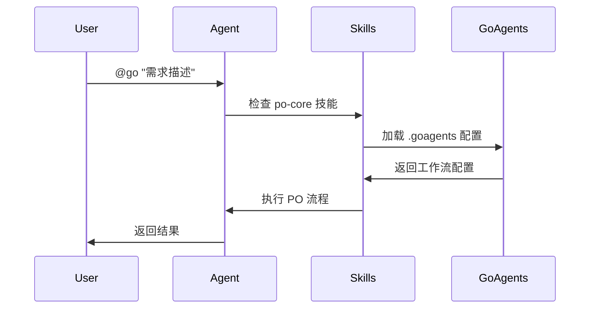
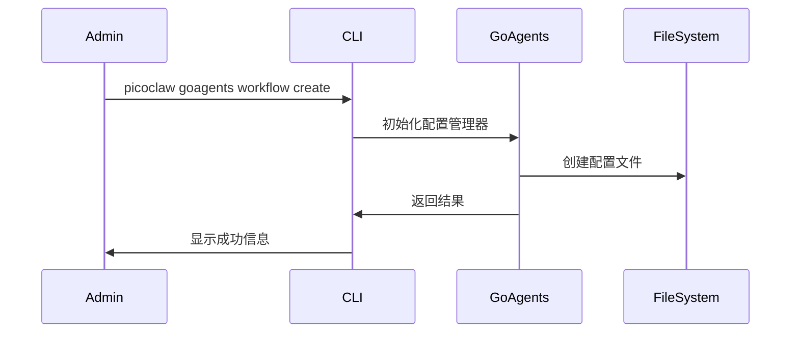

# PO System Implementation Guide - 实施指南

## 概述

本指南提供基于 PicoClaw 技能系统的 PO（产品经理）系统完整实施方案，包括分阶段实施计划、具体操作步骤和验证方法。

## 实施策略

### 渐进式实施原则
1. **先基础后高级** - 从核心功能开始，逐步添加复杂特性
2. **先验证后推广** - 每个阶段都经过充分验证后再进入下一阶段
3. **先标准后灵活** - 先实现标准化模式，再添加自由和混合模式
4. **先单点后集成** - 先实现独立技能，再集成完整系统

## 混合 CLI 集成方案详解

### 🎯 设计原则
1. **用户友好**: 保持 `@go` 简洁触发方式
2. **管理完整**: 提供 `picoclaw goagents` 完整管理能力
3. **架构清晰**: 技能管理与配置管理分离
4. **向后兼容**: 不影响现有 CLI 功能

### 🏗️ CLI 架构设计

#### 用户使用层
```bash
# 简单使用 - 通过 @go 触发
@go "开发电商购物车功能"

# 高级管理 - 通过 goagents 命令
picoclaw goagents workflow create ecommerce
picoclaw goagents team configure discovery-team
picoclaw goagents config validate
```

#### 技术实现层
```bash
# 技能管理（现有）
picoclaw skills install po-core
picoclaw skills enable po-core

# 配置管理（新增）
picoclaw goagents config
picoclaw goagents workflow list
picoclaw goagents team update
```

### 📁 目录结构
```
cmd/picoclaw/internal/
├── goagents/              # 新增：goagents 命令实现
│   ├── command.go         # 主命令
│   ├── workflow.go        # 工作流子命令
│   ├── phase.go          # 阶段子命令
│   ├── team.go           # 团队子命令
│   ├── task.go           # 任务子命令
│   └── config.go         # 配置子命令
├── skills/               # 现有：技能命令
└── agent/                # 现有：agent 命令
```

### 🔄 集成流程

#### 1. @go 触发流程


#### 2. 配置管理流程


## Phase 1: PO 核心系统 (Week 1-2)

### 目标
建立 PO 系统的核心基础设施，包括 PO Core 技能、HARNESS.md 集成、基础质量门禁、CLI 混合集成和完整的层级结构。

### 具体实施步骤

#### Step 1: 完整层级结构设计
基于核心模型 `Workflow -> Phase -> Milestone -> Task -> Team -> Team Role -> Team Member Agent` 实现完整的层级结构：

```yaml
# 完整的层级结构
workflow:
  phases:
    - id: "discovery"
      milestones:
        milestone_1:
          name: "项目启动和需求分析"
          tasks:
            - task_id: "project-background-research"
              sub_tasks:
                - id: "stakeholder_identification"
                - id: "requirement_gathering"
                - id: "scope_definition"
        milestone_2:
          name: "市场调研和用户研究"
          tasks:
            - task_id: "market-analysis"
              sub_tasks:
                - id: "data_collection_preparation"
                - id: "market_size_analysis"
                - id: "competitor_analysis"
                - id: "report_generation"
```

#### Step 2: CLI 混合集成方案
基于现有 PicoClaw CLI 结构，实现混合集成方案：

```bash
# 1. 创建 goagents 内部命令目录
mkdir -p cmd/picoclaw/internal/goagents

# 2. 创建 goagents 命令实现
cat > cmd/picoclaw/internal/goagents/command.go << 'EOF'
package goagents

import (
    "github.com/spf13/cobra"
    "github.com/sipeed/picoclaw/cmd/picoclaw/internal"
)

func NewGoagentsCommand() *cobra.Command {
    cmd := &cobra.Command{
        Use:   "goagents",
        Short: "Manage Go Agents configuration",
        Long:  `Go Agents configuration management for PO system`,
        PersistentPreRunE: func(cmd *cobra.Command, _ []string) error {
            cfg, err := internal.LoadConfig()
            if err != nil {
                return fmt.Errorf("error loading config: %w", err)
            }
            // 初始化 goagents 配置管理器
            return initConfigManager(cfg.WorkspacePath())
        },
        RunE: func(cmd *cobra.Command, _ []string) error {
            return cmd.Help()
        },
    }

    // 添加子命令
    cmd.AddCommand(
        newWorkflowCommand(),
        newPhaseCommand(),
        newTeamCommand(),
        newTaskCommand(),
        newConfigCommand(),
    )

    return cmd
}
EOF

# 3. 在 main.go 中集成 goagents 命令
# 修改 cmd/picoclaw/main.go
# 在 NewPicoclawCommand() 中添加：
cmd.AddCommand(
    // 现有命令...
    goagents.NewGoagentsCommand(), // 新增 goagents 命令
)

# 4. @go 触发机制（通过技能系统）
# PO Core 技能通过 metadata.trigger: "@go" 自动触发
```

#### Step 3: 技能内部任务拆解实现
为每个角色技能添加详细的内部任务分解策略：

```markdown
# role-analyst 技能更新
variants:
  market_specialist:
    execution:
      task_breakdown:
        strategy: "template_based"
        granularity: "medium"
        max_depth: 3
      
      subtask_execution:
        subtasks:
          - id: "data_collection_preparation"
            name: "数据收集准备"
            estimated_time: "4小时"
            quality_gates:
              - gate: "data_source_completeness"
                threshold: 90
          - id: "market_size_analysis"
            name: "市场规模数据收集"
            estimated_time: "1-2天"
            dependencies: ["data_collection_preparation"]
          - id: "competitor_analysis"
            name: "竞品分析和对比"
            estimated_time: "1天"
            dependencies: ["market_size_analysis"]
          - id: "report_generation"
            name: "分析报告生成"
            estimated_time: "1天"
            dependencies: ["competitor_analysis"]
```

#### Step 4: 执行引擎更新
实现支持完整层级结构的执行引擎：

```go
// 支持完整层级的执行引擎
func (we *WorkflowExecutorUpdated) ExecuteWorkflow(workflowID string, userInput string) error {
  // 1. 执行每个阶段
  for _, phase := range workflow.Phases {
    // 2. 执行每个里程碑
    for _, milestone := range phaseConfig.Milestones {
      // 3. 执行每个任务
      for _, task := range milestone.Tasks {
        // 4. 执行技能内部子任务
        err := we.executionEngine.ExecuteSkillWithSubtasks(skill, variant, task, userInput)
      }
    }
  }
}
```

#### Step 5: 创建 PO Core 技能
```bash
# 1. 创建技能目录
mkdir -p ~/.picoclaw/workspace/skills/po-core

# 2. 创建核心技能文件
cat > ~/.picoclaw/workspace/skills/po-core/SKILL.md << 'EOF'
---
name: po-core
description: "产品经理核心 - 项目全生命周期管理"
category: "orchestrator"
version: "1.0.0"
requires:
  skills: ["phase-manager", "task-modes", "team-roles"]
metadata: {
  "trigger": "@go",
  "harness_version": "2026.03"
}
---

# PO Core Skill

## 核心职责
1. 接收用户需求并分析
2. 选择合适的执行模式
3. 组建团队并分配角色
4. 管理阶段转换和质量门禁
5. 协调多 Agent 协作执行

## HARNESS.md 集成
每个任务开始前强制执行：
\`\`\`bash
First, read and strictly follow HARNESS.md in repository root.
Do NOT deviate from its rules.
\`\`\`

## 使用方式
用户输入：@go "项目需求描述"
PO 自动分析并返回执行计划
EOF
```

#### Step 2: 创建 HARNESS.md
```bash
# 在项目根目录创建 HARNESS.md
cat > ~/.picoclaw/workspace/HARNESS.md << 'EOF'
# HARNESS.md - 项目核心约束

## 禁止清单
- ❌ 禁止全局变量
- ❌ 禁止循环依赖
- ❌ 禁止直接数据库操作（必须走service层）
- ❌ 禁止硬编码配置值
- ❌ 禁止忽略错误处理

## 必须遵守
- ✅ 所有新功能必须有单元测试+集成测试覆盖≥85%
- ✅ 新模块必须有接口定义
- ✅ 严格分层（controller → service → repository）
- ✅ 所有公共方法必须有文档注释
- ✅ 错误处理必须完整和一致

## 模块职责矩阵
| 目录 | 职责 | 依赖方向 |
|------|------|---------|
| /domain/ | 核心业务实体与规则 | 无外部依赖 |
| /application/ | 用例协调器 | 只依赖domain |
| /adapters/ | 外部接口实现 | 只依赖application |
| /infrastructure/ | 基础设施实现 | 只依赖application |

## 命名规范
- 文件名：kebab-case
- 类名：PascalCase
- 函数名：camelCase
- 常量：UPPER_SNAKE_CASE
- 接口名：以 I 开头

## 代码质量标准
- 圈复杂度：≤10
- 函数长度：≤50行
- 文件长度：≤500行
- 测试覆盖率：≥85%
- Lint 通过率：100%

## Ralph Wiggum Loop
任务完成后必须执行：
1. 运行所有测试 + lint + 类型检查直到 100% 通过
2. 根据 HARNESS.md 自我审查（列出违规项）
3. 如果失败 → 分析根因 → 修复 → 重复
4. 只有在 green + 自我审查通过时才创建 PR
5. 如果架构有变更，更新 HARNESS.md/ADR
6. 提出 2–3 个后续改进建议
EOF
```

#### Step 3: 创建 Phase Manager 技能
```bash
# 创建阶段管理技能
mkdir -p ~/.picoclaw/workspace/skills/phase-manager

cat > ~/.picoclaw/workspace/skills/phase-manager/SKILL.md << 'EOF'
---
name: phase-manager
description: "阶段管理器 - 管理项目阶段转换"
category: "coordinator"
version: "1.0.0"
requires:
  skills: ["phase-templates"]
---

# Phase Manager

## 支持的阶段
- **discovery**: 需求发现和市场调研
- **planning**: 架构设计和实施计划
- **development**: 功能开发和实现
- **validation**: 测试验证和质量保证

## 阶段转换规则
- discovery → planning: 需求冻结 + 市场分析批准
- planning → development: 架构批准 + 实施计划就绪
- development → validation: 功能实现完成 + 单元测试通过
- validation → 完成: 所有质量门禁通过 + 验收测试通过

## 使用方式
@go --phase-status          # 查看当前阶段
@go --phase-transition      # 阶段转换
EOF
```

### 验证标准
- [ ] PO 技能可以正确解析 @go 命令
- [ ] HARNESS.md 被正确加载和执行
- [ ] 阶段管理器可以跟踪项目状态
- [ ] 基础质量门禁正常工作
- [ ] CLI 混合集成方案正常工作
- [ ] @go 触发机制正常
- [ ] goagents 命令可以管理配置

## Phase 5: 企业级特性扩展 (Week 9-12)

### 目标
实现企业级特性扩展，支持游戏、影视等强行业特征项目，完善输出物类型、外部依赖管理、系统拆分和复杂依赖管理。

### 具体实施步骤

#### Step 1: 输出物类型扩展
```bash
# 1. 创建输出物生成技能
mkdir -p ~/.picoclaw/workspace/skills/output-types

# 2. 创建 output-generator 技能
cat > ~/.picoclaw/workspace/skills/output-types/output-generator.md << 'EOF'
---
name: output-generator
description: "多类型输出物生成器"
category: "utility"

variants:
  document_generator:
    persona: "文档生成专家，擅长创建结构化markdown文档"
    capabilities: ["markdown_formatting", "document_structuring", "content_organization"]
    tools: ["markdown_editors", "documentation_tools", "content_generators"]
    
  media_generator:
    persona: "媒体生成专家，擅长创建视频、图片、3D模型等媒体内容"
    capabilities: ["video_production", "image_creation", "3d_modeling", "media_optimization"]
    tools: ["video_editors", "image_editors", "3d_modeling_software", "media_converters"]
    
  interactive_generator:
    persona: "交互内容生成专家，擅长创建原型和交互式内容"
    capabilities: ["prototype_creation", "interactive_design", "user_interface", "demo_development"]
    tools: ["prototype_tools", "ui_frameworks", "interaction_designers", "demo_platforms"]
    
  code_generator:
    persona: "代码生成专家，擅长创建高质量的代码实现"
    capabilities: ["code_generation", "architecture_implementation", "testing_code", "documentation_generation"]
    tools: ["code_editors", "ide_plugins", "testing_frameworks", "code_quality_tools"]
EOF

# 3. 安装和启用技能
picoclaw skills install output-generator
picoclaw skills enable output-generator

# 4. 扩展任务配置
picoclaw goagents task create game-prototype --output-types "document,code,video,image,3d_model,prototype,demo"

# 5. 验证输出物生成
@go "创建游戏设计文档" --output-type document
@go "实现游戏核心代码" --output-type code
@go "创建游戏演示视频" --output-type video
@go "创建游戏界面设计" --output-type image
@go "创建游戏3D模型" --output-type 3d_model
@go "创建交互原型" --output-type prototype
@go "创建功能演示" --output-type demo
```

#### Step 2: 外部依赖管理
```bash
# 1. 创建依赖管理技能
mkdir -p ~/.picoclaw/workspace/skills/dependency-management

# 2. 创建 dependency-manager 技能
cat > ~/.picoclaw/workspace/skills/dependency-management/dependency-manager.md << 'EOF'
---
name: dependency-manager
description: "外部依赖和共享中台管理器"
category: "coordination"

variants:
  external_coordinator:
    persona: "外部协调专家，擅长管理外部资源和依赖"
    capabilities: ["external_resource_coordination", "vendor_management", "shared_service_integration"]
    tools: ["api_clients", "service_mesh", "vendor_portals"]
    
  shared_service_manager:
    persona: "共享服务管理专家，擅长管理内部共享资源"
    capabilities: ["service_discovery", "resource_allocation", "capacity_planning"]
    tools: ["service_registry", "resource_monitoring", "allocation_systems"]
EOF

# 3. 扩展团队配置支持外部依赖
picoclaw goagents team create game-team --external-dependencies

# 4. 测试依赖协调
@go "协调外部资源" --dependency-type shared_service
```

#### Step 3: 系统拆分支持
```bash
# 1. 创建系统架构技能
mkdir -p ~/.picoclaw/workspace/skills/architecture-design

# 2. 创建 system-architect 技能
cat > ~/.picoclaw/workspace/skills/architecture-design/system-architect.md << 'EOF'
---
name: system-architect
description: "系统架构设计和拆分专家"
category: "technical"

variants:
  system_architect:
    persona: "系统架构师，擅长复杂系统拆分和模块设计"
    capabilities: ["system_decomposition", "module_design", "dependency_mapping", "interface_definition"]
    tools: ["architecture_tools", "diagram_generators", "modeling_software"]
    
  module_designer:
    persona: "模块设计师，擅长模块级别的详细设计"
    capabilities: ["module_specification", "interface_design", "integration_planning"]
    tools: ["design_tools", "documentation_generators", "validation_frameworks"]
EOF

# 3. 创建系统拆分配置
picoclaw goagents system create game-system --breakdown-level module

# 4. 生成系统架构图
@go "设计系统架构" --system-type game
```

#### Step 4: 复杂依赖管理
```bash
# 1. 创建依赖图管理技能
mkdir -p ~/.picoclaw/workspace/skills/dependency-graph

# 2. 创建 dependency-graph 技能
cat > ~/.picoclaw/workspace/skills/dependency-graph/dependency-graph.md << 'EOF'
---
name: dependency-graph
description: "复杂依赖图管理和任务调度专家"
category: "coordination"

variants:
  dependency_analyzer:
    persona: "依赖分析专家，擅长识别和管理复杂依赖关系"
    capabilities: ["dependency_analysis", "critical_path_identification", "bottleneck_detection"]
    tools: ["graph_algorithms", "scheduling_tools", "optimization_engines"]
    
  resource_scheduler:
    persona: "资源调度专家，擅长优化资源分配和任务调度"
    capabilities: ["resource_optimization", "parallel_execution", "bottleneck_resolution"]
    tools: ["scheduling_algorithms", "resource_monitors", "optimization_tools"]
EOF

# 3. 配置复杂依赖关系
picoclaw goagents dependency create complex-project --graph-type multi_level

# 4. 优化任务调度
@go "优化项目执行" --scheduling-algorithm critical_path
```

### 验证标准
- [ ] 多种输出物类型正常生成
- [ ] 外部依赖协调机制正常工作
- [ ] 系统拆分图正确生成
- [ ] 复杂依赖管理有效执行
- [ ] 企业级质量控制通过

## Phase 7: 技能注册表系统 (Week 17-20)

### 目标
实现完整的技能注册表系统，包括技能发现、管理、搜索、验证等核心功能，建立技能生态系统的基础设施。

### 具体实施步骤

#### Step 1: 技能发现器实现
```bash
# 1. 创建技能发现器
mkdir -p ~/.picoclaw/.goagents/registry/discovery

# 2. 实现本地技能扫描
cat > ~/.picoclaw/.goagents/registry/discovery/local_discovery.go << 'EOF'
package discovery

import (
    "os"
    "path/filepath"
    "io/ioutil"
    "encoding/yaml"
)

type LocalDiscovery struct {
    searchPaths []string
    cache       map[string]*Skill
}

func (d *LocalDiscovery) DiscoverLocalSkills() ([]*Skill, error) {
    var skills []*Skill
    
    for _, searchPath := range d.searchPaths {
        err := filepath.Walk(searchPath, func(path string, info os.FileInfo, err error) error {
            if err != nil {
                return err
            }
            
            if info.IsDir() && filepath.Base(path) == "SKILL.md" {
                skill, err := d.parseSkillFile(path)
                if err != nil {
                    return err
                }
                skills = append(skills, skill)
            }
            
            return nil
        })
        
        if err != nil {
            return nil, err
        }
    }
    
    return skills, nil
}

func (d *LocalDiscovery) parseSkillFile(filePath string) (*Skill, error) {
    content, err := ioutil.ReadFile(filePath)
    if err != nil {
        return nil, err
    }
    
    // 解析 Front Matter
    parts := strings.SplitN(string(content), "---\n", 3)
    if len(parts) < 3 {
        return nil, errors.New("invalid skill format")
    }
    
    var skill Skill
    err = yaml.Unmarshal([]byte(parts[1]), &skill)
    if err != nil {
        return nil, err
    }
    
    skill.Content = parts[2]
    skill.FilePath = filePath
    
    return &skill, nil
}
EOF
```

#### Step 2: 技能管理器实现
```bash
# 1. 创建技能管理器
mkdir -p ~/.picoclaw/.goagents/registry/manager

# 2. 实现技能安装/卸载
cat > ~/.picoclaw/.goagents/registry/manager/skill_manager.go << 'EOF'
package manager

import (
    "os"
    "io/ioutil"
    "path/filepath"
    "archive/zip"
)

type SkillManager struct {
    installPath string
    registry    *SkillRegistry
}

func (m *SkillManager) InstallSkill(skillID string, version string) error {
    // 1. 下载技能
    skillData, err := m.downloadSkill(skillID, version)
    if err != nil {
        return err
    }
    
    // 2. 解压技能
    err = m.extractSkill(skillData, skillID)
    if err != nil {
        return err
    }
    
    // 3. 验证技能
    err = m.validateSkill(skillID)
    if err != nil {
        return err
    }
    
    // 4. 更新注册表
    err = m.registry.RegisterSkill(skillID)
    if err != nil {
        return err
    }
    
    return nil
}

func (m *SkillManager) UninstallSkill(skillID string) error {
    // 1. 检查依赖关系
    dependencies, err := m.registry.GetDependencies(skillID)
    if err != nil {
        return err
    }
    
    if len(dependencies) > 0 {
        return fmt.Errorf("cannot uninstall skill %s: required by %v", skillID, dependencies)
    }
    
    // 2. 删除技能文件
    skillPath := filepath.Join(m.installPath, skillID)
    err = os.RemoveAll(skillPath)
    if err != nil {
        return err
    }
    
    // 3. 更新注册表
    err = m.registry.UnregisterSkill(skillID)
    if err != nil {
        return err
    }
    
    return nil
}

func (m *SkillManager) UpdateSkill(skillID string) error {
    // 1. 获取当前版本
    currentVersion, err := m.registry.GetSkillVersion(skillID)
    if err != nil {
        return err
    }
    
    // 2. 获取最新版本
    latestVersion, err := m.getLatestVersion(skillID)
    if err != nil {
        return err
    }
    
    if currentVersion == latestVersion {
        return fmt.Errorf("skill %s is already up to date", skillID)
    }
    
    // 3. 卸载旧版本
    err = m.UninstallSkill(skillID)
    if err != nil {
        return err
    }
    
    // 4. 安装新版本
    err = m.InstallSkill(skillID, latestVersion)
    if err != nil {
        return err
    }
    
    return nil
}
EOF
```

#### Step 3: 技能搜索器实现
```bash
# 1. 创建技能搜索器
mkdir -p ~/.picoclaw/.goagents/registry/searcher

# 2. 实现多维度搜索
cat > ~/.picoclaw/.goagents/registry/searcher/skill_searcher.go << 'EOF'
package searcher

import (
    "strings"
    "sort"
    "regexp"
)

type SkillSearcher struct {
    registry *SkillRegistry
    index    *SearchIndex
}

type SearchQuery struct {
    Query     string   `json:"query"`
    Category  string   `json:"category"`
    Tags      []string `json:"tags"`
    Author    string   `json:"author"`
    MinScore  int      `json:"min_score"`
    Limit     int      `json:"limit"`
    SortBy    string   `json:"sort_by"`    // name, score, updated
    SortOrder string   `json:"sort_order"` // asc, desc
}

type SearchResult struct {
    Skill   *Skill  `json:"skill"`
    Score   float64 `json:"score"`
    Matches []string `json:"matches"`
}

func (s *SkillSearcher) SearchSkills(query SearchQuery) ([]*SearchResult, error) {
    var results []*SearchResult
    
    // 1. 从索引中获取候选技能
    candidates := s.index.GetCandidates(query)
    
    // 2. 计算匹配分数
    for _, candidate := range candidates {
        score := s.calculateScore(candidate, query)
        if score >= float64(query.MinScore) {
            result := &SearchResult{
                Skill: candidate,
                Score: score,
                Matches: s.getMatches(candidate, query),
            }
            results = append(results, result)
        }
    }
    
    // 3. 排序结果
    s.sortResults(results, query.SortBy, query.SortOrder)
    
    // 4. 限制结果数量
    if query.Limit > 0 && len(results) > query.Limit {
        results = results[:query.Limit]
    }
    
    return results, nil
}

func (s *SkillSearcher) calculateScore(skill *Skill, query SearchQuery) float64 {
    var score float64
    
    // 名称匹配
    if strings.Contains(strings.ToLower(skill.Name), strings.ToLower(query.Query)) {
        score += 0.4
    }
    
    // 描述匹配
    if strings.Contains(strings.ToLower(skill.Description), strings.ToLower(query.Query)) {
        score += 0.3
    }
    
    // 标签匹配
    for _, tag := range skill.Tags {
        for _, queryTag := range query.Tags {
            if strings.EqualFold(tag, queryTag) {
                score += 0.2
            }
        }
    }
    
    // 类别匹配
    if query.Category != "" && strings.EqualFold(skill.Category, query.Category) {
        score += 0.1
    }
    
    return score
}

func (s *SkillSearcher) GetSkillsByCategory(category string) ([]*Skill, error) {
    return s.registry.GetSkillsByCategory(category)
}

func (s *SkillSearcher) GetSkillsByTag(tag string) ([]*Skill, error) {
    return s.registry.GetSkillsByTag(tag)
}

func (s *SkillSearcher) GetRecommendedSkills(context string) ([]*Skill, error) {
    // 基于上下文推荐技能
    keywords := s.extractKeywords(context)
    
    var recommendations []*Skill
    for _, keyword := range keywords {
        results, err := s.SearchSkills(SearchQuery{
            Query: keyword,
            Limit: 3,
        })
        if err != nil {
            continue
        }
        
        for _, result := range results {
            recommendations = append(recommendations, result.Skill)
        }
    }
    
    return s.deduplicate(recommendations), nil
}

func (s *SkillSearcher) AutoComplete(prefix string) ([]string, error) {
    var suggestions []string
    
    skills, err := s.registry.GetAllSkills()
    if err != nil {
        return nil, err
    }
    
    for _, skill := range skills {
        if strings.HasPrefix(strings.ToLower(skill.Name), strings.ToLower(prefix)) {
            suggestions = append(suggestions, skill.Name)
        }
        
        for _, tag := range skill.Tags {
            if strings.HasPrefix(strings.ToLower(tag), strings.ToLower(prefix)) {
                suggestions = append(suggestions, tag)
            }
        }
    }
    
    return s.deduplicateStrings(suggestions), nil
}
EOF
```

#### Step 4: 技能验证器实现
```bash
# 1. 创建技能验证器
mkdir -p ~/.picoclaw/.goagents/registry/validator

# 2. 实现格式验证和规范检查
cat > ~/.picoclaw/.goagents/registry/validator/skill_validator.go << 'EOF'
package validator

import (
    "os"
    "path/filepath"
    "encoding/yaml"
    "regexp"
)

type SkillValidator struct {
    rules []ValidationRule
}

type ValidationRule struct {
    Name        string
    Description string
    Validator   func(*Skill) error
    Severity    int // 1-10
}

type ValidationResult struct {
    Valid    bool     `json:"valid"`
    Errors   []string `json:"errors"`
    Warnings []string `json:"warnings"`
    Score    int      `json:"score"`
    Issues   []Issue  `json:"issues"`
}

type Issue struct {
    Type        string `json:"type"`        // error, warning, info
    Category    string `json:"category"`    // format, content, structure
    Message     string `json:"message"`
    Suggestion  string `json:"suggestion"`
    Severity    int    `json:"severity"`    // 1-10
}

func (v *SkillValidator) ValidateSkillFormat(skillPath string) (*ValidationResult, error) {
    // 1. 读取技能文件
    content, err := ioutil.ReadFile(skillPath)
    if err != nil {
        return nil, err
    }
    
    // 2. 解析技能
    skill, err := v.parseSkill(content)
    if err != nil {
        return nil, err
    }
    
    // 3. 验证格式
    return v.ValidateSkillSpec(skill), nil
}

func (v *SkillValidator) ValidateSkillSpec(skill *Skill) (*ValidationResult, error) {
    result := &ValidationResult{
        Valid:    true,
        Errors:   []string{},
        Warnings: []string{},
        Issues:   []Issue{},
        Score:    100,
    }
    
    // 1. 基础格式验证
    for _, rule := range v.rules {
        err := rule.Validator(skill)
        if err != nil {
            result.Valid = false
            result.Errors = append(result.Errors, err.Error())
            
            issue := Issue{
                Type:        "error",
                Category:    "format",
                Message:     err.Error(),
                Suggestion:  v.getSuggestion(rule.Name),
                Severity:    rule.Severity,
            }
            result.Issues = append(result.Issues, issue)
            result.Score -= rule.Severity
        }
    }
    
    // 2. 计算质量分数
    result.Score = v.calculateQualityScore(skill)
    
    return result, nil
}

func (v *SkillValidator) RunSkillTests(skillID string) (*TestResult, error) {
    // 1. 查找技能测试
    testPath := filepath.Join(v.getSkillPath(skillID), "tests")
    
    // 2. 运行测试
    tests, err := v.discoverTests(testPath)
    if err != nil {
        return nil, err
    }
    
    var passedTests, failedTests []Test
    var totalDuration time.Duration
    
    for _, test := range tests {
        start := time.Now()
        passed, err := v.runTest(test)
        duration := time.Since(start)
        
        totalDuration += duration
        
        testResult := Test{
            Name:     test.Name,
            Passed:   passed,
            Duration: duration.String(),
        }
        
        if !passed {
            testResult.Error = err.Error()
            failedTests = append(failedTests, testResult)
        } else {
            passedTests = append(passedTests, testResult)
        }
    }
    
    // 3. 计算覆盖率
    coverage, err := v.calculateCoverage(skillID)
    if err != nil {
        return nil, err
    }
    
    return &TestResult{
        Passed:    len(failedTests) == 0,
        Tests:     append(passedTests, failedTests...),
        Coverage:  coverage,
        Duration: totalDuration.String(),
    }, nil
}

func (v *SkillValidator) CalculateQualityScore(skill *Skill) (int, error) {
    var score int
    
    // 1. 基础分数
    score += 30
    
    // 2. 描述完整性
    if len(skill.Description) > 50 {
        score += 10
    }
    
    // 3. 能力定义
    if len(skill.Capabilities) > 0 {
        score += 10
    }
    
    // 4. 触发条件
    if len(skill.Triggers) > 0 {
        score += 10
    }
    
    // 5. 质量门禁
    if len(skill.QualityGates) > 0 {
        score += 10
    }
    
    // 6. 示例
    if len(skill.Examples) > 0 {
        score += 10
    }
    
    // 7. 文档完整性
    if v.hasDocumentation(skill) {
        score += 10
    }
    
    // 8. 测试覆盖
    if v.hasTests(skill) {
        score += 10
    }
    
    return score, nil
}
EOF
```

#### 验证标准
- [ ] 技能发现器可以扫描本地技能目录
- [ ] 技能管理器可以安装/卸载技能
- [ ] 技能搜索器支持多维度搜索
- [ ] 技能验证器可以验证技能格式
- [ ] 注册表可以索引和管理技能
- [ ] CLI 命令可以管理技能

## Phase 8: 技能导入转换器 (Week 21-24)

### 目标
实现技能导入转换器，支持从外部仓库（如 agency-agents）导入技能并转换为 PicoClaw 标准格式。

### 具体实施步骤

#### Step 1: 格式检测器实现
```bash
# 1. 创建格式检测器
mkdir -p ~/.picoclaw/.goagents/converter/detector

# 2. 实现 Agency Agents 格式检测
cat > ~/.picoclaw/.goagents/converter/detector/agency_detector.go << 'EOF'
package detector

import (
    "strings"
    "io/ioutil"
)

type AgencyFormatDetector struct{}

func (d *AgencyFormatDetector) DetectFormat(filePath string) (Format, error) {
    content, err := ioutil.ReadFile(filePath)
    if err != nil {
        return "", err
    }
    
    contentStr := string(content)
    
    // 检查 Front Matter
    if strings.HasPrefix(contentStr, "---\n") {
        parts := strings.SplitN(contentStr, "---\n", 3)
        if len(parts) < 3 {
            return "", errors.New("invalid front matter format")
        }
        
        fmContent := parts[1]
        
        // 检查 Agency Agents 特定字段
        if strings.Contains(fmContent, "name:") && 
           strings.Contains(fmContent, "description:") &&
           strings.Contains(fmContent, "color:") &&
           strings.Contains(fmContent, "emoji:") {
            return FormatAgencyAgents, nil
        }
    }
    
    return FormatUnknown, errors.New("unsupported format")
}

func (d *AgencyFormatDetector) GetSupportedFormats() []Format {
    return []Format{FormatAgencyAgents}
}

func (d *AgencyFormatDetector) ValidateFormat(filePath string) error {
    format, err := d.DetectFormat(filePath)
    if err != nil {
        return err
    }
    
    if format == FormatUnknown {
        return errors.New("unsupported format")
    }
    
    return nil
}
EOF
```

#### Step 2: 内容解析器实现
```bash
# 1. 创建内容解析器
mkdir -p ~/.picoclaw/.goagents/converter/parser

# 2. 实现 Front Matter 解析和章节提取
cat > ~/.picoclaw/.goagents/converter/parser/agency_parser.go << 'EOF'
package parser

import (
    "strings"
    "regexp"
    "gopkg.in/yaml.v2"
)

type AgencyParser struct{}

func (p *AgencyParser) ParseFrontMatter(content string) (map[string]interface{}, error) {
    parts := strings.SplitN(content, "---\n", 3)
    if len(parts) < 3 {
        return nil, errors.New("invalid front matter format")
    }
    
    fmContent := parts[1]
    var frontMatter map[string]interface{}
    
    err := yaml.Unmarshal([]byte(fmContent), &frontMatter)
    if err != nil {
        return nil, err
    }
    
    return frontMatter, nil
}

func (p *AgencyParser) ParseSections(content string) (map[string]string, error) {
    sections := make(map[string]string)
    
    // 使用正则表达式识别章节
    sectionRegex := regexp.MustCompile(`^#{1,3}\s+(.+)$\n([\s\S]*?)(?=\n#{1,3}\s+|$)`)
    matches := sectionRegex.FindAllStringSubmatch(content, -1)
    
    for _, match := range matches {
        if len(match) >= 3 {
            title := strings.TrimSpace(match[1])
            sectionContent := strings.TrimSpace(match[2])
            sections[title] = sectionContent
        }
    }
    
    return sections, nil
}

func (p *AgencyParser) ExtractCapabilities(content string) ([]string, error) {
    sections, err := p.ParseSections(content)
    if err != nil {
        return nil, err
    }
    
    var capabilities []string
    
    // 从 "Your Core Mission" 章节提取能力
    if missionSection, exists := sections["Your Core Mission"]; exists {
        // 提取项目符号点
        bulletRegex := regexp.MustCompile(`^\s*-\s+(.+)$`)
        matches := bulletRegex.FindAllStringSubmatch(missionSection, -1)
        
        for _, match := range matches {
            if len(match) >= 2 {
                capabilities = append(capabilities, strings.TrimSpace(match[1]))
            }
        }
    }
    
    return capabilities, nil
}

func (p *AgencyParser) ExtractTriggers(content string) ([]string, error) {
    sections, err := p.ParseSections(content)
    if err != nil {
        return nil, err
    }
    
    var triggers []string
    
    // 从各个章节提取触发条件
    for _, section := range sections {
        // 查找粗体文本
        boldRegex := regexp.MustCompile(`\*\*(.+?)\*\*`)
        matches := boldRegex.FindAllStringSubmatch(section, -1)
        
        for _, match := range matches {
            if len(match) >= 2 {
                trigger := strings.TrimSpace(match[1])
                if len(trigger) > 3 && len(trigger) < 50 {
                    triggers = append(triggers, trigger)
                }
            }
        }
    }
    
    return p.deduplicate(triggers), nil
}

func (p *AgencyParser) ExtractPersonality(content string) (string, error) {
    sections, err := p.ParseSections(content)
    if err != nil {
        return "", err
    }
    
    // 从 "Your Identity & Memory" 章节提取个性
    if identitySection, exists := sections["Your Identity & Memory"]; exists {
        // 提取个性描述
        personalityRegex := regexp.MustCompile(`\*\*Personality\*\*:\s*(.+)`)
        matches := personalityRegex.FindStringSubmatch(identitySection)
        
        if len(matches) >= 2 {
            return strings.TrimSpace(matches[1]), nil
        }
    }
    
    return "", nil
}

func (p *AgencyParser) deduplicate(slice []string) []string {
    keys := make(map[string]bool)
    result := []string{}
    
    for _, item := range slice {
        if !keys[item] {
            keys[item] = true
            result = append(result, item)
        }
    }
    
    return result
}
EOF
```

#### Step 3: 格式转换器实现
```bash
# 1. 创建格式转换器
mkdir -p ~/.picoclaw/.goagents/converter/converter

# 2. 实现技能格式转换
cat > ~/.picoclaw/.goagents/converter/converter/agency_to_picoclaw.go << 'EOF'
package converter

import (
    "strings"
    "time"
)

type AgencyToPicoClawConverter struct {
    config *ConversionConfig
}

type ConversionConfig struct {
    TargetCategory    string            `json:"target_category"`
    DefaultVariant    string            `json:"default_variant"`
    QualityThreshold  int               `json:"quality_threshold"`
    CustomMappings    map[string]string `json:"custom_mappings"`
}

func (c *AgencyToPicoClawConverter) ConvertToSkill(parsed *ParsedContent) (*Skill, error) {
    skill := &Skill{
        ID:          c.generateSkillID(parsed.Metadata.Name),
        Name:        parsed.Metadata.Name,
        Description: parsed.Metadata.Description,
        Category:    c.config.TargetCategory,
        Version:     "1.0.0",
        License:     "MIT",
        CreatedAt:   time.Now(),
        UpdatedAt:   time.Now(),
    }
    
    // 转换能力
    skill.Capabilities = c.convertCapabilities(parsed.Metadata.Capabilities)
    
    // 转换触发条件
    skill.Triggers = c.convertTriggers(parsed.Metadata.Triggers)
    
    // 生成元数据
    skill.Metadata = c.generateMetadata(parsed)
    
    return skill, nil
}

func (c *AgencyToPicoClawConverter) generateSkillID(originalName string) string {
    // 转换为符合规范的技能ID
    id := strings.ToLower(originalName)
    id = strings.ReplaceAll(id, " ", "-")
    id = strings.ReplaceAll(id, "_", "-")
    id = strings.ReplaceAll(id, ".", "-")
    
    // 移除特殊字符
    reg := regexp.MustCompile(`[^a-z0-9-]`)
    id = reg.ReplaceAllString(id, "")
    
    return "role-" + id
}

func (c *AgencyToPicoClawConverter) convertCapabilities(capabilities []string) []string {
    var converted []string
    
    for _, cap := range capabilities {
        convertedCap := strings.ToLower(cap)
        convertedCap = strings.ReplaceAll(convertedCap, " ", "_")
        convertedCap = strings.ReplaceAll(convertedCap, "-", "_")
        converted = append(converted, convertedCap)
    }
    
    return converted
}

func (c *AgencyToPicoClawConverter) convertTriggers(triggers []string) []string {
    var converted []string
    
    for _, trigger := range triggers {
        // 转换为中文触发条件
        convertedTrigger := c.translateToChinese(trigger)
        converted = append(converted, convertedTrigger)
    }
    
    return converted
}

func (c *AgencyToPicoClawConverter) generateMetadata(parsed *ParsedContent) map[string]interface{} {
    return map[string]interface{}{
        "author":            "Go Agents Team",
        "source_repository": "agency-agents",
        "original_file":     parsed.Metadata.Name,
        "original_format":   "agency-agents",
        "conversion_date":   time.Now(),
        "conversion_tool":   "agency-to-picoclaw-converter",
        "personality":       parsed.Metadata.Personality,
        "mission":          parsed.Metadata.Mission,
    }
}

func (c *AgencyToPicoClawConverter) GenerateVariants(skill *Skill) ([]Variant, error) {
    var variants []Variant
    
    // 基于技能能力生成变体
    for _, capability := range skill.Capabilities {
        variant := Variant{
            Name:        c.generateVariantName(capability),
            Description: c.generateVariantDescription(capability),
            Persona:     c.generateVariantPersona(capability),
            Capabilities: []string{capability},
        }
        
        variants = append(variants, variant)
    }
    
    return variants, nil
}

func (c *AgencyToPicoClawConverter) translateToChinese(text string) string {
    translations := map[string]string{
        "Frontend Development": "前端开发",
        "Backend Development": "后端开发",
        "Mobile App Development": "移动应用开发",
        "UI Implementation": "UI实现",
        "Performance Optimization": "性能优化",
        "React Development": "React开发",
        "Vue Development": "Vue开发",
        "Angular Development": "Angular开发",
        "Database Design": "数据库设计",
        "API Development": "API开发",
        "Testing": "测试",
        "Code Review": "代码审查",
        "Documentation": "文档编写",
    }
    
    if translated, exists := translations[text]; exists {
        return translated
    }
    
    return text
}
EOF
```

#### Step 4: CLI 工具实现
```bash
# 1. 创建导入CLI
mkdir -p ~/.picoclaw/.goagents/converter/cli

# 2. 实现导入命令
cat > ~/.picoclaw/.goagents/converter/cli/import_command.go << 'EOF'
package cli

import (
    "fmt"
    "os"
    "path/filepath"
    "github.com/spf13/cobra"
)

type ImportCommand struct {
    repoURL       string
    format        string
    outputDir     string
    qualityThreshold int
    parallel      int
    dryRun        bool
    verbose       bool
}

func NewImportCommand() *cobra.Command {
    cmd := &cobra.Command{
        Use:   "import",
        Short: "Import skills from external repositories",
        Long:  "Import skills from external repositories like agency-agents and convert to PicoClaw format",
    }
    
    cmd.Flags().StringVarP(&importCmd.repoURL, "repo", "r", "", "Repository URL")
    cmd.Flags().StringVarP(&importCmd.format, "format", "f", "", "Source format (agency-agents, vercel-skills)")
    cmd.Flags().StringVarP(&importCmd.outputDir, "output", "o", "./converted-skills", "Output directory")
    cmd.Flags().IntVar(&importCmd.qualityThreshold, "quality-threshold", 80, "Minimum quality threshold")
    cmd.Flags().IntVar(&importCmd.parallel, "parallel", 4, "Number of parallel workers")
    cmd.Flags().BoolVar(&importCmd.dryRun, "dry-run", false, "Dry run without making changes")
    cmd.Flags().BoolVarP(&importCmd.verbose, "verbose", "v", false, "Verbose output")
    
    cmd.RunE = importCmd.Run
    cmd.AddCommand(scanCmd)
    cmd.AddCommand(convertCmd)
    cmd.AddCommand(validateCmd)
    cmd.AddCommand(installCmd)
    
    return cmd
}

func (cmd *ImportCommand) Run(cmd *cobra.Command, args []string) error {
    if cmd.repoURL == "" {
        return fmt.Errorf("repository URL is required")
    }
    
    if cmd.format == "" {
        return fmt.Errorf("source format is required")
    }
    
    // 1. 扫描仓库
    if cmd.verbose {
        fmt.Printf("Scanning repository: %s\n", cmd.repoURL)
    }
    
    scanner := NewRepoScanner(cmd.repoURL, cmd.format)
    skillFiles, err := scanner.Scan()
    if err != nil {
        return fmt.Errorf("failed to scan repository: %v", err)
    }
    
    fmt.Printf("Found %d skill files\n", len(skillFiles))
    
    // 2. 转换技能
    converter := NewSkillConverter(cmd.format)
    
    var convertedSkills []*Skill
    for _, skillFile := range skillFiles {
        if cmd.verbose {
            fmt.Printf("Converting: %s\n", skillFile)
        }
        
        skill, err := converter.Convert(skillFile)
        if err != nil {
            fmt.Printf("Error converting %s: %v\n", skillFile, err)
            continue
        }
        
        // 验证质量
        validator := NewSkillValidator()
        result, err := validator.ValidateSkillSpec(skill)
        if err != nil {
            fmt.Printf("Error validating %s: %v\n", skillFile, err)
            continue
        }
        
        if result.Score < cmd.qualityThreshold {
            fmt.Printf("Skipping %s: quality score %d below threshold %d\n", 
                skillFile, result.Score, cmd.qualityThreshold)
            continue
        }
        
        convertedSkills = append(convertedSkills, skill)
    }
    
    fmt.Printf("Successfully converted %d skills\n", len(convertedSkills))
    
    // 3. 输出结果
    if !cmd.dryRun {
        err = cmd.writeSkills(convertedSkills)
        if err != nil {
            return fmt.Errorf("failed to write skills: %v", err)
        }
        
        fmt.Printf("Skills written to: %s\n", cmd.outputDir)
    }
    
    return nil
}

func (cmd *ImportCommand) writeSkills(skills []*Skill) error {
    for _, skill := range skills {
        skillDir := filepath.Join(cmd.outputDir, skill.Category, skill.ID)
        
        // 创建目录
        err := os.MkdirAll(skillDir, 0755)
        if err != nil {
            return err
        }
        
        // 写入 SKILL.md
        skillFile := filepath.Join(skillDir, "SKILL.md")
        err = cmd.writeSkillFile(skillFile, skill)
        if err != nil {
            return err
        }
        
        // 写入 metadata.json
        metadataFile := filepath.Join(skillDir, "metadata.json")
        err = cmd.writeMetadataFile(metadataFile, skill)
        if err != nil {
            return err
        }
    }
    
    return nil
}
EOF
```

#### 验证标准
- [ ] 格式检测器可以识别 Agency Agents 格式
- [ ] 内容解析器可以提取技能信息
- [ ] 格式转换器可以生成标准技能
- [ ] CLI 工具可以批量导入技能
- [ ] 质量验证器可以过滤低质量技能
- [ ] 转换后的技能符合 PicoClaw 规范

### 具体实施步骤

#### Step 1: 实现 Standard Mode
```bash
# 创建标准化模式技能
mkdir -p ~/.picoclaw/workspace/skills/task-modes

cat > ~/.picoclaw/workspace/skills/task-modes/standard-mode/SKILL.md << 'EOF'
---
name: standard-mode
description: "标准化任务执行模式"
category: "execution"
version: "1.0.0"
requires:
  skills: ["task-templates"]
---

# Standard Mode Execution

## 模板执行机制
Agent 严格按照预定义模板步骤执行任务：
1. 解析模板任务
2. 加载执行模板
3. 按步骤顺序执行
4. 验证执行完整性
5. 生成标准化输出

## 粒度控制
- 改动规模：300-800 行代码
- 文件影响：3-12 个文件
- 预计时间：10-90 分钟
- 质量门禁：本地 green build + 测试覆盖率≥85%

## 模板示例
市场分析任务模板：
- 步骤1：数据收集准备（2小时）
- 步骤2：市场规模数据收集（4小时）
- 步骤3：数据清洗和整理（3小时）
- 步骤4：市场规模计算（2小时）
- 步骤5：报告生成（1小时）
EOF
```

#### Step 2: 实现 Free Mode
```bash
# 创建自由模式技能
cat > ~/.picoclaw/workspace/skills/task-modes/free-mode/SKILL.md << 'EOF'
---
name: free-mode
description: "自由模式 - Phase Lead主导的动态任务规划"
category: "execution"
version: "1.0.0"
---

# Free Mode Execution

## Phase Lead 权限
- 任务分析和规划
- 任务分配和调整
- 里程碑定义
- 团队协调

## 动态任务生成
1. Phase Lead 分析里程碑目标
2. 制定任务分解策略
3. 生成具体任务
4. 团队协作优化
5. PO 审核批准

## 里程碑驱动
每个里程碑都有明确的成功标准：
- 项目目标明确
- 需求范围确定
- 团队达成共识

## 适用场景
- 创新项目
- 复杂需求
- 专家主导工作
- 高度不确定性
EOF
```

#### Step 3: 创建任务模板库
```bash
# 创建任务模板目录
mkdir -p ~/.picoclaw/workspace/skills/task-templates

# 创建市场分析模板
cat > ~/.picoclaw/workspace/skills/task-templates/market-analysis/SKILL.md << 'EOF'
---
name: market-analysis
description: "市场调研和分析"
category: "template"
version: "1.0.0"
estimated_time: "2-3天"
required_agents: ["analyst"]
deliverables: ["market-analysis-report.md"]
---

# Market Analysis Template

## 执行步骤
1. **数据收集准备**（2小时）
   - 准备数据源清单
   - 准备分析工具
   - 质量检查：数据源完整性

2. **市场规模数据收集**（4小时）
   - 从行业报告收集数据
   - 从政府统计数据收集
   - 从第三方研究机构收集
   - 质量检查：数据准确性

3. **数据清洗和整理**（3小时）
   - 数据去重和格式统一
   - 异常值处理
   - 质量检查：数据一致性

4. **市场规模计算**（2小时）
   - 应用市场规模计算公式
   - 交叉验证计算结果
   - 质量检查：计算准确性

5. **报告生成**（1小时）
   - 生成标准格式报告
   - 填写模板化总结
   - 质量检查：报告格式

## 输出格式
- market_size_report.xlsx：市场规模数据
- market_analysis_report.md：分析报告
- execution_summary.md：执行总结
EOF
```

### 验证标准
- [ ] Standard Mode 可以正确执行模板任务
- [ ] Free Mode 可以动态生成任务计划
- [ ] 任务粒度控制在 300-800 行范围内
- [ ] 模板库可以正常加载和使用

## Phase 3: 团队角色系统 (Week 5-6)

### 目标
实现完整的团队角色技能，包括 Analyst、Architect、Developer、QA 等角色，建立协作机制。

### 具体实施步骤

#### Step 1: 创建角色技能
```bash
# 创建团队角色目录
mkdir -p ~/.picoclaw/workspace/skills/team-roles

# 创建分析师角色
cat > ~/.picoclaw/workspace/skills/team-roles/role-analyst/SKILL.md << 'EOF'
---
name: role-analyst
description: "需求分析师角色"
category: "role"
version: "1.0.0"
persona: |
  我是专业需求分析师，具有5年电商产品经验。
  我擅长需求分解、市场调研、竞品分析。
  我的输出总是结构化、可执行的。

---

# Analyst Role

## 专业能力
- **市场调研**: 行业分析、竞品研究、趋势识别
- **用户研究**: 用户访谈、画像构建、行为分析
- **需求分析**: 业务需求分解、功能规格定义
- **数据分析**: 数据收集、统计分析、报告编写

## 输出模板
📊 **需求分析结果**
**核心功能**: ...
**技术考虑**: ...
**竞品分析**: ...
**输出文件**: brief.md, research-findings.md
EOF
```

#### Step 2: 创建其他角色
```bash
# 创建架构师角色
cat > ~/.picoclaw/workspace/skills/team-roles/role-architect/SKILL.md << 'EOF'
---
name: role-architect
description: "技术架构师角色"
category: "role"
persona: |
  我是资深技术架构师，专注于分布式系统设计。
  我擅长系统架构、技术选型、性能优化。
  我的设计总是考虑可扩展性、可维护性。
---

# Architect Role

## 专业能力
- **系统架构**: 微服务设计、分布式系统、数据架构
- **技术选型**: 技术栈评估、工具选择、框架设计
- **性能优化**: 性能瓶颈分析、缓存策略、数据库优化
- **安全设计**: 安全架构、风险评估、合规性
EOF
```

#### Step 3: 建立协作机制
```bash
# 创建协作配置
cat > ~/.picoclaw/workspace/skills/team-roles/collaboration-config.md << 'EOF'
---
name: collaboration-config
description: "团队协作配置"
category: "configuration"
---

# Collaboration Configuration

## 协作模式
- **lead_coordination**: 领导协调模式
- **hierarchical_coordination**: 层级协调模式
- **peer_coordination**: 同级协作模式

## 汇报关系
- **team_members** 向 **phase_lead** 汇报
- **phase_lead** 向 **po** 汇报
- **escalation_path**: 成员 → 阶段领导 → PO

## 决策权限
- **技术决策**: 由阶段领导最终决定
- **业务决策**: 由 PO 最终决定
- **质量决策**: 由质量门禁自动决定
EOF
```

### 验证标准
- [ ] 所有角色技能可以正确加载
- [ ] 角色之间的协作机制正常工作
- [ ] 汇报关系和决策权限清晰
- [ ] 团队配置可以动态调整

## Phase 4: 工业化集成 (Week 7-8)

### 目标
集成工业化最佳实践，包括多 Agent Review、可观测性、垃圾收集自动化和零手动代码强制。

### 具体实施步骤

#### Step 1: 实现多 Agent Review
```bash
# 创建多Agent审查技能
mkdir -p ~/.picoclaw/workspace/skills/multi-agent-review

cat > ~/.picoclaw/workspace/skills/multi-agent-review/SKILL.md << 'EOF'
---
name: multi-agent-review
description: "多Agent协作审查"
category: "review"
version: "1.0.0"
---

# Multi-Agent Review

## 审查角色
- **security_reviewer**: 安全审查专家
- **performance_reviewer**: 性能审查专家
- **readability_reviewer**: 可读性审查专家
- **architecture_reviewer**: 架构审查专家

## 审查流程
1. 主Agent完成工作后自动触发
2. 并行启动多个审查Agent
3. 每个Agent从不同角度审查
4. 汇总审查意见
5. 生成综合审查报告

## 审查标准
- **安全审查**: 检查安全漏洞、权限问题
- **性能审查**: 检查性能瓶颈、优化机会
- **可读性审查**: 检查代码质量、文档完整性
- **架构审查**: 检查设计合理性、扩展性
EOF
```

#### Step 2: 集成可观测性
```bash
# 创建可观测性技能
mkdir -p ~/.picoclaw/workspace/skills/observability

cat > ~/.picoclaw/workspace/skills/observability/SKILL.md << 'EOF'
---
name: observability
description: "Agent可观测性"
category: "monitoring"
version: "1.0.0"
---

# Observability for Agents

## 日志集成
- 结构化日志格式
- OpenTelemetry trace
- 错误日志自动收集
- 性能指标监控

## 故障诊断
失败时的诊断流程：
1. 读取 /logs/ 目录下的最新日志
2. 分析错误根因
3. 提供修复建议
4. 记录诊断结果

## 监控指标
- 任务执行时间
- 质量门禁通过率
- Agent协作效率
- HARNESS.md违反统计
EOF
```

#### Step 3: 实现垃圾收集自动化
```bash
# 创建垃圾收集技能
mkdir -p ~/.picoclaw/workspace/skills/garbage-collection

cat > ~/.picoclaw/workspace/skills/garbage-collection/SKILL.md << 'EOF'
---
name: garbage-collection
description: "代码库垃圾收集自动化"
category: "maintenance"
version: "1.0.0"
---

# Garbage Collection

## 收集任务
- **死代码检测**: 识别未使用的代码
- **重复逻辑检测**: 找到重复的代码片段
- **过时文档检测**: 识别过时的文档
- **依赖清理**: 清理未使用的依赖

## 执行频率
- 每周自动运行一次
- 里程碑完成后强制运行
- 手动触发：@go --garbage-collection

## 输出
- 重构建议报告
- 清理PR自动生成
- 代码质量改进建议
EOF
```

### 验证标准
- [ ] 多 Agent Review 可以正常工作
- [ ] 可观测性系统可以监控和诊断
- [ ] 垃圾收集自动化正常运行
- [ ] 零手动代码强制机制生效

## 测试和验证

### 单元测试
```bash
# 测试每个技能的功能
picoclaw skills test po-core
picoclaw skills test phase-manager
picoclaw skills test standard-mode
picoclaw skills test free-mode
picoclaw skills test role-analyst
```

### 集成测试
```bash
# 测试完整的PO流程
@go "开发测试功能 - 验证PO系统"

# 验证点：
# 1. PO正确分析需求
# 2. 合适的模式被选择
# 3. 团队正确组建
# 4. 任务正确分配
# 5. 质量门禁正常工作
```

### 端到端测试
```bash
# 测试完整的项目开发流程
@go "开发完整的电商购物车功能"

# 验证整个生命周期：
# Discovery → Planning → Development → Validation
# 每个阶段的团队协作
# 任务执行和质量控制
# 最终交付和验收
```

## 部署和运维

### 部署检查清单
- [ ] 所有技能文件已创建
- [ ] HARNESS.md 已配置
- [ ] 技能依赖关系正确
- [ ] 权限设置正确
- [ ] 测试全部通过
- [ ] CLI 混合集成已部署
- [ ] @go 触发机制已验证

### 监控和维护
```bash
# 日常监控命令
@go --observability --daily      # 每日监控
@go --performance --weekly       # 每周性能检查
@go --quality --monthly         # 每月质量评估
@go --garbage-collection --weekly  # 每周垃圾收集

# 配置管理命令
picoclaw goagents config validate  # 验证配置
picoclaw goagents workflow list    # 列出工作流
picoclaw goagents team status      # 检查团队状态
```

### 故障处理
```bash
# 常见故障处理
@go --diagnose                  # 诊断当前问题
@go --rollback --version "1.0.0"  # 回滚到指定版本
@go --reset --hard              # 硬重置（谨慎使用）

# 配置故障处理
picoclaw goagents config repair  # 修复配置
picoclaw goagents workflow reset # 重置工作流
```

## 成功指标

### 短期指标（1-2个月）
- PO 系统稳定性：≥95%
- 任务执行成功率：≥85%
- 质量门禁通过率：≥90%
- 用户满意度：≥4.0/5.0

### 中期指标（3-6个月）
- 开发效率提升：≥50%
- 代码质量改善：≥30%
- 团队协作效率：≥80%
- 工业化指标达标：100%

### 长期指标（6个月+）
- 成为行业标准实践
- 社区广泛采用
- 持续迭代优化
- 生态系统形成

## 风险缓解

### 技术风险
- **技能复杂性**: 分阶段实施，逐步增加复杂度
- **性能影响**: 技能懒加载，缓存优化
- **兼容性问题**: 严格版本控制，向后兼容

### 运营风险
- **学习成本**: 详细文档，渐进式功能开放
- **接受度**: 用户反馈驱动，持续改进
- **维护负担**: 自动化运维，监控告警

## 总结

通过这个8周的分阶段实施计划，我们可以：

1. **建立完整的 PO 系统** - 从核心功能到高级特性
2. **实现工业化标准** - Harness Engineering 最佳实践
3. **保证质量和效率** - 多层质量控制和性能优化
4. **支持持续演进** - 可扩展架构和自动化运维

成功实施后，PicoClaw 将升级为工业级的多 Agent 协作平台！
